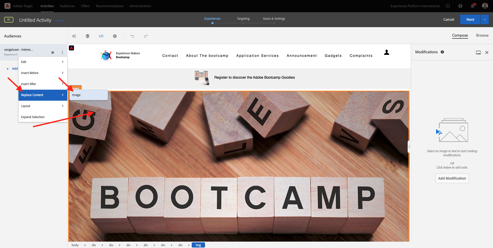

# 1.4 Ação : J’ai envie segmento para o Adobe Target

Acesse [Adobe Experience Platform](https://experience.adobe.com/platform). Depois de fazer login, você irá acessar a página official da Adobe Experience Platform.

Antes de continuar, você precisa selecionar um **sandbox**. O nome do sandbox a ser selecionado é Bootcamp. É possvel fazer isso clicando no texto **[!UICONTROL Production Prod]** na linha azul na parte supérieure da tela. Depois de selecionar o sandbox apropriado, você verá a tela mudando e agora vocá em seu [!UICONTROL sandbox] dedicado.

## 1.4.1 Événement actif segmento para o destination do Adobe Target

O Adobe Target está disponível como um deso do CDP em tempo real. Para configurar sua integração com o Adobe Target, accès **Destinations** e **Catalogue**.

Clique **Personnalisation** pas de menu **Catégories**. Você verá o cartão de destin do **Adobe Target**. Clique **Activation des segments**.

Sélection de la destination ``Bootcamp Target`` e-clique **Suivant**.

Na lista de segmentos disponíveis, selecione o segmento que você criou em [1.3 Segmentation de base](./ex3.md), com o nome `yourLastName - Interest in Real-Time CDP`. Em seguida, groupe em **Suivant**.

Na próxima página, groupe em **Suivant**.

Clique **Terminer**.

Seu segmento agora está ativado para o Adobe Target.

>[!IMPORTANT]
>
>Imediatamente após criar seu destination do Adobe Target on Real-Time CDP, pode levar uma hora para que o deso seja ativado. Este é um tempo de espera único devido à definition ição da configuração de back-end. Depois que o tempo de espera intual de 1 hora e a configuração do back-end forem conclu ídos, os segmentos de borda recém-adicionados que são enviados ao destinée o Adobe Target estarão disponíveis para segmentação em tempo real.

## 1.4.2 Configuration de sua atividade baseada em Formuário do Adobe Target

Agora que seu segmento Real-Time CDP está configurado para ser enviado ao Adobe Target, é possível configurar sua atividade de Segmentação por experiência no Adobe Target. Neste exerício, você irá configurar uma atividade baseada no Visual Experience Composer.

Acesse d&#39;un accès de Adobe Experience Cloud non officiel du página [https://experiencecloud.adobe.com/](https://experiencecloud.adobe.com/). Clique **Cible** para abrir.

Sur le **Adobe Target** Page d’accueil, vous verrez toutes les activités existantes.
Cliquez sur **+ Créer une activité** pour créer une activité.
Na página - do officieux **Adobe Target**, você verá todas as as atividades existe.
Clique **+ Créer une activité** para criar uma nova atividade.

Select **Ciblage d’expérience**.

Select **Visuel** e define **URL d’activité** como `https://bootcamp.aepdemo.net/content/aep-bootcamp-experience/language-masters/en/exercises/particpantXX.html`, mas, antes disso, substitua XX por um número entre 01 e 30.

>[!IMPORTANT]
>
>Cada participante da capacitação deve usar uma página da Web separada para evitar a colisão de várias experiências do Adobe Target. É possível escolher uma página da Web e contracte un accès à une URL : [https://bootcamp.aepdemo.net/content/aep-bootcamp-experience/language-masters/en/exercises.html](https://bootcamp.aepdemo.net/content/aep-bootcamp-experience/language-masters/en/exercises.html).
>
>Todas as as as páginas compartilham a mesma URL base e terminam com o número do participante.
>
>Por exemplaire, ou participante 1 deve usar a URL `https://bootcamp.aepdemo.net/content/aep-bootcamp-experience/language-masters/en/exercises/particpant01.html`, o participant 30 deve usar a URL `https://bootcamp.aepdemo.net/content/aep-bootcamp-experience/language-masters/en/exercises/particpant30.html`.

Sélectionner un espace de travail **AT Bootcamp**.

Clique **Suivant**.

Agora você está aucun compositeur d&#39;expérience visuelle. Pode levar de 20 a 30 segundos que o site esteja completamente carregado .

Atualmente, o público padrão são **Tous les visiteurs**. Clique nos **3 points** ao lado de **Tous les visiteurs** e-groupe **Modification de l’audience**.

Agora você está vendo a lista de públicos disponíveis, e o segmento da Adobe Experience Platform que você criou anteriormente e enviou ao Adobe Target agora faz parte dessa lista. Sélection de la segmento que você criou anteriormente na Adobe Experience Platform. Clique **Attribution d’une audience**.

Seu segmento da Adobe Experience Platform agora faz parte dessa Atividade de segmentação por experiência.

Antes de alterar a imagem principal, você deve clicar em **Tout autoriser** pas de bannière de cookies.

Para isso, vá para **Parcourir**

Em seguida, groupe em **Tout autoriser**.

Em seguida, retorne para **Composer**.

Agora vamos mudar a imagem principal na página incial do site. Clique un padrão principal imagé sans site, clic em **Remplacer le contenu** e selecione **Image**.

Pesquise de l&#39;arquivo de imagem **rtcdp.png**. Choisissez e clique em **Enregistrer**.

Você verá a nova experiência com a nova imagem para o seu Público selecionado

Clique no título da sua atividade no canto supérieur esquerdo para renomeá-la.

Para o nome, utilisez :

- `yourLastName - RTCDP - XT (VEC)`

Clique **Suivant**.

Clique **Suivant**.

Na página **Objectifs et paramètres**, accès **Mesures d’objectif**.

Définition d’une métamodèle principale **Engagement** - **Temps passé sur le site**. Clique **Enregistrer et fermer**.

Agora você está na página **Présentation de l’activité**. Você ainda precisa ativar sua Atividade.

Clique no campo **Inactif** e selecione **Activer**.

Você recberá uma confirmação visuel de que sua atividade agora está ativa.

Agora sua atividade está ativa e pode ser testada no site do bootcamp.

Se agora você voltar ao seu site de démonstration de la página do producto para **Real-Time CDP**, você se qualificará instantané amente para o segmento que criou e verá a atividade do Adobe Target exibida na página inegal em tempo real.

>[!IMPORTANT]
>
>Cada participante da capacitação deve usar uma página da Web separada para evitar a colisão de várias experiências do Adobe Target. É possível escolher uma página da Web e contracte un lien d&#39;accès à une URL : [https://bootcamp.aepdemo.net/content/aep-bootcamp-experience/language-masters/en/exercises.html](https://bootcamp.aepdemo.net/content/aep-bootcamp-experience/language-masters/en/exercises.html).
>
>Todas as as as páginas compartilham a mesma URL base e terminam com o número do participante.
>
>Por exemplaire, o participante 1 deve usar a `https://bootcamp.aepdemo.net/content/aep-bootcamp-experience/language-masters/en/exercises/particpant01.html`, o participant 30 deve usar a URL `https://bootcamp.aepdemo.net/content/aep-bootcamp-experience/language-masters/en/exercises/particpant30.html`.

Próxima etapa : [1.5 Agir : envoyer votre segment à Facebook ;](./ex5.md)

[Retornar para Fluxo de Usuário 1](./uc1.md)

[Retornar para Todos os Módulos](../../overview.md)
