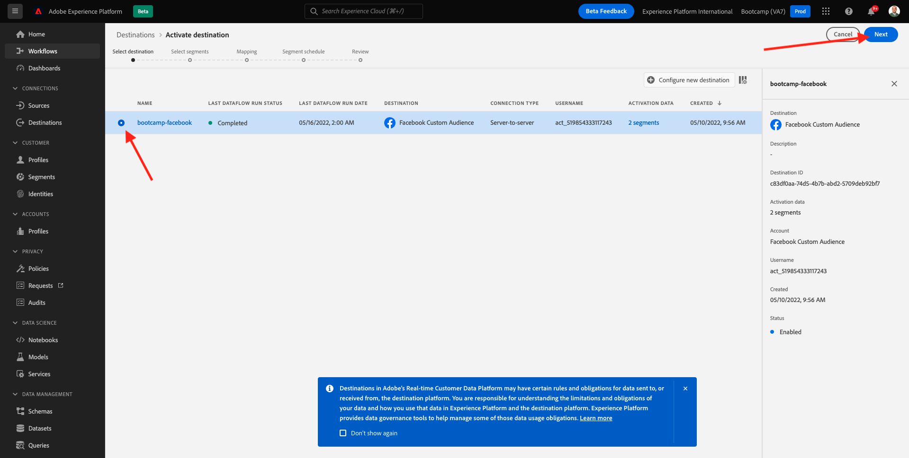

# 1.5 Ação : j&#39;ai envie segmento para o Facebook

Acesse [Adobe Experience Platform](https://experience.adobe.com/platform). Depois de fazer login, você irá acessar a página official da Adobe Experience Platform.

Antes de continuar, você precisa selecionar um **sandbox**. O nome do sandbox a ser selecionado é Bootcamp. É possvel fazer isso clicando no texto **[!UICONTROL Production Prod]** na linha azul na parte supérieure da tela. Depois de selecionar o sandbox apropriado, você verá a tela mudando e agora vocá em seu [!UICONTROL sandbox] dedicado.

Aucun menu à esquerda, vá para **Destinations** e, em seguida, vá para **Catalogue**. Você verá o **Catalogue des destinations**. Em **Destinations**, cliquez sur em **Activation des segments** no cartão **Audience personnalisée facebook**.

Sélectionner o **bootcamp-facebook** e-groupe **Suivant**.

Na lista de segmentos disponíveis, selecione o segmento que você criou no exerício anterior. Clique **Suivant**.

Na página **Mappage**, verifique se a caixa de seleção **Appliquer la transformation** está marcada. Clique **Suivant**.

Na página **Planification des segments**, sélectionnez a **Origine de votre audience** e define como **Directement des clients**. Clique **Suivant**.

Por fim, un página **Réviser**, cliquez sur em **Terminer**.

Seu segmento agora está vinculado aos Públicos Personalizados do Facebook. Sempre que um cliente se qualificar para segmento, um sinal será enviado do servdor (côté serveur) do Facebook para incluir client no Público Personalizado no lado do Facebook.

No Facebook, você encontrará seu segmento da Adobe Experience Platform em Públicos Personalizados :

L&#39;apartheid Agora você pode ver seu público personalizado sur Facebook :

[Retornar para Fluxo de Usuário 1](./uc1.md)

[Retornar para Todos os Módulos](../../overview.md)
