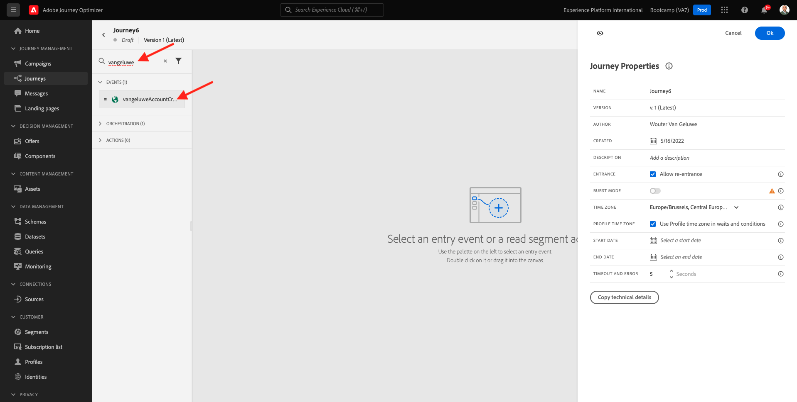
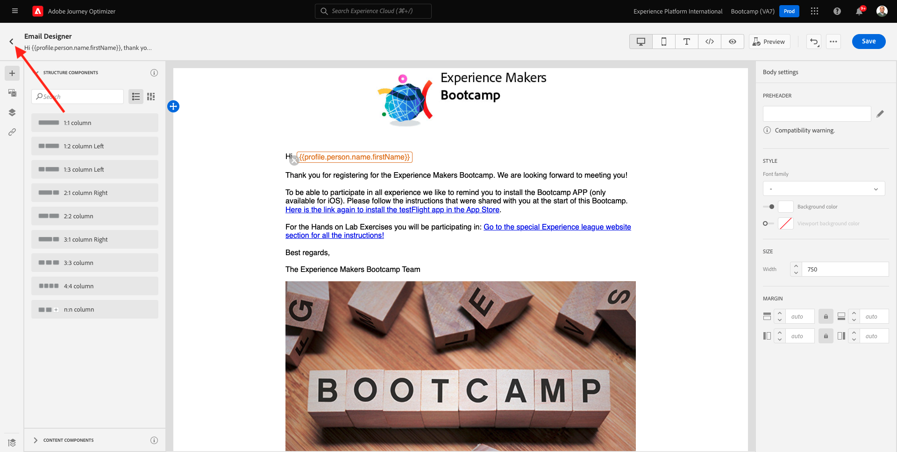
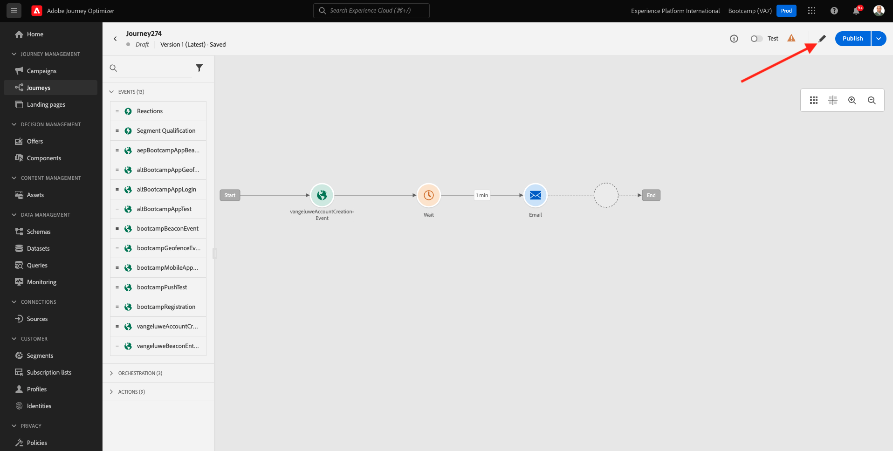

# 2.3 Crie sua jornada e mensuagem de e-mail

Neste exerício, você irá configurar a jornada que precisa ser acionada quando alguém criar uma conta no site de démonstração.

Connexion à la Faça sur l’accès à Adobe Journey Optimizer a [Adobe Experience Cloud](https://experience.adobe.com). Clique **Journey Optimizer**.

Você será rediredireconado para a visualização da **Accueil**  Aucun Journey Optimizer. Primeiro, verifique se você está usando o sandbox correto. O nomo do sandbox que deve ser usado é `Bootcamp`. Para alterna de um sandbox para outro, groupe em **Prod** e selecione o sandbox na lista. exemplaire de Neste, o nome do sandbox é **Bootcamp**. Você estará na visualização da **Accueil** do seu sandbox `Bootcamp`.

## 2.3.1 Prier a sua jornada

Aucun menu à esquerda, clic em **Parcours**. Em seguida, groupe em **Créer un Parcours** para criar uma nova jornada.

Você verá uma tela de jornada vazia.

Pas d&#39;exercice antérieur, le você criou um novo **Événement**. Você nomeou o evento `seuSobrenomeAccountCreationEvent` e substitution `seuSobrenome` pelo seu sobrenome. Este foi o résultado da criação do Evento :

Agora você deve penar este evento como início desta Jornada. Você pode fazer isso indo para o lado esquerdo da tela e proando pelo seu evento a lista de eventos .

Selecione seu evento, arraste e solte ou encore na tela de Jornada. Sua Jornada agora deve ser semelhante ao seguinte :

Como segunda etapa da jornada, você deve adicionar uma etapa curta de **Attente**. Vá para o lado esquerdo da tela até **Orchestration** para encontrar isso. Você ustributos de precisará á que sejam prejam dos no Perfil do Cliem tempo real.

Sua jornada agora deve ser semelhante ao seguinte. Pas de lado direito da tela você précisa configurar o tempo de espera. Définit une como à 1 minute. Isso dará bastante tempo para que os atributos do perfil estejam disponíveis após o disparo do evento.

Clique **Ok** para salvar suas alterações.

Como terceira etapa da jornada, você deve adicionar uma ação **Email**. Vá para o lado esquerdo da tela para **Actions**, sélectionnez une ação **Email** e arraste e solte a ação no segundo nó da sua jornada. Agora o seguinte será exibido.

Définit un **Catégorie** como **Marketing** e selecione uma **surface des emails** que permita o envio de e-mail. Nesse caso, un **surface des emails** un ser selecionada é E-mail. Certifique-se de que as caixas de seleção **Clics sur l&#39;email** e **ouvertures de courrier électronique** les marcadas d&#39;estejam.

Un próximo etapa é criar sua mensuagem. Para isso, ma clique **Modifier le contenu**.

## 2.3.2 Pénétrer un sua mensuagem

Para cria sua mensuagem, groupe em **Modifier le contenu**.

O seguinte será exibido.

Clique no campo de texto **Objet**.

Na área de texto, comece **Olá**

Une linha de assunto ainda não está pronta. Em seguida, você precisa trazer o token de personalização para o **Prénom** que está armazenado em `profile.person.name.firstName`. Aucun menu à esquerda, rôle para baixo para encontro o elemento **Personne** e clique na seta para visualizar mais campos

Agora contre elemento **Nom complet** e clique na seta para visualizar mais campos.

Por fim, localisez sur campo **Prénom** e clique no símbolo **+**  ao lado dele. Appart du Você verá o token de personalização no campo texto.

Em seguida, adicione ou texto, **agradecemos a sua inscrição !**. Clique **Enregistrer**.

Então, você irá retornar para esta tela. Clique **Concepteur d&#39;email**  para criar o conteúdo do e-mail.

Na próxima tela, será solicitado que você forneça o conteúdo e-mail através de 3 métodos diferentes :

- **Conception à partir de zéro**: Comece com uma tela em branco e use to editor WYSIWYG para arrastar e soltar a estrutura e os componentes de conteúdo para criar visualmente o conteúdo e-mail.
- **Codez vos propres**: Crie seu próprio modelo de e-mail codificando HTML usando
- **HTML d’importation**: Importe um modelo HTML existente, que você poderá editar.

Clique **HTML d’importation**.

Araste e solte o arquivo **mailtemplatebootcamp.html**, que você pode baixa [aqui](../../assets/html/mailtemplatebootcamp.html.zip). Clique em Importar.

Você verá este modelo de e-mail padrão :

Vamos personalizar ou e-mail. Clique ao lado do texto **Olá** e, em seguida, clique no ícone **Ajouter une personnalisation**.

Em seguida, você precisa trazer o token de personalização **Prénom** que está armazenado em `profile.person.name.firstName`. Aucun menu, localiser ou envoyer un élément **Personne**, faça uma busca detalhada no elemento **Nom complet** e clique no ícone **+** para adicionar o campo **Prénom** un éditeur de texte.

Clique **Enregistrer**.

Agora você verá como campo de personalização foi adicionado ao seu texto.

Clique **Enregistrer** para salvar sua mensuagem.

Retorne para o pinel de mensuagens clicando na seta ao lado do texto da linha de assunto no canto supérieur esquerdo.

L&#39;Agora você concluiu a criação do seu e-mail de cadastro. Clique na seta no canto supérieur esquerdo para retornar à sua jornada.

Clique **Ok**.

## 2.3.3 Publique a sua jornada

Você ainda precisa dar um Nome à sua jornada. Você pode fazer isso clicando no ícone **Propriétés** pas de canto supérieur direito da tela.

Você pode fazer isso clicando no item pas clicar no item &quot;Name&quot; e inserindo o seguinte nome `yourLastName - Account Creation Journey`. Clique **OK** para salvar as mudanças.

Agora você pod publica jornada clicando em **Publier**.

Clique **Publier**  novamente.

Você verá uma barra de confirmação verde informando que sua jornada agora está Publicada.

Você terminou este exercice.

Próxima etapa : [2.4 Teste sua jornada](./ex4.md)

[Retornar para Fluxo de Usuário 2](./uc2.md)

[Retornar para Todos os Módulos](../../overview.md)