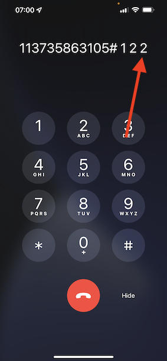

# 2.6 Personalização no call center

Conforme discutido várias vezes durante o bootcamp, personalizar a experiência do cliente é algo que deve acontecer de maneira omnichannel. Oum call center geralmente é basontado do restante da jornada do cliente e isso pode, com fréquência, levar a experiências frustrantes do cliente, mas não precisa ser assim. Vamos mostrar um exemplaire de como pode du centre d&#39;appel ser facile conectado à Adobe Experience Platform, em tempo real.

## Fluxo da jornada do cliente

Aucun exercice physique n&#39;est antérieur, usando o aplicativo móvel, você compou producto clicando no botão **Acheter**.

Vamos supor que você tenha uma pergunta sobre o status do seu pedido, o que você faria ? Normalmente, você ligaria para o call center.

Antes de ligar para o call center, você precisa saber seu **Loyalty ID**. Você pode encontrar seu ID de fidelidade sur le site Visualizador de Perfil do .

Nesse caso, o **Loyalty ID** é **5863105**. Como parte de nossa implementação personalizada do recurso de call center no ambiente de démonstração, você deve adicionar um prefixo seu **Loyalty ID**. O prefixo é **11373**, portanto, o ID de fidelidade a ser usado neste exemplaire o é **11373 5863105**.

Vamos fazer est agora. Utiliser seu telefone e ligue para o número **+1 (323) 745-1670**.

Será solicitado que você insira seu ID de fidelidade, seguido de **#**. Digite seu ID de fidelidade.

Você ouvirá **Bonjour, seu nome**. Esse nome é retirado do Perfil do Cliente em tempo real an Adobe Experience Platform. Você tem 3 escolhas. Pressione o número **1**, **État de la commande**.

Depois de ouvir o status do seu pedido, você terá a opção de pressionar **1** para voltar ao menu principal ou pressionar 2. Pressione **2**.

Em seguida, será solicitado que você avalie sua experiência de call center, selecionando um número entre 1 e 5, sendo 1 baixo e 5 alto. Faça a sua escolha.

Sua chamada para o appel centre será encerrada.

Acesse [Adobe Experience Platform](https://experience.adobe.com/platform). Depois de fazer login, você irá acessar a página official da Adobe Experience Platform.

Antes de continuar, você precisa selecionar um **sandbox**. O nomo do sandbox a ser selecionado é ``Bootcamp``. É possvel fazer isso clicando no texto **[!UICONTROL Production Prod]** na linha azul na parte supérieure da tela. Dépôt de selecionar o [!UICONTROL sandbox] apropriétaire, você verá a tela mudando e agora você está em seu [!UICONTROL sandbox] dedicado.

Pas de menu à esquerda, accès **Profils** e **Parcourir**.

Sélectionner o **Espace de noms d’identité** **Email** e insira o endereço de e-mail do seu perfil de cliente. Clique **Affichage**. Clique para abrir seu perfil.

Você verá seu perfil de cliente novamente. Acesse **Événements**.

Em eventos, você verá 2 eventos com um eventType de **callCenter**. O primeiro evento é o result da sua resposta à pergunta **Évaluer la satisfaction de vos appels** (avalie seu chamada).

Rôle um pouco para baixo e você verá o evento que foi enregistrement quando você selecionou a opção de verifico o **État de la commande**.

Acesse **abonnement au segment**. Agora você verá que 2 segmentos se qualificam em seu perfil, em tempo real, com base nas interações que você teve por meio do call center. Essas associações de segmento podem e devem ser usadas para impactar qual comunicação e personalização acontece em qualquer outro canal.

Você terminou este exercice.

[Retornar para Fluxo de Usuário 2](./uc2.md)

[Retornar para Todos os Módulos](../../overview.md)
