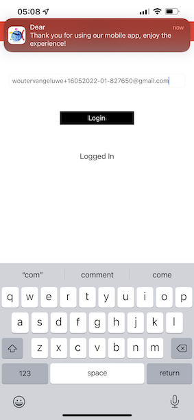

# 3.1 Utilisation de la balise aplicativo móvel e acione

## Installer sur aplicativo móvel

Antes de installar o aplicativo, é rendário habilitar o **Rastreamento** no seu dispositivo iOS. Para isso, accédez à **Configurações** > **Privacidade e segurança** > **Rastreamento** e verifique a opção **Permitir que os aplicativos solicitem o rastreamento**.

Accédez à une App Store da Apple et demandez `aepmobile-bootcamp`. Cliquez Sur **Instalar** Ou **Télécharger**.

Installation de Depois que o aplicativo estiver, groupe em **Abrir**.

Cliquez Sur L’Écran **OK**.

Clique-Les **Permitir**.

Cliquez sur **J&#39;accepte**.

Clique em **Permitir enquanto usa o aplicativo**.

Clique-Les **Permitir**.

Agora você está no aplicativo, a página inegal, pronto(a) para verificar day a jornada do cliente.

## Fluxo da jornada do cliente

Primeiramente, é rendário fazer pour se connecter. Cliquez Sur **Login**.

Depois de criar sua nos exerícios anteriores, isso é exibido no site. Agora é obligário reutility o endereço de e-mail da conta que você crou no aplicativo para fazer de connexion.

Digite o endereço de e-mail que você ne nous parle pas de site e groupe em **Login**.

Você recerá uma confirmação de que está conectado e receberá uma notificação

L&#39;appareillage Retorne para a página inegal do aplicativo e os recursos adicionais irão .

Primeiro, accédez à **Products**. Clique em qualquer producto, neste exemplaire : **Café à aller**.

Você verá a página do producto **Café à aller** no aplicativo.

Agora você irá simular um evento de entrada de sinalização (balise) em uma loja off line. O objetivo da simulação é personalizar a experiência do cliente nas telas da loja. Para visualizar a experiência na loja, foi criada uma página que mostrará de forma dinâmica as informações relevant para o cliente ao entrar na loja.

Antes de continuar, abra esta página da Web em seu computador : [https://bootcamp.aepdemo.net/content/aep-bootcamp-experience/language-masters/en/screen.html](https://bootcamp.aepdemo.net/content/aep-bootcamp-experience/language-masters/en/screen.html)

Em seguida, une tela abaixo será exibida :

Em seguida, retorne para a página officier. Clique no ícone do **beacon**.

Após essa etapa, ou seguinte será exibido. Primeiro, sélectionnez **Bootcamp Screen Beacon** e clique no botão de **entrada**. Isso permitirá que você simule uma entrada de sinalização com beacon.

Agora confirme une tela da loja. Você verá o último producto visualizado aparecer nessa tela em 5 segundos.

Em seguida, restauré para **Products**. Clique em qualquer producto, neste exemplaire : **couverture de plage Tan**.

Em seguida, retorne para a página officier. Clique no ícone do **beacon**.

Em seguida, select **Bootcamp Screen Beacon** e clique no botão de **Entrada** novamente. Isso permitirá que você simule uma entrada de sinalização (balise).

Agora, confira a tela da loja novamente. Você verá o último producto visualizado aparecer nessa tela em 5 segundos.

Agora, vamos vérificar também o seu Visualizador de Perfil sur aucun site. Você verá muitos eventos que foram adicionados, para mostrar que qualquer interação com um cliente é coletada e armazenada na Adobe Experience Platform.

Nos próximos exerícios, você irá configurar e testar sua própria jornada de entrada do beacon.

Próxima etapa : [3.2 Crie seu evento](./ex2.md)

[Retornar para Fluxo de Usuário 3](./uc3.md)

[Retornar para Todos os Módulos](../../overview.md)
