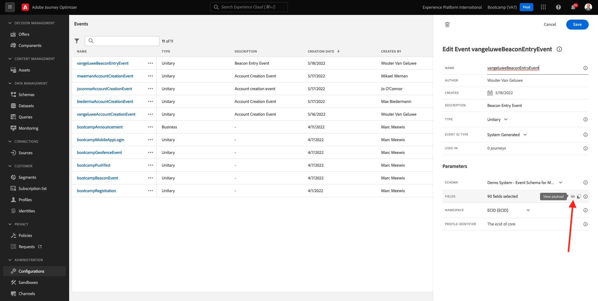

# 3.2 Événement de la seu de crie

Connexion à Faça sur Adobe Journey Optimizer et accès à [Adobe Experience Cloud]. Clique-Les **Journey Optimizer**.

Le Você será redireciponado para a **Home** on Journey Optimizer. Primeiro, verifique se você está usando o sandbox correto. O nome do sandbox que deve ser usado `Bootcamp`. Para alternar de um sandbox para outro, groupe em **Prod** e selecione o sandbox na lista. exemplaire de Neste, o nome do sandbox é **Bootcamp**. Você estará na visualização da **Home** do seu sandbox `Bootcamp`.

Aucun menu à esquerda, rôle para baixo e clique em **Configurations**. Em seguida, clic no botão **Gérer** em Eventos.

Você verá uma visão geral de todos os eventos disponíveis. Clique em **Créer un événement** para começar a criar seu próprio evento.

Appart de Uma nova janela de evento vazia irá .

Em primeiro lugar, dê um nome ao seu evento como, por exemplaire: `yourLastNameBeaconEntryEvent` e adicione uma description como, por exemplaire: `Beacon Entry Event`.

Em seguida, certifique-se de que **Type** está definition como **Unitary** e, para a seleção de **Event ID Type**, select **System Generated**.

Un schéma etapa seguinte é a seleção do . Um schema foi preparado para este exercice ício. Utilisation du schéma `Demo System - Event Schema for Mobile App (Global v1.1) v.1`.

Depois de selecionar o Schema, você verá vários campos sendo selecionados na seção **Fields**. Agora você deve passar o mouse sobre a seção **Fields** e três ícones pop-up serão exibidos. Clique no ícone de **Edit**.

Você verá uma janela pop-up de **Fields**, onde você deve selecionar alguns dos campos que precisamos para personalizar a jornada. Escolheremos outros atributos de perfil posteriormente, utilitzando os dados já existe

Rôle para baixo ver o objeto `Place context` e marque a caixa de seleção. Com isso, todo o contexto da localização do cliente será disponibilité bilizado para a jornada. Clique em **Ok** para salvar suas alterações.

Em seguida, você deverá ver a tela abaixo. Clique em **Save** mais uma vez para salvar suas alterações.

Seu evento agora está configurado e salvo.

Clique no seu evento novamente para abrir a tela **Edit Event** mais uma vez. Passe à la souris sobre **Fields** para ver os 3 ícones. Cliquez sur le bouton no ícone **View**.

Agora você verá um exemplaire o do payload esperado.
Seu evento tem um eventID de orquestração único, que você pode encontrar rolando para baixo nessa carga útil visualiza `_experience.campaign.orchestration.eventID`.

O eventID é o que deve ser enviado à Adobe Experience Platform para acionar a jornada que você construction irá em um dos próximos exercice Lembre-se deste eventID, você pode precisar dele posteriormente.
`"eventID": "e76c0bf0c77c3517e5b6f4c457a0754ebaf5f1f6b9357d74e0d8e13ae517c3d5"`

Clique em **Ok** e, em seguida, clic em **Annuler**.

Você terminou este exercice.

Próxima etapa : [3.3 Crie sua jornada e notificação push](./ex3.md)

[Retornar para Fluxo de Usuário 3](./uc3.md)

[Retornar para Todos os Módulos](../../overview.md)
