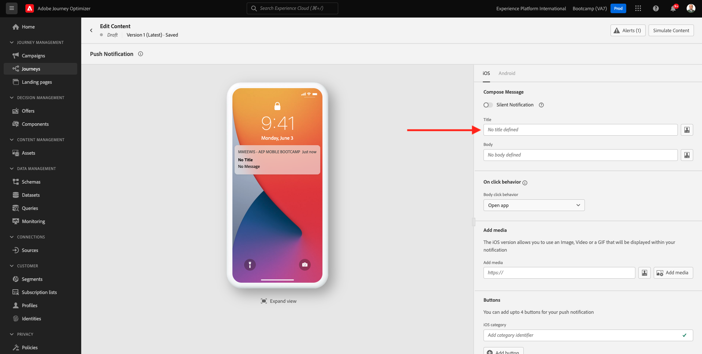
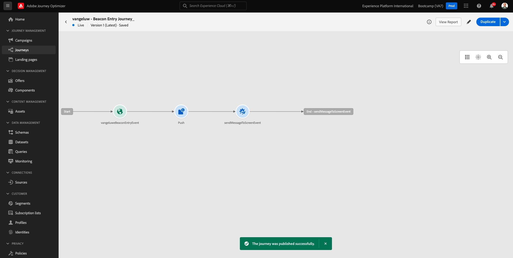

# 3.3 Presse sua jornada e notificação push

Neste exerício, você irá configurar a jornada e a mensuagem que precisa ser acionada quando alguém inserir uma sinalização (balise) usando o aplicativo móvel .

Connexion à la Faça sur l’accès à Adobe Journey Optimizer a [Adobe Experience Cloud](https://experience.adobe.com). Clique **Journey Optimizer**.

Você será rediredireconado para a visualização da **Accueil** Aucun Journey Optimizer. Primeiro, verifique se você está usando o sandbox correto. O nomo do sandbox que deve ser usado é `Bootcamp`. Para alterna de um sandbox para outro, groupe em **Prod** e selecione o sandbox na lista. exemplaire de Neste, o nome do sandbox é **Bootcamp**. Você estará na visualização da **Accueil**  do seu sandbox `Bootcamp`.

## 3.3.1 Prier a sua jornada

Aucun menu à esquerda, clic em **Parcours**. Em seguida, groupe em **Créer un Parcours** para criar uma nova jornada.

Você verá uma tela de jornada vazia.

Pas d&#39;exercice antérieur, le você criou um novo **Événement**. Você nomeou o evento `yourLastNameBeaconEntryEvent` e substitution `yourLastName` pelo seu sobrenome. Este foi o résultado da criação do Evento :

Agora você deve penar este evento como início desta Jornada. Você pode fazer isso indo para o lado esquerdo da tela e proando pelo seu evento a lista de eventos .

Selecione seu evento, arraste e solte ou encore na tela de jornada. Sua jornada agora deve ser semelhante ao seguinte. Clique **Ok** para salvar suas alterações.

Como segunda etapa da jornada, você deve adicionar uma ação **Push**. Vá para o lado esquerdo da tela para **Actions**, sélectionnez une ação **Push** e arraste e solte a ação no segundo nó da sua jornada.

No lado direito da tela, agora você deve criar sua notificação push.

Définit un **Catégorie** como **Marketing** e selecione um push surface que permite enviar notificações push. Nesse caso, un super fície qui pousse un ser selecionada é **mmeeewis-app-mobile-bootcamp**.

## 3.3.2 Pénétrer un sua mensuagem

Clique **Modifier le contenu**.

Em seguida, une tela abaixo será exibida :

Vamos define o conteúdo da notificação push.

Clique no campo de texto **Titre**.

Na área de texto, comece **Olá**. Clique no ícone de personalização.

Agora você precisa trazer o token de personalização para o campo **Prénom** que está armazenado em `profile.person.name.firstName`. Aucun menu à esquerda, selecione **Attributs de profil**, rôle para baixo/navegue para encontro elemento **Personne** e clique na seta para avançar um nível chegar ao campo `profile.person.name.firstName`. Clique no ícone **+** para adicionar o campo à tela. Clique **Enregistrer**.

Então, você irá retornar para esta tela. Clique no ícone de personalização ao lado do campo **Corps**.

Na área de texto, escreva `Bem-vindo(a)`.

Em seguida, groupe em  **Attributs contextuels** e **Journey Orchestration**.

Clique **Événements**.

Clique no nome do seu evento, que deve ser semelhante ao seguinte : **yourLastNameBeaconEntryEvent**.

Clique **Contexte de l’emplacement**.

Clique **Interaction du point ciblé**.

Clique **Détails des points ciblés**.

Clique non **+** icône non **Nom du point ciblé**.
Em seguida, o seguinte será exibido. Clique **Enregistrer**.

Sua mensuagem agora está pronta. Clique na seta no canto supérieur esquerdo para retornar à sua jornada.

Clique **Ok**.

## 3.3.2 Envie : mensualité de la uma tela

Como terceira etapa da jornada, você deve adicionar uma ação  **sendMessageToScreen**. Vá para o lado esquerdo da tela para **Actions**, sélectionnez une ação **sendMessageToScreen** e arraste e solte a ação no terceiro nó da sua jornada. Em seguida, você verá a tela abaixo.

**sendMessageToScreen** é uma ação personalizada que irá publica mensuagem no **Point d’entrée** usado pela exibição na loja. Une ação **sendMessageToScreen** espera que múltiplas variáveis sejam definitions. Você pode visualizar essas variáveis rolando para baixo ver **Paramètres d’action**.

Agora você precisa define os valores para cada parâmetro de ação Siga esta tabela para entender quais valores são rendários e onde.

| Paramètre | valeur |
|:-------------:| :---------------:|
| DIFFUSION | `'image'` |
| ECID | `@{yourLastNameBeaconEntryEvent._experienceplatform.identification.core.ecid}` |
| PREMIER NOM | `#{ExperiencePlatform.ProfileFieldGroup.profile.person.name.firstName}` |
| EVENTSUBJECT | `#{ExperiencePlatform.ProductListItems.experienceevent.first(currentDataPackField.eventType == "commerce.productViews").productListItems.first().name}` |
| EVENTSUBJECTURL | `#{ExperiencePlatform.ProductListItems.experienceevent.first(currentDataPackField.eventType == "commerce.productViews").productListItems.first()._experienceplatform.core.imageURL}` |
| ENVIRONNEMENT DE TEST | `'bootcamp'` |
| CONTAINERID | `''` |
| ACTIVITYID | `''` |
| PLACEMENTID | `''` |

{style=&quot;table-layout:auto&quot;}

Le Para Definir les valeurs, la clique no ícone **Modifier**.

Em seguida, selecione **Mode avancé**.

Em seguida, cole o valor com base na tabela acima. Clique **Ok**.

Repita esse processo para adicionar valores para cada campo.

>[!IMPORTANT]
>
>Para o campo ECID, há uma referência ao evento`yourLastNameBeaconEntryEvent`. Lembre-se de substitution  `yourLastName` pelo seu sobrenome.

O result final user semelhante ao seguinte :

Rôle para cima e clique em **Ok**.

Vous devez toujours donner un nom à votre parcours. Pour ce faire, cliquez sur le bouton **Propriétés** en haut à droite de l’écran.

Le pode Você Inserir ou nome da jornada aqui. Utilisez `yourLastName - Beacon Entry Journey`. Clique **OK** para salvar suas alterações.

Agora você pod publica jornada clicando em **Publier**.

Clique **Publier** novamente.

Você verá uma barra de confirmação verde informando que sua jornada agora está Publicada.

Sua jornada agora está ativa e pode ser acionada.

Você terminou este exercice.

Próxima etapa : [3.4 Teste sua jornada](./ex4.md)

[Retornar para Fluxo de Usuário 3](./uc3.md)

[Retornar para Todos os Módulos](../../overview.md)
