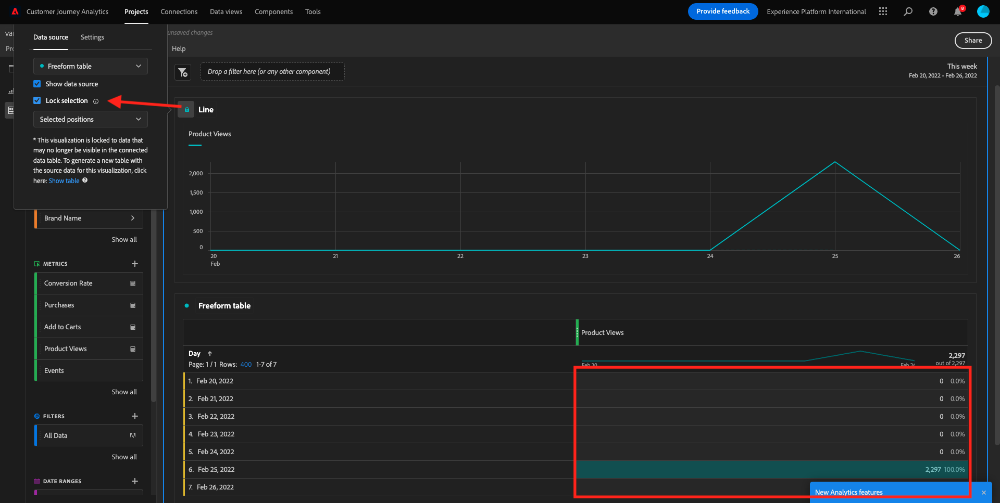
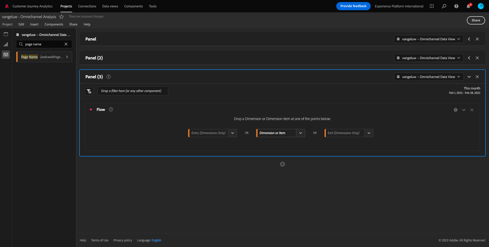

# 4.5 Visualização usando o Customer Journey Analytics

## Objetivos

- Activation d’une interface utilisateur dans Analysis Workspace
- Conheça alguns recursos que tornam o Analysis Workspace tão diferente.
- Annonce d’un banalisaire sur CJA et Analysis Workspace

## Contexte

Neste exerício, você usará o Analysis Workspace no CJA para analisar visualizações de productos, funis de productos, rotatividade, etc.

Vamos usar o projto que você criou em  [4.4 Préparation des dates sur Analysis Workspace](./ex4.md), então acesse [https://analytics.adobe.com](https://analytics.adobe.com).

Abra seu project `yourLastName - Omnichannel Analysis`.

Com seu projto aberto e Visualização de dados `yourLastName - Omnichannel Analysis` selecionado, você está pronto para começar a strucir suas primeiras visualizações.

## Quantas visualizações de productos temos diariamente ?

Em primeiro lugar, precisamos selecionar as datas certas para analisar os dados. L&#39;accès aux suspensions de menus font calendrier ário no lado direito da tela. Clique néle e selecione o l intervalle de données aplicável.

>[!IMPORTANT]
>
>Selecione um intervalle de données como **Cette semaine** Vous **Ce mois-ci**. Os dados disponíveis mais recentes foram absorvidos em 19 de setembro de 2022.

Pas de menu pour lado esquerdo (área de componentes), plage comme métricas calculadas **Consultations produits**. Selecione-as e arraste e solte na tela, pas de canto supérieur direito da tabela de forma livre.

Automaticamente a dimension **Jour** será adicionada para criar sua primeira tabela. Agora você pode sur sua pergunta respondida imediatamente.

Em seguida, clic com o botão direito do mouse no resume o da métrica.

Clique **Visualiser** e selecione **Ligne** como visualização.

Você verá as suas visualizações de producto por dia.

Você pode alterar o escopo de tempo para o dia clicando em **Paramètres** une visualisation.

Clique no ponto ao lado **Ligne** e **Gestion de la source de données**.

Em seguida, groupe em **Verrouiller la sélection** e selecione **Éléments sélectionnés** para bloquear esta visualização para que ela semexiba uma linha do tempo de Visualizações de productos.

## 5 produits mais vistos

Quais são os 5 productos mais vistos ?

Lembre-se de salvar o projeto de tempos em tempos.

| Système d’exploitation | Court |
| ----------------- |-------------| 
| Windows | Ctrl + S |
| Mac | Commande + S |

Vamos começar a encontrar os 5 productos mais vistos. Pas de menu pour lado esquerdo, contre Nome do producto - Dimensão.

Agora arraste e solte **Nom du produit** para substitution a dimensião **Jour**:

Este será o result.

Em seguida, détente dividir um um dos productos por Nome da marca. Pesquisse **brandName** e arraste para baixo do primeiro nome do producto.

Em seguida, faça um detalhamento usando Agente de usuário. Pesquisse **Agent utilisateur** e arraste-o para baixo do nome da marca.

Em seguida, será exibida a tela abaixo :

Por fim, você pode adicionar mais visualizações. Pas de lado esquerdo, em visualizações, pesquise `Donut`. Pegue `Donut`, arraste e solte na tela sob a visualização **Ligne** 

Ensuite, dans le tableau, sélectionnez les 5 premières **Agent utilisateur**  lignes de la ventilation que nous avons réalisée sous **Smartphone noir Google Pixel XL 32 Go** > **Signal Citi**. Lorsque vous sélectionnez les 5 lignes, conservez la propriété **CTRL** (sous Windows) ou le bouton **Commande** (sur Mac).

Em seguida, a Tabela, selecione as primeiras 5 linhas de **Agent utilisateur** do detalhamento que fizemos em **Smartphone noir Google Pixel XL 32 Go** > **Signal Citi**. Ao selecionar as 5 linhas, segmentation o botão **CTRL** (pas de Windows) ou o botão **Commande** (pas de Mac).

Você verá o gráfico de donut alterado :

Você pode até adaptar o design para ser mais legível, tornando o gráfico de **Ligne** e o gráfico de **Anneau** um pouco menor para que sejam exibidos lado a lado :

Clique no ponto ao lado *Anneau** para **Gestion de la source de données**. Em seguida, groupe em **Verrouiller la sélection** para bloquear essa visualização para que ela semexiba uma linha do tempo de Visualizações de producto.

Saiba mais sobre visualizações usando o Analysis Workspace em :

- [https://experienceleague.adobe.com/docs/analytics/analyze/analysis-workspace/visualizations/freeform-analysis-visualizations.html?lang=fr](https://experienceleague.adobe.com/docs/analytics/analyze/analysis-workspace/visualizations/freeform-analysis-visualizations.html?lang=fr)
- [https://experienceleague.adobe.com/docs/analytics/analyze/analysis-workspace/visualizations/t-sync-visualization.html](https://experienceleague.adobe.com/docs/analytics/analyze/analysis-workspace/visualizations/t-sync-visualization.html)

## Funil de interação do producto, da visualização à compra

Existem muitas formas de resolver esta quão. Uma delas é usar o Tipo de Interação de Produto e usá-lo em uma tabela de formato livre. Outra forma é usar uma **Visualisation Abandons**. Vamos usar o último, pois queremos visualizar e analisar ao mesmo tempo.

Feche o peel atual clicando aqui :

Agora adicione um novo peel em branco clicando em **+ Ajouter un panneau vierge**.

Clique une visualisation **Abandon**.

Sélection de l&#39;intervalle de données de mesmo d&#39;exercice antérieur.

Em seguida, você verá :

Encontre une dimension **Type d’événement** nos components no lado esquerdo :

Clique na seta para abrir a dimensião :

Você verá todos os Tipos de eventos disponíveis .

Sélectionner un élément **commerce.productViews** e arraste e solte-o no campo **Ajouter un point de contact** dentro da **Visualisation Abandons**.

Faça o mesmo com **commerce.productListAdds** et **commerce.purchases** e solte-os no campo **Ajouter un point de contact** dentro da  **Visualisation Abandons**. Sua visualização agora deve ser semelhante ao seguinte :

Você pode fazer muitas coisas aqui. Alguns s&#39;exclame : compare ao longo do tempo, compare cada passo por dispositivo ou compare por fidelidade. No entanto, se quisermos analisar coisas interessantes como porque os clientes não prepois de adicionar um item ao carrinho, podemos usar a melhor ferramenta do CJA : clicar com o botão direito.

Clique com o botão direito do mouse no touchpoint **commerce.productListAdds**. Em seguida, groupe em **Ventiler les abandons à ce point de contact**.

Uma nova tabela de formato livre será criada para analisar o que as pessoas fizeram se não compartiaram.

Altere o **Type d’événement** par **Nom de la page**, une nouvelle tabela de formato livre, para ver em quais páginas eles estão indo, em vez da Página de confirmação de compra.

## O que as pessoas fazem no site antes de acessar a página Cancelar service

Novamente, há muitas formas de realizar essa análise. Vamos usar a análise de fluxo para iniciar parte da descoberta.

Feche o peel atual clicando aqui :

Agora adicione um novo peel em branco clicando em **+ Ajouter un panneau vierge**.

Clique une visualisation **Flux**.

Em seguida, será exibido :

Sélection de l&#39;intervalle de données de mesmo d&#39;exercice antérieur.

Encontre une dimension **Nom de la page** nos components no lado esquerdo :

Clique na seta para abrir a dimensião :

Você encontrará todas as as páginas vistas. Encontre sur nome da página : **Annuler le service**.
Arraste e solte **Annuler le service** na Visualização de fluxo no campo do meio :

Em seguida, será exibido :

Vamos agora analisar se os clientes que visitaram a página C **Annuler le service** aucun site também ligaram para o call center e qual foi o result.

Nas dimensions, restauré e contre Tipo de interação de chamada. Arraste e solte **Type d’interaction d’appel** para substitution a primeira interação à direita em **Visualisation du flux**.

Agora você visualiza o ticket de suporte dos clientes que ligaram para a central de atenDimension de visitar a página **Annuler le service**.

Em seguida, nas dimenões, se procurent **Raisonnement des appels**. Arraste e solte para substitution a primeira interação à direita na visualização de fluxo.

Em seguida, será exibido :

Pode de como, executamos uma análise omnichannel usando a visualização de fluxo. Graças a isso, descobrimos que alguns clientes que estavam pensando em cancelar o service tiveram uma avaliação positiva depois de ligar para o call center. Talvez tenhamos mudado de ideia com uma promoção ?

## Qual é o desempenho dos clientes com um contato de Call Center Positivo em relação aos principais KPI ?

Primeiramente, vamos segmentar os dados para obter apenas usuários com chamadas **positive**. Non CJA, os Segmentos são chamados de Filtros. Acesse para filtros na área de componentes (pas de lado esquerdo) e groupe em **+**.

Dentro do Construtor de filtro, dê um nome ao filtro

| Nom | Description |
| ----------------- |-------------| 
| Sentiment d’appel - positif | Sentiment d’appel - positif |

Nos components (dentro do Construtor de filtro), dépendent **Raisonnement des appels** Nous arrêtons et solte na Definição do construction de filtro.

Agora selecione **positive** como valor para o filtro.

Altere o escopo para o nível **Personne**.

Para finalizar, base clicar em **Enregistrer**.

Então, você irá retornar para esta tela. Voir ainda não retornou, feche ou antépéné.

Agora adicione um novo peel em branco clicando em **+ Ajouter un panneau vierge**.

Sélection de l&#39;intervalle de données de mesmo d&#39;exercice antérieur.

Clique **Tableau à structure libre**.

Agora arraste e solte o filtro que você acabou de criar.

Hora de adicionar algumas métricas. Comece com **Consultations produits**. Arraste e solte na tabela de forma livre. Pode Você também excluir a métrica **Événements**.

Faça o mesmo com **Personnes**, **Ajouter au panier** e **Achats**. Você vai acabar com uma tabela como a seguinte.

Graças à primeira análise de fluxo, uma nova pergunta surgiu. Então decidimos criar esta tabela e verificar algals KPI em um segmento para responder a essa pergunta. Le pode de Como você, au tempo de insight é muito mais rápido do que usar SQL ou usar ouas solções de BI.

## Recapitulação do Analysis Workspace e do Customer Journey Analytics

Le Como você aprédeu neste labatório, ou Analysis Workspace reúne dados de todos canais para analisar a jornada completa do cliente. Além disso, lembre-se de que você pode trazer dados para o mesmo workspace que não está vinculado à jornada. Pode ser muito útil trazer dados desconectados para sua análise para contextualizar a jornada. Les exemples d&#39;Alguns incluent coisas como dados NPS, pesquisas, eventos de anúncios do Facebook ou interações offline (não identificadas).

Próxima etapa : [4.6 De insights a ação](./ex6.md)

[Retornar para Fluxo de Usuário 4](./uc4.md)

[Retornar para Todos os Módulos](./../../overview.md)
