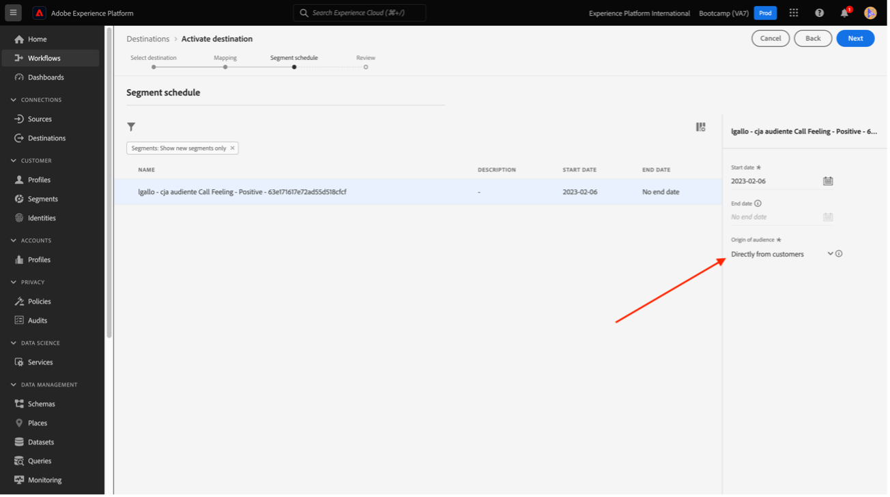
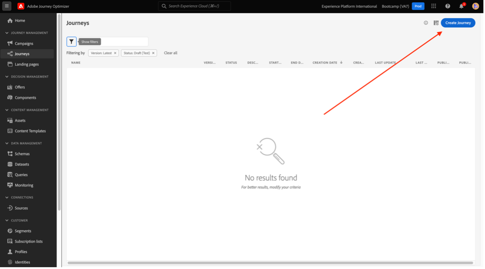

# 4.6 Dos insights à ação

## Objetivos

- Entenda comar um público com base em uma visão coletada no Customer Journey Analytics
- Utilisez esse público no CDP em tempo real e no Adobe Journey Optimizer

## 4.6.1 Crie uma audiência e publique-a

Em seu projeto, você criou um filtro chamado **Sentiments d’appel** e sitguiu visualizar a quantidade de usuários que tiveram suas ligações ao call center classificadas como **positizone**. Agora, você poderá criar um segmento com esses usuários e ativação-los em jornadas ou em canais de comunicação.

O primeiro passo é : Pas de peintures criado no último Exercício, selecione a linha **1. Sentiment d’appel - positif**, la clique com o botão direito de seu mouse e selecione a opção **Création d’une audience d’après une sélection**:

Em seguida, dê um nome para a sua audiência seguindo o modelo **yourLastName - appel de l’audience de cia**:

Remarque que é possível ter um preview da audiência que está sendo criada :

Para finalizar, clique-moi **Public**:

## 4.6.2 Utilisation de sua audiência como parte de um segmento

Voltando para a Adobe Experience Platform, vá em **Segments > Parcourir** e você conseguirá visualizar o seu segmento criado no CJA pronto e disponível para usado nas suas ativações e jornadas !

Vamos agora usar esse segmento em uma ativação no Facebook e em uma jornada do cliente!

## 4.6.3 Utiliser seu segmento a Real-Time CDP em tempo real

Na Adobe Experience Platform, vá em **Segments > Parcourir** e contre une audiência que você criou no CJA :

Clique no seu segmento e, em seguida, clique em **Activation vers la destination**:

Choisissez une destination chamada bootcamp-facebook e, em seguida, clic em Next :

Em seguida, groupe em Next novamente :

Sélectionner une opção **Origine de votre audience** e define como **Directement des clients** Accrochez-moi à la suite :

Por fim, un página **Réviser** claquez-moi la fin !

Pronto ! Agora o seu segmento está vinculado aos públicos personalizados do Facebook.
Agora, vamos utiliszar esse segmento no AJO !

## 4.6.4 Utilisation de segments de menu à pas dans Adobe Journey Optimizer

Na interface da Adobe Experience Platform clique em Journey Optimizer e, em seguidon, pas de menu latéral esquerdo, clic em **Parcours** e comece : uma jornada clicando em **Créer un Parcours**:

Em seguida, pas d&#39;esquerdo latéral de menu, em Eventos, selecione **Qualification de segment** e arraste-o até a jornada :

Em seguida, em **Segment** groupe **Modifier** para selecionar um segmento :

Selecione a audiência que você crio no CJA e clique em **Enregistrer**:

Pronto ! Une partir daí você pode criar uma jornada para clientes que se qualificam para esse segmento !

[Retour au flux utilisateur 4](./uc4.md)

[Voltar para todos os módulos](./../../overview.md)
