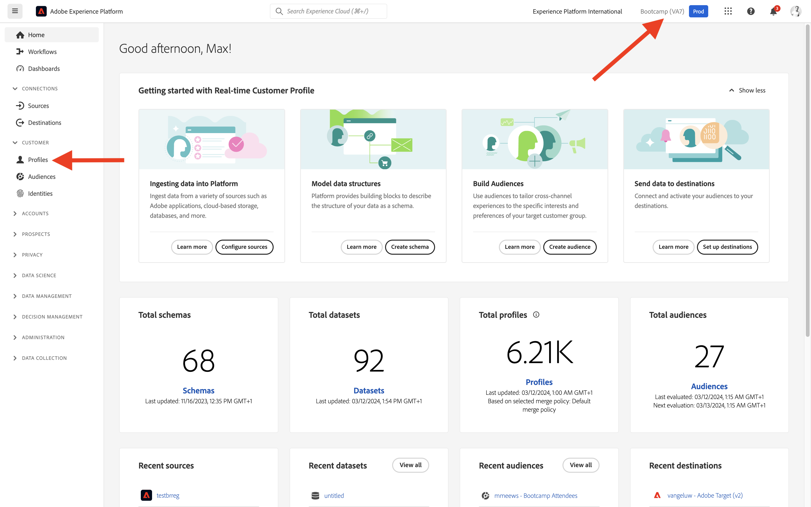

# 1.2 Visualisation de votre propre profil client en temps réel - interface utilisateur

Au cours de cet exercice, vous vous connecterez à Adobe Experience Platform et afficherez votre propre profil client en temps réel dans l’interface utilisateur.

## Histoire

Dans Real-time Customer Profile, toutes les données de profil s’affichent avec les données d’événement, ainsi que les appartenances à des segments existants. Les données affichées peuvent provenir de n’importe où, des applications d’Adobe et des solutions externes. Il s’agit de la vue la plus puissante de Adobe Experience Platform, le véritable système d’enregistrement d’expérience.

## 1.2.1 Utilisation de la vue Profil client dans Adobe Experience Platform

Accédez à [Adobe Experience Platform](https://experience.adobe.com/platform). Une fois connecté, vous accédez à la page d’accueil de Adobe Experience Platform.

Avant de continuer, vous devez sélectionner une **sandbox**. L’environnement de test à sélectionner est nommé ``Bootcamp``. Pour ce faire, cliquez sur le texte **[!UICONTROL Production Prod]** dans la ligne bleue en haut de votre écran. Après avoir sélectionné le [!UICONTROL sandbox], vous verrez le changement d’écran et vous êtes maintenant dans votre [!UICONTROL sandbox].

Dans le menu de gauche, accédez à **Profils** et à **Parcourir**.

Dans le panneau Visionneuse de profils de votre site web, vous trouverez la présentation des identités. Chaque identité est liée à un espace de noms.

Dans le panneau Visionneuse de profils, vous pouvez actuellement voir cette identité :

| Espace de noms | Identité |
|:-------------:| :---------------:|
| Experience Cloud ID (ECID) | 19428085896177382402834560825640259081 |

Avec Adobe Experience Platform, tous les identifiants sont également importants. Auparavant, l’ECID était l’identifiant le plus important dans le contexte de l’Adobe et tous les autres identifiants étaient liés à l’ECID dans une relation hiérarchique. Avec Adobe Experience Platform, ce n’est plus le cas, et chaque ID peut être considéré comme un identifiant Principal.

En règle générale, l’identifiant Principal dépend du contexte. Si vous demandez à votre centre d’appels, **Quel est l’identifiant le plus important ?** ils répondront probablement, **le numéro de téléphone !** Mais si vous demandez à votre équipe CRM, elle répond : **L&#39;adresse email !**  Adobe Experience Platform comprend cette complexité et la gère à votre place. Chaque application, qu’elle soit Adobe ou non, parlera avec Adobe Experience Platform en se référant à l’identifiant qu’elle considère Principal. Et ça marche tout simplement.

Pour le champ **Espace de noms d’identité**, sélectionnez **ECID** et pour le champ **Valeur d’identité** entrez l’ECID qui se trouve dans le panneau Visionneuse de profils du site web bootcamp. Cliquez sur **Affichage**. Votre profil s’affiche alors dans la liste. Cliquez sur le bouton **Identifiant de profil** pour ouvrir votre profil.

Vous voyez maintenant un aperçu de quelques éléments importants **Attributs de profil** de votre profil client.

Accédez à **Événements**, où vous pouvez voir les entrées pour chaque événement d’expérience lié à votre profil.

Enfin, accédez à l’option de menu **abonnement au segment**. Vous verrez désormais tous les segments à inclure dans ce profil.

Créez maintenant un segment qui vous permettra de personnaliser l’expérience client pour un client anonyme ou qui connaît un client.

Étape suivante : [1.3 Création d’un segment - IU](./ex3.md)

[Retour au flux utilisateur 1](./uc1.md)

[Revenir à tous les modules](../../overview.md)
