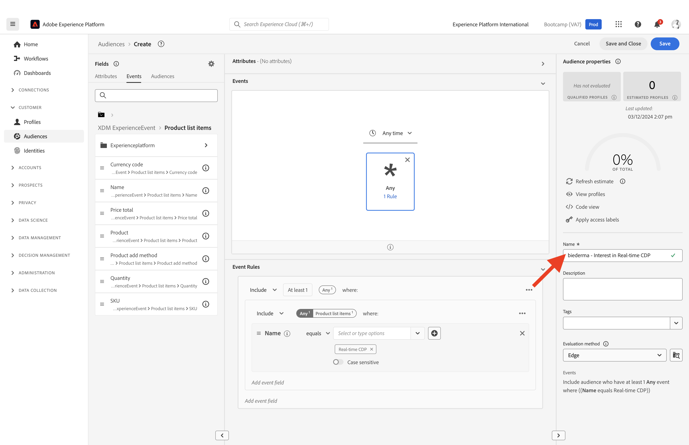

# 1.3 Création d’un segment - IU

Dans cet exercice, vous allez créer un segment à l’aide du créateur de segments de Adobe Experience Platform.

## Histoire

Accédez à [Adobe Experience Platform](https://experience.adobe.com/platform). Une fois connecté, vous accédez à la page d’accueil de Adobe Experience Platform.

Avant de continuer, vous devez sélectionner une **sandbox**. L’environnement de test à sélectionner est nommé ``Bootcamp``. Pour ce faire, cliquez sur le texte **[!UICONTROL Production Prod]** dans la ligne bleue en haut de votre écran. Après avoir sélectionné le [!UICONTROL sandbox], vous verrez le changement d’écran et vous êtes maintenant dans votre [!UICONTROL sandbox].

Dans le menu de gauche, accédez à **Segments**. Sur cette page, vous pouvez voir un aperçu de tous les segments existants. Cliquez sur le bouton **+ Créer un segment** pour commencer à créer un segment.

Une fois que vous êtes dans le nouveau créateur de segments, vous constatez immédiatement que la variable **Attributs** et l’option **XDM Individual Profile** référence.

Étant donné que XDM est le langage qui alimente les activités d’expérience, XDM est également la base du créateur de segments. Toutes les données ingérées dans Platform doivent être mappées sur XDM. Par conséquent, toutes les données font partie du même modèle de données, quel que soit l’endroit d’où elles proviennent. Cela vous offre un grand avantage lors de la création de segments. Comme dans cette interface utilisateur du créateur de segments, vous pouvez combiner des données provenant de n’importe quelle origine dans le même workflow. Les segments créés dans le créateur de segments peuvent être envoyés à des solutions telles qu’Adobe Target, Adobe Campaign et Adobe Audience Manager pour activation.

Vous devez maintenant créer un segment de tous les clients qui ont consulté le produit. **Real-Time CDP**.

Pour créer ce segment, vous devez ajouter un événement d’expérience. Vous pouvez trouver tous les événements d’expérience en cliquant sur la variable **Événements** dans le **Champs** de la barre de menus.

Ensuite, vous verrez le niveau supérieur, **XDM ExperienceEvents** noeud . Cliquez sur **XDM ExperienceEvent**.

Accédez à **Éléments de liste de produits**.

Sélectionner **Nom** et faites glisser et déposez le **Nom** du menu de gauche sur le canevas du créateur de segments dans la **Événements** . Vous verrez alors :

Le paramètre de comparaison doit être **est égal à** et dans le champ de saisie, saisissez **CDP en temps réel**.

Chaque fois que vous ajoutez un élément au créateur de segments, vous pouvez cliquer sur le **Actualiser l’estimation** pour obtenir une nouvelle estimation de la population de votre segment.

As **Méthode d’évaluation**, sélectionnez **Edge**.

Enfin, attribuons un nom à votre segment et enregistrez-le.

Pour définir une convention d’affectation des noms, utilisez :

- `yourLastName - Interest in Real-Time CDP`

Cliquez ensuite sur le bouton **Enregistrer et fermer** pour enregistrer votre segment.

Revenez maintenant à la page d’aperçu des segments, où vous trouverez un exemple d’aperçu des profils de clients qui remplissent les critères de votre segment.

Vous pouvez maintenant passer à l’exercice suivant et utiliser votre segment avec Adobe Target.

Étape suivante : [1.4 Agir : envoyer votre segment à Adobe Target ;](./ex4.md)

[Retour au flux utilisateur 1](./uc1.md)

[Revenir à tous les modules](../../overview.md)
