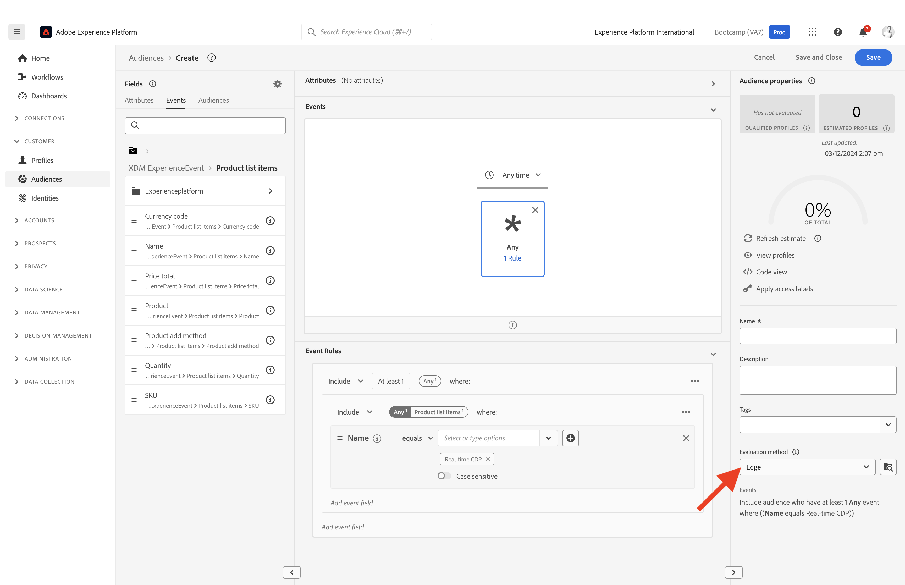

# 1.3 Création d’une audience - IU

Au cours de cet exercice, vous allez créer une audience en utilisant le créateur d’audiences Adobe Experience Platform.

## Histoire

Accédez à [Adobe Experience Platform](https://experience.adobe.com/platform). Une fois connecté, vous accédez à la page d’accueil de Adobe Experience Platform.

Avant de continuer, vous devez sélectionner un **sandbox**. L’environnement de test à sélectionner est nommé ``Bootcamp``. Pour ce faire, cliquez sur le texte **[!UICONTROL Production Prod]** dans la ligne bleue en haut de votre écran. Après avoir sélectionné l’[!UICONTROL sandbox] approprié, vous verrez le changement d’écran et vous êtes désormais dans votre [!UICONTROL sandbox] dédié.

Dans le menu de gauche, accédez à **Audiences**. Sur cette page, vous trouverez des tableaux de bord contenant des informations essentielles sur les performances de **Audience**.

Cliquez sur **Parcourir** pour afficher un aperçu de toutes les audiences existantes. Cliquez sur le bouton **+ Créer une audience** pour commencer à créer une audience.

Une Pop-Ip s’affiche et vous demande si vous souhaitez **&#39;Composer l’audience&#39;** ou **&#39;Créer la règle&#39;**. Sélectionnez **&#39;Build rule&#39;** pour continuer et cliquez sur **create**.

![Segmentation][def]

Une fois que vous êtes dans le créateur d’audiences, vous remarquez immédiatement l’option de menu **Attributs** et la référence **XDM Individual Profile**.

Étant donné que XDM est le langage qui alimente les activités d’expérience, XDM est également la base du créateur d’audiences. Toutes les données ingérées dans Platform doivent être mappées sur XDM. Par conséquent, toutes les données font partie du même modèle de données, quel que soit l’endroit d’où elles proviennent. Cela vous offre un grand avantage lors de la création d’audiences. Comme dans cette interface utilisateur du créateur d’audiences, vous pouvez combiner des données provenant de n’importe quelle origine dans le même workflow. Les audiences créées dans Audience Builder peuvent être envoyées à des solutions telles qu’Adobe Target, Adobe Campaign ou tout autre canal d’activation.

Vous devez maintenant créer une audience de tous les clients qui ont consulté le produit **Real-Time CDP**.

Pour créer cette audience, vous devez ajouter un événement d’expérience. Vous pouvez trouver tous les événements d’expérience en cliquant sur l’icône **Événements** dans la barre de menus **Champs**.

Vous verrez ensuite le noeud de niveau supérieur **XDM ExperienceEvents**. Cliquez sur **XDM ExperienceEvent**.

Accédez à **Éléments de liste de produits**.

Sélectionnez **Nom** et faites glisser et déposez l’objet **Nom** du menu de gauche sur le canevas du créateur d’audiences dans la section **Événements** . Vous verrez alors :

Le paramètre de comparaison doit être **equals** et, dans le champ d’entrée, saisissez **CDP en temps réel**.

Chaque fois que vous ajoutez un élément au créateur d’audiences, vous pouvez cliquer sur le bouton **Actualiser l’estimation** pour obtenir une nouvelle estimation de la population de votre audience.

En tant que **Méthode d’évaluation**, sélectionnez **Edge**.

Enfin, attribuons un nom à votre audience et enregistrez-le.

Pour définir une convention d’affectation des noms, utilisez :

- `yourLastName - Interest in Real-Time CDP`

Cliquez ensuite sur le bouton **Enregistrer et fermer** pour enregistrer votre audience.

Revenez maintenant à la page d’aperçu de l’audience, où vous trouverez un exemple d’aperçu des profils de clients qui remplissent les critères de votre audience.

Vous pouvez maintenant poursuivre l’exercice suivant et utiliser votre audience avec Adobe Target.

Étape suivante : [1.4 Take Action : envoyez votre audience à Adobe Target](./ex4.md)

[Retour au flux utilisateur 1](./uc1.md)

[Revenir à tous les modules](../../overview.md)

[def]: ./images/segmentationpopup.png
