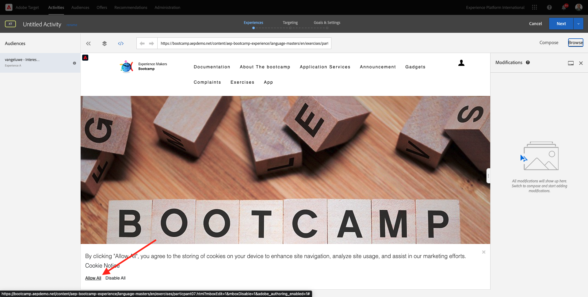

# 1.4 Agir : envoyer votre segment à Adobe Target ;

Accédez à [Adobe Experience Platform](https://experience.adobe.com/platform). Une fois connecté, vous accédez à la page d’accueil de Adobe Experience Platform.

Avant de continuer, vous devez sélectionner une **sandbox**. L’environnement de test à sélectionner est nommé ``Bootcamp``. Pour ce faire, cliquez sur le texte **[!UICONTROL Production Prod]** dans la ligne bleue en haut de votre écran. Après avoir sélectionné le [!UICONTROL sandbox], vous verrez le changement d’écran et vous êtes maintenant dans votre [!UICONTROL sandbox].

## 1.4.1 Activation de votre segment vers votre destination Adobe Target

Adobe Target est disponible en tant que destination à partir de Real-Time CDP. Pour configurer votre intégration Adobe Target, accédez à **Destinations**, à **Catalogue**.

Cliquez sur **Personnalisation** dans le **Catégories** . Vous verrez alors le **Adobe Target** carte de destination. Cliquez sur **Activation des segments**.

Sélectionner la destination ``Bootcamp Target`` et cliquez sur **Suivant**.

Dans la liste des segments disponibles, sélectionnez le segment que vous avez créé dans [1.3 Création d’un segment](./ex3.md), qui est nommé `yourLastName - Interest in Real-Time CDP`. Cliquez ensuite sur **Suivant**.

Sur la page suivante, cliquez sur **Suivant**.

Cliquez sur **Terminer**.

Votre segment est maintenant activé vers Adobe Target.

>[!IMPORTANT]
>
>Lorsque vous venez de créer votre destination Adobe Target dans Real-Time CDP, la mise en service de cette destination peut prendre jusqu’à une heure. Il s’agit d’un temps d’attente ponctuel, en raison de la configuration du serveur principal. Une fois la configuration initiale du temps d’attente d’une heure et du serveur principal terminée, les segments de périphérie nouvellement ajoutés envoyés à la destination Adobe Target seront disponibles pour le ciblage en temps réel.

## 1.4.2 Configuration de votre activité Adobe Target basée sur les formulaires

Maintenant que votre segment Real-Time CDP est configuré pour être envoyé à Adobe Target, vous pouvez configurer votre activité de ciblage d’expérience dans Adobe Target. Dans cet exercice, vous allez configurer une activité basée sur le compositeur d’expérience visuelle.

Accédez à la page d’accueil de Adobe Experience Cloud en accédant à [https://experiencecloud.adobe.com/](https://experiencecloud.adobe.com/). Cliquez sur **Cible** pour l’ouvrir.

Sur le **Adobe Target** Page d’accueil, vous verrez toutes les activités existantes.
Cliquez sur **+ Créer une activité** pour créer une activité.

Sélectionner **Ciblage d’expérience**.

Sélectionner **Visuel** et définissez la variable **URL d’activité** to `https://bootcamp.aepdemo.net/content/aep-bootcamp-experience/language-masters/en/exercises/particpantXX.html`, mais avant cela, remplacez XX par un nombre compris entre 01 et 30.

>[!IMPORTANT]
>
>Chaque participant à l’activation doit utiliser une page web distincte pour éviter les collisions de différentes expériences Adobe Target. Vous pouvez sélectionner une page web et trouver l’URL en vous rendant ici : [https://bootcamp.aepdemo.net/content/aep-bootcamp-experience/language-masters/en/exercises.html](https://bootcamp.aepdemo.net/content/aep-bootcamp-experience/language-masters/en/exercises.html).
>
>Les pages partagent toutes la même URL de base et se terminent par le nombre de participants.
>
>Par exemple, le participant 1 doit utiliser l’URL `https://bootcamp.aepdemo.net/content/aep-bootcamp-experience/language-masters/en/exercises/particpant01.html`, participant 30 doit utiliser l’URL `https://bootcamp.aepdemo.net/content/aep-bootcamp-experience/language-masters/en/exercises/particpant30.html`.

Sélectionner l’espace de travail **AT Bootcamp**.

Cliquez sur **Suivant**.

Vous êtes maintenant dans le compositeur d’expérience visuelle. Il peut s’écouler entre 20 et 30 secondes avant que le site web ne soit complètement chargé.

L’audience par défaut est actuellement **Tous les visiteurs**. Cliquez sur le bouton **3 points** en regard de **Tous les visiteurs** et cliquez sur **Modification de l’audience**.

La liste des audiences disponibles s’affiche désormais. Le segment Adobe Experience Platform que vous avez créé précédemment et que vous avez envoyé à Adobe Target fait désormais partie de cette liste. Sélectionnez le segment que vous avez précédemment créé dans Adobe Experience Platform. Cliquez sur **Attribution d’une audience**.

Votre segment Adobe Experience Platform fait désormais partie de cette activité de ciblage d’expérience.

Avant de pouvoir modifier l’image principale, vous devez cliquer sur **Tout autoriser** sur la bannière de cookie.

Pour ce faire, accédez à **Parcourir**

Cliquez ensuite sur **Tout autoriser**.

Ensuite, revenez à **Composer**.

Changeons maintenant l&#39;image de héros sur la page d&#39;accueil du site web. Cliquez sur l’image principale par défaut du site web, puis sur **Remplacer le contenu** puis sélectionnez **Image**.

Recherche du fichier image **rtcdp.png**. Sélectionnez-le, puis cliquez sur **Enregistrer**.

Vous verrez ensuite la nouvelle expérience avec la nouvelle image, pour le public sélectionné.

Cliquez sur le titre de votre activité dans le coin supérieur gauche pour la renommer.

Pour le nom, veuillez utiliser :

- `yourLastName - RTCDP - XT (VEC)`

Cliquez sur **Suivant**.

Cliquez sur **Suivant**.

Sur le **Objectifs et paramètres** - page, accédez à **Mesures d’objectif**.

Définissez l’objectif Principal sur **Engagement** - **Temps passé sur le site**. Cliquez sur **Enregistrer et fermer**.

Vous êtes maintenant sur le **Présentation de l’activité** page. Vous devez toujours activer votre activité.

Cliquez sur le champ **Inactif** et sélectionnez **Activer**.

Vous obtiendrez alors une confirmation visuelle que votre activité est maintenant active.

Votre activité est maintenant en ligne et peut être testée sur le site web de bootcamp.

Si vous revenez maintenant à votre site web de démonstration et rendez-vous sur la page produit pour **Real-Time CDP**, vous êtes alors immédiatement admissible pour le segment que vous avez créé et l’activité Adobe Target s’affiche en temps réel sur la page d’accueil.

>[!IMPORTANT]
>
>Chaque participant à l’activation doit utiliser une page web distincte pour éviter les collisions de différentes expériences Adobe Target. Vous pouvez sélectionner une page web et trouver l’URL en vous rendant ici : [https://bootcamp.aepdemo.net/content/aep-bootcamp-experience/language-masters/en/exercises.html](https://bootcamp.aepdemo.net/content/aep-bootcamp-experience/language-masters/en/exercises.html).
>
>Les pages partagent toutes la même URL de base et se terminent par le nombre de participants.
>
>Par exemple, le participant 1 doit utiliser l’URL `https://bootcamp.aepdemo.net/content/aep-bootcamp-experience/language-masters/en/exercises/particpant01.html`, participant 30 doit utiliser l’URL `https://bootcamp.aepdemo.net/content/aep-bootcamp-experience/language-masters/en/exercises/particpant30.html`.

Étape suivante : [1.5 Agir : envoyer votre segment à Facebook ;](./ex5.md)

[Retour au flux utilisateur 1](./uc1.md)

[Revenir à tous les modules](../../overview.md)
