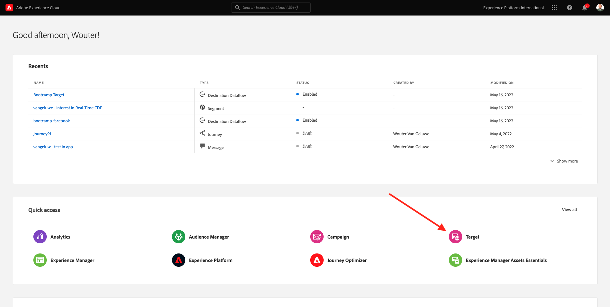

# 1.4 Action à effectuer : envoyez votre audience à Adobe Target

Accédez à [Adobe Experience Platform](https://experience.adobe.com/platform). Une fois connecté, vous accédez à la page d’accueil de Adobe Experience Platform.

Avant de continuer, vous devez sélectionner un **sandbox**. L’environnement de test à sélectionner est nommé ``Bootcamp``. Pour ce faire, cliquez sur le texte **[!UICONTROL Production Prod]** dans la ligne bleue en haut de votre écran. Après avoir sélectionné l’[!UICONTROL sandbox] approprié, vous verrez le changement d’écran et vous êtes désormais dans votre [!UICONTROL sandbox] dédié.

## 1.4.1 Activation de l’audience vers votre destination Adobe Target

Adobe Target est disponible en tant que destination depuis Real-Time CDP. Pour configurer votre intégration Adobe Target, accédez à **Destinations**, à **Catalogue**.

Cliquez sur **Personalization** dans le menu **Catégories** . Vous verrez ensuite la carte de destination **Adobe Target**. Cliquez sur **Activer les audiences**.

Sélectionnez la destination ``Bootcamp Target`` et cliquez sur **Suivant**.

Dans la liste des audiences disponibles, sélectionnez l&#39;audience que vous avez créée dans [1.3 Create an audience](./ex3.md), qui s&#39;appelle `yourLastName - Interest in Real-Time CDP`. Cliquez ensuite sur **Suivant**.

Sur la page suivante, cliquez sur **Suivant**.

Cliquez sur **Terminer**.

Votre audience est maintenant activée vers Adobe Target.

>[!IMPORTANT]
>
>Lorsque vous venez de créer votre destination Adobe Target dans Real-Time CDP, la mise en service de cette destination peut prendre jusqu’à une heure. Il s’agit d’un temps d’attente ponctuel, en raison de la configuration du serveur principal. Une fois la configuration initiale du temps d’attente d’une heure et du serveur principal terminée, les audiences Edge nouvellement ajoutées envoyées à la destination Adobe Target seront disponibles pour le ciblage en temps réel.

## 1.4.2 Configuration de votre activité Adobe Target basée sur les formulaires

Maintenant que votre audience Real-Time CDP est configurée pour être envoyée à Adobe Target, vous pouvez configurer votre activité de ciblage d’expérience dans Adobe Target. Dans cet exercice, vous allez configurer une activité basée sur le compositeur d’expérience visuelle.

Accédez à la page d’accueil de Adobe Experience Cloud en vous rendant sur [https://experiencecloud.adobe.com/](https://experiencecloud.adobe.com/). Cliquez sur **Target** pour l’ouvrir.

Sur la page d’accueil **Adobe Target**, vous verrez toutes les activités existantes.
Cliquez sur **+ Créer une activité** pour créer une activité.

Sélectionnez **Ciblage d’expérience**.

Sélectionnez **Visuel** et définissez l’ **URL d’activité** sur `https://bootcamp.aepdemo.net/content/aep-bootcamp-experience/language-masters/en/exercises/particpantXX.html`, mais avant cela, remplacez XX par un nombre compris entre 01 et 30.

>[!IMPORTANT]
>
>Chaque participant à l’activation doit utiliser une page web distincte pour éviter les collisions de différentes expériences Adobe Target. Vous pouvez sélectionner une page web et trouver l’URL en accédant à : [https://bootcamp.aepdemo.net/content/aep-bootcamp-experience/language-masters/en/exercises.html](https://bootcamp.aepdemo.net/content/aep-bootcamp-experience/language-masters/en/exercises.html).
>
>Les pages partagent toutes la même URL de base et se terminent par le nombre de participants.
>
>Par exemple, le participant 1 doit utiliser l’URL `https://bootcamp.aepdemo.net/content/aep-bootcamp-experience/language-masters/en/exercises/particpant01.html`, le participant 30 doit utiliser l’URL `https://bootcamp.aepdemo.net/content/aep-bootcamp-experience/language-masters/en/exercises/particpant30.html`.

Sélectionnez l’espace de travail **AT Bootcamp**.

Cliquez sur **Suivant**.

Vous êtes maintenant dans le compositeur d’expérience visuelle. Il peut s’écouler entre 20 et 30 secondes avant que le site web ne soit complètement chargé.

L’audience par défaut est actuellement **Tous les visiteurs**. Cliquez sur le **3 points** en regard de **Tous les visiteurs** et cliquez sur **Changer d’audience**.

La liste des audiences disponibles s’affiche désormais. L’audience Adobe Experience Platform que vous avez créée précédemment et envoyée à Adobe Target fait désormais partie de cette liste. Sélectionnez l’audience que vous avez précédemment créée dans Adobe Experience Platform. Cliquez sur **Attribuer une audience**.

Votre audience Adobe Experience Platform fait désormais partie de cette activité de ciblage d’expérience.

Avant de pouvoir modifier l’image principale, vous devez cliquer sur **Autoriser tout** sur la bannière de cookie.

Pour ce faire, accédez à **Browse**

Cliquez ensuite sur **Autoriser tout**.

Ensuite, revenez à **Composer**.

Changeons maintenant l&#39;image de héros sur la page d&#39;accueil du site web. Cliquez sur l’image principale par défaut du site web, cliquez sur **Remplacer le contenu**, puis sélectionnez **Image**.

Recherchez le fichier image **rtcdp.png**. Sélectionnez-le, puis cliquez sur **Enregistrer**.

Vous verrez ensuite la nouvelle expérience avec la nouvelle image, pour le public sélectionné.

Cliquez sur le titre de votre activité dans le coin supérieur gauche pour la renommer.

Pour le nom, veuillez utiliser :

- `yourLastName - RTCDP - XT (VEC)`

Cliquez sur **Suivant**.

Cliquez sur **Suivant**.

Sur la page **Objectifs et paramètres** - , accédez à **Mesures d’objectif**.

Définissez l’objectif Principal sur **Engagement** - **Temps passé sur le site**. Cliquez sur **Enregistrer et fermer**.

Vous vous trouvez maintenant sur la page **Aperçu de l’activité**. Vous devez toujours activer votre activité.

Cliquez sur le champ **Inactif** et sélectionnez **Activer**.

Vous obtiendrez alors une confirmation visuelle que votre activité est maintenant active.

Votre activité est maintenant en ligne et peut être testée sur le site web de bootcamp.

Si vous revenez maintenant à votre site web de démonstration et que vous consultez la page des produits pour **Real-Time CDP**, vous aurez immédiatement droit à l’audience que vous avez créée et l’activité Adobe Target s’affichera sur la page d’accueil en temps réel.

>[!IMPORTANT]
>
>Chaque participant à l’activation doit utiliser une page web distincte pour éviter les collisions de différentes expériences Adobe Target. Vous pouvez sélectionner une page web et trouver l’URL en accédant à : [https://bootcamp.aepdemo.net/content/aep-bootcamp-experience/language-masters/en/exercises.html](https://bootcamp.aepdemo.net/content/aep-bootcamp-experience/language-masters/en/exercises.html).
>
>Les pages partagent toutes la même URL de base et se terminent par le nombre de participants.
>
>Par exemple, le participant 1 doit utiliser l’URL `https://bootcamp.aepdemo.net/content/aep-bootcamp-experience/language-masters/en/exercises/particpant01.html`, le participant 30 doit utiliser l’URL `https://bootcamp.aepdemo.net/content/aep-bootcamp-experience/language-masters/en/exercises/particpant30.html`.

Étape suivante : [1.5 Take Action : envoyez votre audience à Facebook](./ex5.md)

[Retour au flux utilisateur 1](./uc1.md)

[Revenir à tous les modules](../../overview.md)
