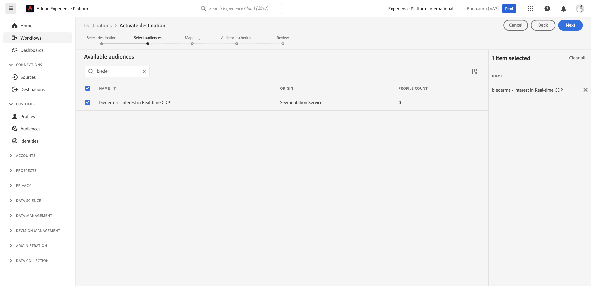
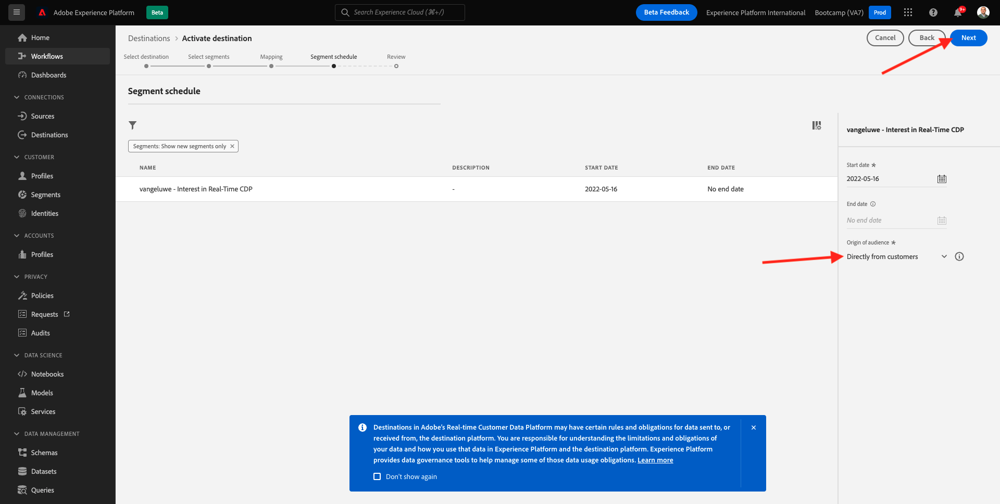

# 1.5 Agir : envoyer votre segment à Facebook ;

Accédez à [Adobe Experience Platform](https://experience.adobe.com/platform). Une fois connecté, vous accédez à la page d’accueil de Adobe Experience Platform.

Avant de continuer, vous devez sélectionner une **sandbox**. L’environnement de test à sélectionner est nommé ``Bootcamp``. Pour ce faire, cliquez sur le texte **[!UICONTROL Production Prod]** dans la ligne bleue en haut de votre écran. Après avoir sélectionné le [!UICONTROL sandbox], vous verrez le changement d’écran et vous êtes maintenant dans votre [!UICONTROL sandbox].

Dans le menu de gauche, accédez à **Destinations**, puis accédez à **Catalogue**. Vous verrez alors le **Catalogue des destinations**. Dans **Destinations**, cliquez sur **Activation des segments** sur le **Audience personnalisée facebook** carte.

Sélectionner la destination **bootcamp-facebook** et cliquez sur **Suivant**.

Dans la liste des segments disponibles, sélectionnez le segment que vous avez créé lors de l’exercice précédent. Cliquez sur **Suivant**.

Sur le **Mappage** , assurez-vous que la variable **Appliquer la transformation** est activée. Cliquez sur **Suivant**.

Sur le **Planification des segments** , sélectionnez **Origine de votre audience** et définissez-le sur **Directement des clients**. Cliquez sur **Suivant**.

Enfin, le **Réviser** page, cliquez sur **Terminer**.

Votre segment est maintenant lié aux audiences personnalisées Facebook. Chaque fois qu’un client est admissible pour ce segment, un signal est envoyé côté serveur à Facebook pour inclure ce client dans l’audience personnalisée côté Facebook.

Dans Facebook, vous trouverez votre segment de Adobe Experience Platform sous Audiences personnalisées :

Vous pouvez maintenant voir votre audience personnalisée apparaître dans Facebook :

[Retour au flux utilisateur 1](./uc1.md)

[Revenir à tous les modules](../../overview.md)
