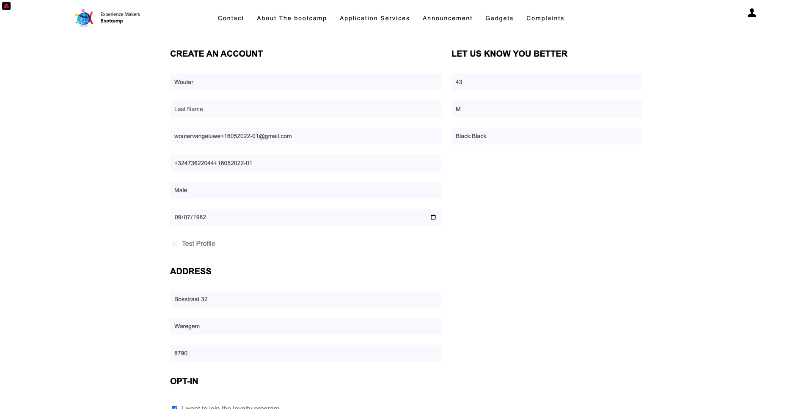

# 2.1 Visitez le site web et créez votre compte

## Contexte

Le parcours de l’inconnu au connu est l’un des sujets les plus importants parmi les marques de nos jours, tout comme le parcours client de l’acquisition à la rétention.

Adobe Experience Platform joue un rôle énorme dans ce parcours. Platform est le cerveau de la communication, le **système d&#39;enregistrement d&#39;expérience**.

Platform est un environnement dans lequel le mot client est plus large que les clients connus. Un visiteur inconnu du site web est également un client du point de vue de Platform et, en tant que tel, tout le comportement en tant que visiteur inconnu est également envoyé à Platform. Grâce à cette approche, lorsque ce visiteur devient finalement un client connu, une marque peut également visualiser ce qui s’est produit avant ce moment. Cela s’avère utile du point de vue de l’attribution et de l’optimisation de l’expérience.

## Flux de parcours client

Accédez à [https://bootcamp.aepdemo.net](https://bootcamp.aepdemo.net). Cliquez sur **Autoriser tout**. En fonction du comportement de navigation dans le flux utilisateur précédent, vous verrez la personnalisation se produire sur la page d’accueil du site web.

Cliquez sur l’icône représentant un logo d’Adobe dans le coin supérieur gauche de votre écran pour ouvrir la visionneuse de profils. Consultez le panneau Visionneuse de profils et Real-time Customer Profile avec l’**identifiant Experience Cloud** comme identifiant principal pour ce client actuellement inconnu.

Vous pouvez également voir tous les événements d’expérience collectés en fonction du comportement du client.

Cliquez sur l’icône **Profil** dans le coin supérieur droit de votre écran.

Cliquez sur **Créer un compte**.

Renseignez tous les champs du formulaire. Utilisez une valeur réelle pour l’adresse email et le numéro de téléphone, car elle sera utilisée dans les exercices ultérieurs pour la diffusion des emails et des SMS.

Faites défiler l’écran vers le bas et cliquez sur **Enregistrer**.

Vous verrez alors ceci.

Vous recevrez également cet e-mail :

Et quelques minutes plus tard, vous recevrez aussi cet email :

Voyons comment ce parcours d’intégration a été configuré ensuite.

Étape suivante : [2.2 Créez votre événement](./ex2.md)

[Retour au flux utilisateur 2](./uc2.md)

[Revenir à tous les modules](../../overview.md)
