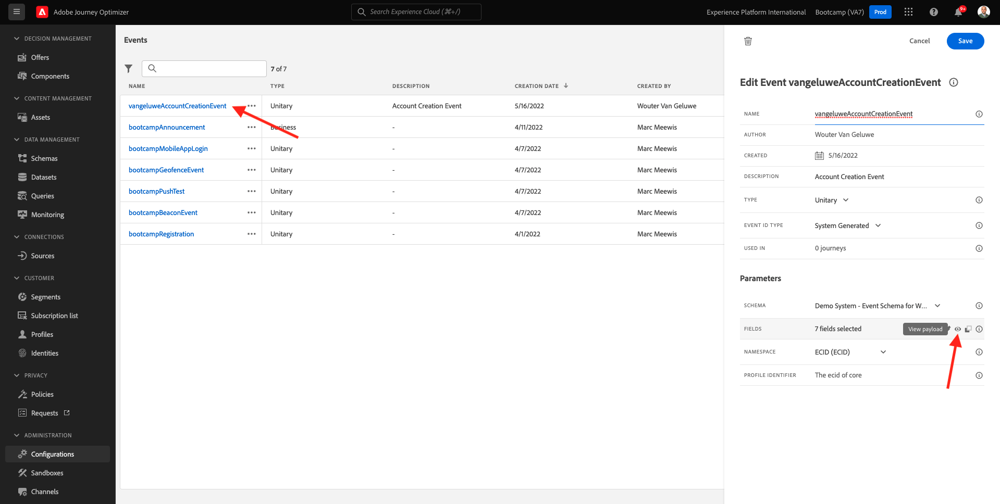

# 2.2 Créer votre événement

Connectez-vous à Adobe Journey Optimizer en accédant à [Adobe Experience Cloud](https://experience.adobe.com). Cliquez sur **Journey Optimizer**.

Vous serez redirigé vers le **Accueil**  dans Journey Optimizer. Tout d’abord, assurez-vous d’utiliser l’environnement de test approprié. L’environnement de test à utiliser est appelé `Bootcamp`. Pour passer d’un environnement de test à un autre, cliquez sur **Prod** et sélectionnez l’environnement de test dans la liste. Dans cet exemple, l’environnement de test est nommé **Bootcamp**. Vous serez alors dans le **Accueil** affichage de votre environnement de test `Bootcamp`.

Dans le menu de gauche, faites défiler l’écran vers le bas et cliquez sur **Configurations**. Cliquez ensuite sur le **Gérer** sous **Événements**.

Vous verrez ensuite un aperçu de tous les événements disponibles. Cliquez sur **Créer un événement** pour commencer à créer votre propre événement.

Une nouvelle fenêtre d’événement vide s’affiche alors.

Tout d’abord, attribuez un nom à votre événement comme suit : `yourLastNameAccountCreationEvent` et ajoutez une description comme celle-ci `Account Creation Event`.

Ensuite, assurez-vous que la variable **Type** est défini sur **Unitaire**, et pour le **Type d’identifiant d’événement** sélection, sélectionnez **Généré par le système**.

La sélection de schéma suivante s’affiche. Un schéma a été préparé pour cet exercice. Veuillez utiliser le schéma `Demo System - Event Schema for Website (Global v1.1) v.1`.

Après avoir sélectionné le schéma, plusieurs champs sont sélectionnés dans la variable **Champs** . Vous devez maintenant pointer sur le **Champs** et 3 icônes s’affichent. Cliquez sur le bouton **Modifier** icône .

Vous verrez une **Champs** fenêtre contextuelle dans laquelle vous devez sélectionner certains des champs dont nous avons besoin pour personnaliser l&#39;email.  Nous choisirons d’autres attributs de profil ultérieurement, en utilisant les données déjà présentes dans Adobe Experience Platform.

Dans l’objet `_experienceplatform.demoEnvironment`, veillez à sélectionner les champs **brandLogo** et **brandName**.

Dans l’objet `_experienceplatform.identification.core`, veillez à sélectionner le champ . **email**.

Cliquez sur **Ok** pour enregistrer vos modifications.

Vous devriez alors voir ceci. Cliquez sur **Enregistrer** une fois de plus pour enregistrer vos modifications.

Votre événement est maintenant configuré et enregistré.

Cliquez à nouveau sur l’événement pour ouvrir la **Modifier l’événement** à nouveau. Survol **Champs** pour afficher à nouveau les 3 icônes. Cliquez sur le bouton **Afficher la charge utile** icône .

Vous verrez maintenant un exemple de la charge utile attendue.
Votre événement comporte un eventID d’orchestration unique, que vous pouvez trouver en faisant défiler la page vers le bas dans cette payload jusqu’à ce que vous voyiez `_experience.campaign.orchestration.eventID`.

L’identifiant d’événement est ce qui doit être envoyé à Adobe Experience Platform pour déclencher le parcours que vous allez créer dans l’un des exercices suivants. Mémorisez cet eventID, car vous en aurez peut-être besoin plus tard.
`"eventID": "19cab7852cdef99d25b6d5f1b6503da39d1f486b1d585743f97ed2d1e6b6c74f"`

Cliquez sur **Ok**, puis cliquez sur **Annuler**.

Vous avez maintenant terminé cet exercice.

Étape suivante : [2.3 Créer votre email](./ex3.md)

[Retour au flux utilisateur 2](./uc2.md)

[Revenir à tous les modules](../../overview.md)
