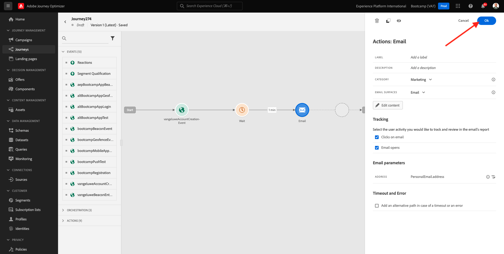

# 2.3 Création de votre parcours et de votre message électronique

Dans cet exercice, vous allez configurer le parcours qui doit être déclenché lorsqu’une personne crée un compte sur le site web de démonstration.

Connectez-vous à Adobe Journey Optimizer en accédant à [Adobe Experience Cloud](https://experience.adobe.com). Cliquez sur **Journey Optimizer**.

Vous serez redirigé vers le **Accueil**  dans Journey Optimizer. Tout d’abord, assurez-vous d’utiliser l’environnement de test approprié. L’environnement de test à utiliser est appelé `Bootcamp`. Pour passer d’un environnement de test à un autre, cliquez sur **Prod** et sélectionnez l’environnement de test dans la liste. Dans cet exemple, l’environnement de test est nommé **Bootcamp**. Vous serez alors dans le **Accueil** affichage de votre environnement de test `Bootcamp`.

## 2.3.1 Création de votre parcours

Dans le menu de gauche, cliquez sur **Parcours**. Cliquez ensuite sur **Créer un Parcours** pour créer un parcours.

Vous verrez alors un écran de parcours vide.

Dans l’exercice précédent, vous avez créé une **Événement**. Vous l’avez appelé comme suit : `yourLastNameAccountCreationEvent` et remplacé `yourLastName` par votre nom de famille. Il s’agit du résultat de la création de l’événement :

Vous devez maintenant considérer cet événement comme le début de ce Parcours. Pour ce faire, accédez au côté gauche de l’écran et recherchez votre événement dans la liste des événements.

Sélectionnez votre événement, faites-le glisser et déposez-le sur le canevas de Parcours. Votre Parcours ressemble maintenant à ceci :

Pour la deuxième étape du parcours, vous devez ajouter une **Attente** étape . Accédez au côté gauche de l’écran au **Orchestration** pour le trouver. Vous utiliserez les attributs de profil et devez vous assurer qu’ils sont renseignés dans le profil client en temps réel.

Votre parcours ressemble maintenant à ceci. Dans la partie droite de l’écran, vous devez configurer le temps d’attente. Définissez-le sur 1 minute. Cela donnera beaucoup de temps aux attributs de profil qui seront disponibles après le déclenchement de l’événement.

Cliquez sur **Ok** pour enregistrer vos modifications.

Pour la troisième étape du parcours, vous devez ajouter une **Email** action. Accédez au côté gauche de l’écran pour **Actions**, sélectionnez la variable **Email** puis faites-la glisser sur le deuxième noeud de votre parcours. Vous voyez maintenant ceci.

Définissez la variable **Catégorie** to **Marketing** et sélectionnez une surface d&#39;email permettant d&#39;envoyer des emails. Dans ce cas, la surface de l&#39;email à sélectionner est **Email**. Assurez-vous que les cases à cocher de **Clics sur l&#39;email** et **ouvertures de courrier électronique** sont toutes deux activées.

L’étape suivante consiste à créer votre message. Pour ce faire, cliquez sur **Modifier le contenu**.

## 2.3.2 Création de votre message

Pour créer votre message, cliquez sur **Modifier le contenu**.

Vous voyez maintenant ceci.

Cliquez sur le bouton **Objet** Champ de texte.

Dans la zone de texte, commencez à écrire. **Bonjour**

L’objet n’est pas encore terminé. Vous devez ensuite importer le jeton de personnalisation pour le champ. **Prénom** qui est stocké sous `profile.person.name.firstName`. Dans le menu de gauche, faites défiler l’écran vers le bas pour trouver le **Personne** et cliquez sur la flèche pour aller plus loin.

Maintenant, trouvez la variable **Nom complet** et cliquez sur la flèche pour aller plus loin.

Enfin, recherchez la **Prénom** et cliquez sur le champ **+** signe à côté. Le jeton de personnalisation apparaît alors dans le champ de texte.

Ajoutez ensuite le texte. **, merci de vous être inscrit !**. Cliquez sur **Enregistrer**.

Vous serez alors de retour ici. Cliquez sur **Concepteur d&#39;email** pour créer le contenu de l&#39;email.

Dans l’écran suivant, vous serez invité à utiliser 3 méthodes différentes pour fournir le contenu de l’email :

- **Conception à partir de zéro**: Commencez par un canevas vierge et utilisez l’éditeur WYSIWYG pour faire glisser et déposer la structure et les composants de contenu afin de créer visuellement le contenu de l’email.
- **Codez vos propres**: Créez votre propre modèle d&#39;email en le codant à l&#39;aide de HTML
- **HTML d’importation**: Importez un modèle de HTML existant que vous pourrez éditer.

Cliquez sur **HTML d’importation**. Vous pouvez également cliquer sur **Modèles enregistrés** et sélectionnez le modèle. **Bootcamp - Modèle de courrier électronique**.

Si vous avez sélectionné **HTML d’importation**, vous pouvez désormais faire glisser et déposer le fichier. **mailtemplatebootcamp.html**, que vous pouvez télécharger [here](../../assets/html/mailtemplatebootcamp.html.zip). Cliquez sur Importer.

Ce modèle d’email par défaut s’affiche alors :

Personnalisons l&#39;email. Cliquez sur en regard du texte. **Bonjour** puis cliquez sur le bouton **Ajouter une personnalisation** icône .

Ensuite, vous devez apporter le **Prénom** jeton de personnalisation stocké sous `profile.person.name.firstName`. Dans le menu, recherchez le **Personne** élément, accédez au **Nom complet** , puis cliquez sur le bouton **+** pour ajouter le champ Prénom à l’éditeur d’expression.

Cliquez sur **Enregistrer**.

Vous remarquerez maintenant comment le champ de personnalisation a été ajouté à votre texte.

Cliquez sur **Enregistrer** pour enregistrer votre message.

Revenez au tableau de bord du message en cliquant sur le bouton **flèche** en regard du texte de l’objet dans le coin supérieur gauche.

Vous avez maintenant terminé de créer votre email d’enregistrement. Cliquez sur la flèche dans le coin supérieur gauche pour revenir à votre parcours.

Cliquez sur **OK**.

## 2.3.3 Publication du parcours

Vous devez toujours donner un nom à votre parcours. Pour ce faire, cliquez sur le bouton **Propriétés** en haut à droite de l’écran.

Vous pouvez ensuite y saisir le nom du parcours. Veuillez utiliser `yourLastName - Account Creation Journey`. Cliquez sur **OK** pour enregistrer vos modifications.

Vous pouvez maintenant publier votre parcours en cliquant sur **Publier**.

Cliquez sur **Publier** encore une fois.

Une barre de confirmation verte s’affiche alors, indiquant que votre parcours est désormais Publié.

Vous avez maintenant terminé cet exercice.

Étape suivante : [2.4 Test de votre parcours](./ex4.md)

[Retour au flux utilisateur 2](./uc2.md)

[Revenir à tous les modules](../../overview.md)