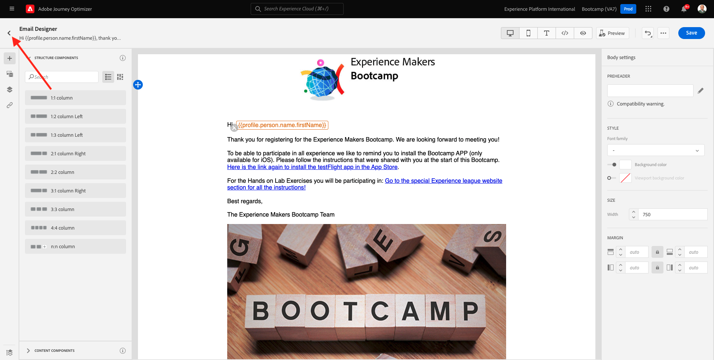
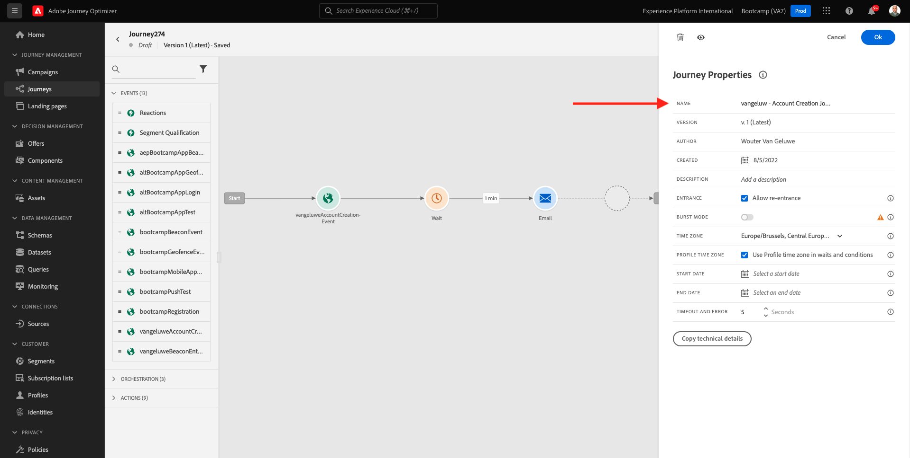

# 2.3 Création de votre parcours et de votre email

Dans cet exercice, vous allez configurer le parcours qui doit être déclenché lorsqu’une personne crée un compte sur le site web de démonstration.

Connectez-vous à Adobe Journey Optimizer en vous rendant à [Adobe Experience Cloud](https://experience.adobe.com?lang=fr). Cliquez sur **Journey Optimizer**.

Vous serez redirigé vers la vue **Home** dans Journey Optimizer. Tout d’abord, assurez-vous d’utiliser l’environnement de test approprié. L’environnement de test à utiliser s’appelle `Bootcamp`. Pour passer d’un environnement de test à un autre, cliquez sur **Prod** et sélectionnez l’environnement de test dans la liste. Dans cet exemple, l’environnement de test est appelé **Bootcamp**. Vous serez alors dans la vue **Home** de votre environnement de test `Bootcamp`.

## 2.3.1 Création de votre parcours

Dans le menu de gauche, cliquez sur **Parcours**. Cliquez ensuite sur **Créer un Parcours** pour créer un parcours.

Vous verrez alors un écran de parcours vide.

Dans l’exercice précédent, vous avez créé un **événement**. Vous l&#39;avez appelé comme suit `yourLastNameAccountCreationEvent` et remplacé `yourLastName` par votre nom de famille. Il s’agit du résultat de la création de l’événement :

Vous devez maintenant considérer cet événement comme le début de ce Parcours. Pour ce faire, accédez au côté gauche de l’écran et recherchez votre événement dans la liste des événements.

Sélectionnez votre événement, faites-le glisser et déposez-le sur le canevas de Parcours. Votre Parcours ressemble maintenant à ceci :

Pour la deuxième étape du parcours, vous devez ajouter une étape **Wait** courte. Accédez à la section **Orchestration** sur le côté gauche de votre écran pour trouver ceci. Vous utiliserez les attributs de profil et devez vous assurer qu’ils sont renseignés dans le profil client en temps réel.

Votre parcours ressemble maintenant à ceci. Dans la partie droite de l’écran, vous devez configurer le temps d’attente. Définissez-le sur 1 minute. Cela donnera beaucoup de temps aux attributs de profil qui seront disponibles après le déclenchement de l’événement.

Cliquez sur **Ok** pour enregistrer vos modifications.

Comme troisième étape du parcours, vous devez ajouter une action **Email**. Accédez au côté gauche de votre écran à **Actions**, sélectionnez l’action **Email**, puis faites-la glisser sur le deuxième noeud de votre parcours. Vous voyez maintenant ceci.

Définissez la **catégorie** sur **Marketing** et sélectionnez une surface d&#39;email qui vous permet d&#39;envoyer des emails. Dans ce cas, la surface de l&#39;email à sélectionner est **Email**. Assurez-vous que les cases à cocher des **clics sur l’email** et des **ouvertures d’email** sont toutes deux activées.

L’étape suivante consiste à créer votre message. Pour ce faire, cliquez sur **Modifier le contenu**.

## 2.3.2 Création de votre message

Pour créer votre message, cliquez sur **Modifier le contenu**.

Vous voyez maintenant ceci.

Cliquez sur le champ de texte **Objet** .

Dans la zone de texte, commencez à écrire **Hi**

L’objet n’est pas encore terminé. Vous devez ensuite importer le jeton de personnalisation pour le champ **Prénom** stocké sous `profile.person.name.firstName`. Dans le menu de gauche, faites défiler l’écran vers le bas pour trouver l’élément **Person** et cliquez sur la flèche pour aller plus loin.

Recherchez maintenant l’élément **Nom complet** et cliquez sur la flèche pour aller plus loin.

Enfin, recherchez le champ **Prénom** et cliquez sur le signe **+** situé à côté. Le jeton de personnalisation apparaît alors dans le champ de texte.

Ajoutez ensuite le texte **, merci de vous être inscrit !**. Cliquez sur **Enregistrer**.

Vous serez alors de retour ici. Cliquez sur **Email Designer** pour créer le contenu de l’email.

Dans l’écran suivant, vous serez invité à utiliser 3 méthodes différentes pour fournir le contenu de l’email :

- **Conception à partir de zéro** : commencez par un canevas vierge et utilisez l’éditeur WYSIWYG pour faire glisser et déposer la structure et les composants de contenu afin de créer visuellement le contenu de l’email.
- **Codez votre propre** : créez votre propre modèle d&#39;email en le codant à l&#39;aide de HTML
- **Importer un HTML** : importez un modèle d’HTML existant que vous pourrez modifier.

Cliquez sur **Importer l’HTML**. Vous pouvez également cliquer sur **Modèles enregistrés** et sélectionner le modèle **Bootcamp - Modèle de courrier électronique**.

Si vous avez sélectionné **Importer l&#39;HTML**, vous pouvez désormais faire glisser et déposer le fichier **mailtemplatebootcamp.html**, que vous pouvez télécharger [ici](../../assets/html/mailtemplatebootcamp.html.zip). Cliquez sur Importer.

Ce modèle d’email par défaut s’affiche alors :

Personnalisons l&#39;email. Cliquez sur en regard du texte **Hi** et cliquez sur l’icône **Ajouter Personalization** .

Ensuite, vous devez importer le jeton de personnalisation **Prénom** stocké sous `profile.person.name.firstName`. Dans le menu, recherchez l’élément **Person** , recherchez l’élément **Full Name** , puis cliquez sur l’icône **+** pour ajouter le champ First Name à l’éditeur d’expression.

Cliquez sur **Enregistrer**.

Vous remarquerez maintenant comment le champ de personnalisation a été ajouté à votre texte.

Cliquez sur **Enregistrer** pour enregistrer votre message.

Revenez au tableau de bord des messages en cliquant sur la **flèche** en regard de l’objet du texte dans le coin supérieur gauche.

Vous avez maintenant terminé de créer votre email d’enregistrement. Cliquez sur la flèche dans le coin supérieur gauche pour revenir à votre parcours.

Cliquez sur **OK**.

## 2.3.3 Publish de votre parcours

Vous devez toujours donner un nom à votre parcours. Pour ce faire, cliquez sur l’icône **Crayon** dans le coin supérieur gauche de votre écran.

Vous pouvez ensuite y saisir le nom du parcours. Veuillez utiliser `yourLastName - Account Creation Journey`. Cliquez sur **OK** pour enregistrer vos modifications.

Vous pouvez maintenant publier votre parcours en cliquant sur **Publish**.

Cliquez de nouveau sur **Publish**.

Une barre de confirmation verte s’affiche alors, indiquant que votre parcours est désormais Publié.

Vous avez maintenant terminé cet exercice.

Étape suivante : [2.4 Test de votre parcours](./ex4.md)

[Retour au flux utilisateur 2](./uc2.md)

[Revenir à tous les modules](../../overview.md)