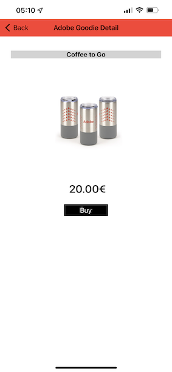

# 2.5 Installation et utilisation de l’application mobile

## Installation de l’application mobile

Avant d’installer l’application, vous devez activer le **suivi** sur votre appareil iOS. Pour ce faire, accédez à **Settings** > **Privacy &amp; Security** > **Tracking** et assurez-vous que l’option **Allow Apps to Request to Track** (Autoriser les applications à demander le suivi).

Accédez à Apple App Store et recherchez `aepmobile-bootcamp`. Cliquez sur **Installer** ou **Télécharger**.

Une fois l’application installée, cliquez sur **Ouvrir**.

Cliquez sur **OK**.

Cliquez sur **Autoriser**.

Cliquez sur **J&#39;accepte**.

Cliquez sur **Autoriser lors de l’utilisation de l’application**.

Cliquez sur **Autoriser**.

Vous êtes maintenant dans l’application, sur la page d’accueil, prêt à passer par le parcours client.

## Flux de parcours client

Tout d&#39;abord, vous devez vous connecter. Cliquez sur **Login**.

Après avoir créé votre compte dans les exercices précédents, vous l’avez vu sur le site web. Vous devez maintenant réutiliser l’adresse électronique du compte que vous avez créé dans l’application pour vous connecter.

Entrez l’adresse électronique que vous avez utilisée sur le site web ici et cliquez sur **Connexion**.

Vous obtiendrez alors une confirmation de connexion et vous recevrez une notification push.

Revenez à la page d’accueil de l’application et d’autres fonctionnalités s’affichent.

Accédez à **Products**. Cliquez sur n&#39;importe quel produit, dans cet exemple **Café à consommer}.**

Vous verrez la page produit **Café to go** dans l’application. Cliquez sur **Acheter**.

Vous avez maintenant terminé cet exercice et vous êtes prêt pour les exercices suivants.

Étape suivante : [2.6 Personalization dans le centre d’appels](./ex6.md)

[Retour au flux utilisateur 2](./uc2.md)

[Revenir à tous les modules](../../overview.md)
