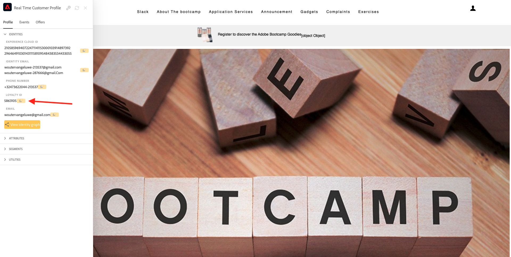
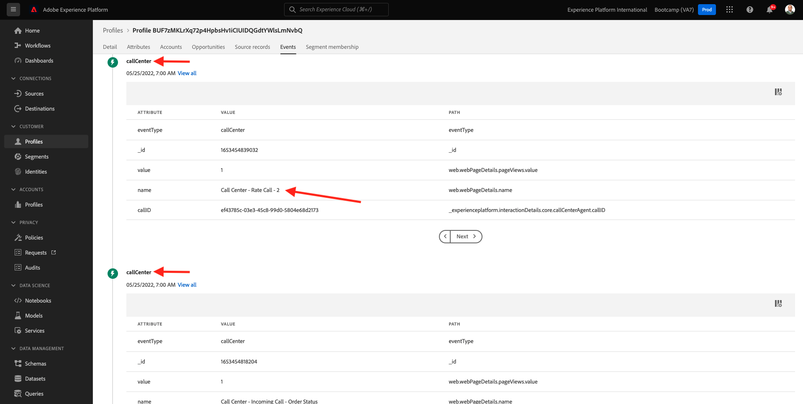

# 2.6 Personalization dans le centre d’appels

Comme nous l’avons déjà mentionné plusieurs fois au cours du bootcamp, personnaliser l’expérience client est quelque chose qui devrait se produire de manière omnicanale. Un centre d’appel est souvent très déconnecté du reste du parcours client, ce qui entraîne souvent des expériences client frustrantes, mais cela n’a pas besoin d’être le cas. Voici un exemple de la manière dont le centre d’appel peut facilement être connecté à Adobe Experience Platform, en temps réel.

## Flux de Parcours client

Dans l’exercice précédent, à l’aide de l’application mobile, vous avez acheté un produit en cliquant sur le bouton **Buy** .

Supposons que vous ayez une question sur l’état de votre commande, que feriez-vous ? En règle générale, vous appelez le centre d’appel.

Avant d’appeler le centre d’appels, vous devez connaître votre **identifiant de fidélité**. Votre identifiant de fidélité est accessible dans la visionneuse de profils du site web.

Dans ce cas, le **Loyalty ID** est **5863105**. Dans le cadre de notre implémentation personnalisée de la fonctionnalité du centre d’appels dans l’environnement de démonstration, vous devez ajouter un préfixe à votre **identifiant de fidélité**. Le préfixe est **11373**. Par conséquent, l’identifiant de fidélité à utiliser dans cet exemple est **11373 5863105**.

Faisons ça maintenant. Utilisez votre téléphone et appelez le numéro **+1 (323) 745-1670**.

Vous serez invité à saisir votre identifiant de fidélité, suivi de **#**. Saisissez votre identifiant de fidélité.

Vous entendrez alors **Bonjour, prénom**. Ce prénom provient de Real-time Customer Profile dans Adobe Experience Platform. Vous avez alors 3 choix. Numéro de presse **1**, **État de la commande**.

Après avoir entendu l’état de votre commande, vous aurez le choix d’appuyer sur **1** pour revenir au menu principal, sinon appuyez sur 2. Appuyez sur **2**.

Vous serez alors invité à évaluer l’expérience de votre centre d’appels en sélectionnant un nombre compris entre 1 et 5, 1 étant faible et 5 étant élevé. Faites votre choix.

Votre appel au centre d’appel se termine maintenant.

Accédez à [Adobe Experience Platform](https://experience.adobe.com/platform). Une fois connecté, vous accédez à la page d’accueil de Adobe Experience Platform.

Avant de continuer, vous devez sélectionner un **sandbox**. L’environnement de test à sélectionner est nommé ``Bootcamp``. Pour ce faire, cliquez sur le texte **[!UICONTROL Production Prod]** dans la ligne bleue en haut de votre écran. Après avoir sélectionné l’[!UICONTROL sandbox] approprié, vous verrez le changement d’écran et vous êtes désormais dans votre [!UICONTROL sandbox] dédié.

Dans le menu de gauche, accédez à **Profils** et à **Parcourir**.

Sélectionnez l&#39;**espace de noms d&#39;identité** **Email** et saisissez l&#39;adresse électronique de votre profil client. Cliquez sur **Afficher**. Cliquez sur pour ouvrir votre profil.

Vous verrez à nouveau votre profil client. Accédez à **Events**.

Sous events, vous verrez 2 événements avec un eventType de **callCenter**. Le premier événement est le résultat de votre réponse à la question **Évaluez votre satisfaction d’appel**.

Faites défiler l’écran vers le bas un peu et vous verrez l’événement qui a été enregistré lorsque vous avez sélectionné l’option permettant de vérifier votre **État de la commande**.

Accédez à **Appartenance au segment**. Vous verrez maintenant que 2 segments répondent aux critères de votre profil, en temps réel, en fonction des interactions que vous avez eues via le centre d’appels. Ces appartenances aux segments peuvent et doivent ensuite être utilisées pour influer sur les communications et la personnalisation qui se produisent sur n’importe quel autre canal.

Vous avez maintenant terminé cet exercice.

[Retour au flux utilisateur 2](./uc2.md)

[Revenir à tous les modules](../../overview.md)
