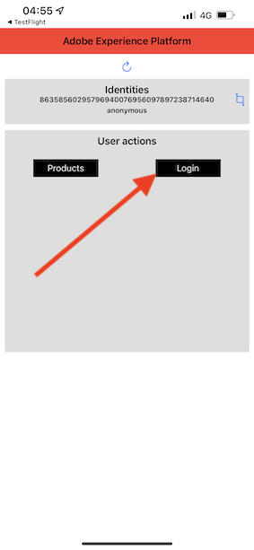

# 3.1 Utilisation de l’application mobile et déclenchement d’une entrée de balise

## Installation de l’application mobile

Avant d’installer l’application, vous devez activer **Tracking** sur votre appareil iOS. Pour ce faire, accédez à **Paramètres** > **Confidentialité et sécurité** > **Tracking** et assurez-vous que l’option **Autoriser les applications à demander pour effectuer le suivi**.

Accédez à Apple App Store et recherchez `aepmobile-bootcamp`. Cliquez sur **Installer** ou **Télécharger**.

Une fois l’application installée, cliquez sur **Ouvrir**.

Cliquez sur **OK**.

Cliquez sur **Autoriser**.

Cliquez sur **Je suis d&#39;accord.**.

Cliquez sur **Autoriser lors de l’utilisation de l’application**.

Cliquez sur **Autoriser**.

Vous êtes maintenant dans l’application, sur la page d’accueil, prêt à passer par le parcours client.

## Flux de parcours client

Tout d&#39;abord, vous devez vous connecter. Cliquez sur **Ouverture de session**.

Après avoir créé votre compte dans les exercices précédents, vous l’avez vu sur le site web. Vous devez maintenant réutiliser l’adresse électronique du compte que vous avez créé dans l’application pour vous connecter.

Saisissez ici l&#39;adresse email que vous avez utilisée sur le site web et cliquez sur **Connexion**.

Vous obtiendrez alors une confirmation de connexion et vous recevrez une notification push.

Revenez à la page d’accueil de l’application et d’autres fonctionnalités s’affichent.

Tout d’abord, accédez à **Produits**. Cliquez sur n’importe quel produit, dans cet exemple **Café à emporter**.

Vous verrez le **Café à emporter** page produit dans l’application.

Vous allez maintenant simuler un événement d’entrée de balise dans un emplacement de magasin hors ligne. L’objectif de la simulation est de personnaliser l’expérience client sur les écrans du magasin. Pour visualiser l’expérience en magasin, une page a été créée afin d’afficher dynamiquement les informations pertinentes pour le client qui vient d’entrer dans le magasin.

Avant de poursuivre, ouvrez cette page web sur votre ordinateur : [https://bootcamp.aepdemo.net/content/aep-bootcamp-experience/language-masters/en/screen.html](https://bootcamp.aepdemo.net/content/aep-bootcamp-experience/language-masters/en/screen.html)

Vous verrez alors :

Ensuite, revenez à la page d’accueil. Cliquez sur le bouton **beacon** icône .

Vous verrez alors ceci. Tout d’abord, sélectionnez **Balise d’écran Bootcamp** puis cliquez sur le bouton **entrée** bouton . Vous pourrez ainsi simuler une entrée de balise.

Maintenant, regardez l&#39;écran du magasin. Le dernier produit que vous avez consulté s’affiche dans les 5 secondes qui suivent.

Ensuite, revenez à **Produits**. Cliquez sur n’importe quel produit, dans cet exemple **Plage Tan**.

Ensuite, revenez à la page d’accueil. Cliquez sur le bouton **beacon** icône .

Vous verrez alors ceci. Tout d’abord, sélectionnez **Balise d’écran Bootcamp** puis cliquez sur le bouton **entrée** à nouveau. Vous pourrez ainsi simuler une entrée de balise.

Maintenant, regardez de nouveau l&#39;écran en magasin. Le dernier produit que vous avez consulté s’affiche dans les 5 secondes qui suivent.

Jetons également un coup d’oeil à votre Visionneuse de profils sur le site web. De nombreux événements y ont été ajoutés, simplement pour montrer que toute interaction avec un client est collectée et stockée dans Adobe Experience Platform.

Dans les exercices suivants, vous allez configurer et tester votre propre parcours d’entrée de balise.

Étape suivante : [3.2 Création de votre événement](./ex2.md)

[Retour au flux utilisateur 3](./uc3.md)

[Revenir à tous les modules](../../overview.md)
