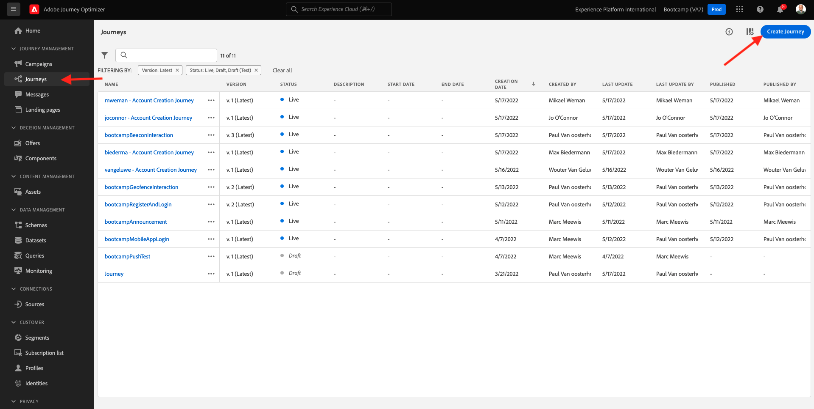
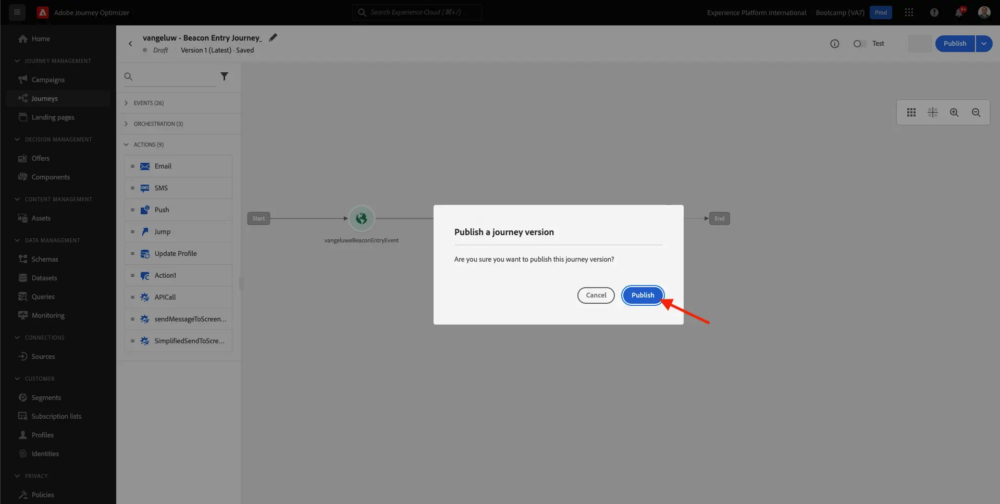

# 3.3 Création de votre parcours et de votre notification push

Dans cet exercice, vous allez configurer le parcours et le message qui doivent être déclenchés lorsqu’une personne entre dans une balise à l’aide de l’application mobile.

Connectez-vous à Adobe Journey Optimizer en vous rendant à [Adobe Experience Cloud](https://experience.adobe.com?lang=fr). Cliquez sur **Journey Optimizer**.

Vous serez redirigé vers la vue **Home** dans Journey Optimizer. Tout d’abord, assurez-vous d’utiliser l’environnement de test approprié. L’environnement de test à utiliser s’appelle `Bootcamp`. Pour passer d’un environnement de test à un autre, cliquez sur **Prod** et sélectionnez l’environnement de test dans la liste. Dans cet exemple, l’environnement de test est appelé **Bootcamp**. Vous serez alors dans la vue **Home** de votre environnement de test `Bootcamp`.

## 3.3.1 Création de votre parcours

Dans le menu de gauche, cliquez sur **Parcours**. Cliquez ensuite sur **Créer un Parcours** pour créer un parcours.

Vous verrez alors un écran de parcours vide.

Dans l’exercice précédent, vous avez créé un **événement**. Vous l&#39;avez appelé comme suit `yourLastNameBeaconEntryEvent` et remplacé `yourLastName` par votre nom de famille. Il s’agit du résultat de la création de l’événement :

Vous devez maintenant considérer cet événement comme le début de ce Parcours. Pour ce faire, accédez au côté gauche de l’écran et recherchez votre événement dans la liste des événements.

Sélectionnez votre événement, faites-le glisser et déposez-le sur le canevas de parcours. Votre parcours ressemble maintenant à ceci. Cliquez sur **Ok** pour enregistrer vos modifications.

Pour la deuxième étape du parcours, vous devez ajouter une action **Push**. Accédez au côté gauche de votre écran à **Actions**, sélectionnez l’action **Push**, puis faites-la glisser sur le deuxième noeud de votre parcours.

Sur le côté droit de l’écran, vous devez maintenant créer votre notification push.

Définissez la **catégorie** sur **Marketing** et sélectionnez une surface push qui vous permet d’envoyer des notifications push. Dans ce cas, la surface push à sélectionner est **mmeeewis-app-mobile-bootcamp**.

## 3.3.2 Création de votre message

Cliquez sur **Modifier le contenu**.

Vous verrez alors :

Définissons le contenu de la notification push.

Cliquez sur le champ de texte **Titre** .

Dans la zone de texte, commencez à écrire **Hi**. Cliquez sur l&#39;icône de personnalisation.

Vous devez maintenant importer le jeton de personnalisation pour le champ **Prénom** qui est stocké sous `profile.person.name.firstName`. Dans le menu de gauche, sélectionnez **Attributs de profil**, faites défiler l’écran vers le bas/accédez à l’élément **Personne** et cliquez sur la flèche pour aller plus loin jusqu’à atteindre le champ `profile.person.name.firstName`. Cliquez sur l’icône **+** pour ajouter le champ à la zone de travail. Cliquez sur **Enregistrer**.

Vous serez alors de retour ici. Cliquez sur l’icône de personnalisation en regard du champ **Body**.

Dans la zone de texte, écrivez `Welcome at the `.

Cliquez ensuite sur **Attributs contextuels**, puis sur **Journey Orchestration**.

Cliquez sur **Events**.

Cliquez sur le nom de votre événement, qui doit ressembler à ceci : **yourLastNameBeaconEntryEvent**.

Cliquez sur **Placer le contexte**.

Cliquez sur **Interaction POI**.

Cliquez sur **Détails du point ciblé**.

Cliquez sur l’icône **+** sur **Nom du point ciblé**.
Vous verrez alors ceci. Cliquez sur **Enregistrer**.

Votre message est maintenant prêt. Cliquez sur la flèche dans le coin supérieur gauche pour revenir à votre parcours.

Cliquez sur **OK**.

## 3.3.2 Envoi d’un message à un écran

Comme troisième étape du parcours, vous devez ajouter une action **sendMessageToScreen**. Accédez au côté gauche de votre écran à **Actions**, sélectionnez l’action **sendMessageToScreen**, puis faites-la glisser sur le troisième noeud de votre parcours. Vous verrez alors ceci.

L’action **sendMessageToScreen** est une action personnalisée qui publiera un message sur le point de terminaison utilisé par l’affichage en magasin. L’action **sendMessageToScreen** exige la définition de plusieurs variables. Vous pouvez voir ces variables en faisant défiler l’écran jusqu’à ce que **Paramètres d’action** s’affiche.

Vous devez maintenant définir les valeurs de chaque paramètre d’action. Suivez ce tableau pour déterminer les valeurs requises à quel emplacement.

| Paramètre | valeur |
|:-------------:| :---------------:|
| DIFFUSION | `'image'` |
| ECID | `@{yourLastNameBeaconEntryEvent._experienceplatform.identification.core.ecid}` |
| PREMIER NOM | `#{ExperiencePlatform.ProfileFieldGroup.profile.person.name.firstName}` |
| EVENTSUBJECT | `#{ExperiencePlatform.ProductListItems.experienceevent.first(currentDataPackField.eventType == "commerce.productViews").productListItems.first().name}` |
| EVENTSUBJECTURL | `#{ExperiencePlatform.ProductListItems.experienceevent.first(currentDataPackField.eventType == "commerce.productViews").productListItems.first()._experienceplatform.core.imageURL}` |
| ENVIRONNEMENT DE TEST | `'bootcamp'` |
| CONTAINERID | `''` |
| ACTIVITYID | `''` |
| PLACEMENTID | `''` |

{style="table-layout:auto"}

Pour définir ces valeurs, cliquez sur l&#39;icône **Modifier** .

Sélectionnez ensuite **Mode avancé**.

Ensuite, collez la valeur en fonction du tableau ci-dessus. Cliquez sur **OK**.

Répétez cette procédure pour ajouter des valeurs pour chaque champ.

>[!IMPORTANT]
>
>Pour le champ ECID, il existe une référence à l’événement `yourLastNameBeaconEntryEvent`. Veillez à remplacer `yourLastName` par votre nom de famille.

Le résultat final doit ressembler à ceci :

Faites défiler la page vers le haut et cliquez sur **Ok**.

Vous devez toujours donner un nom à votre parcours. Pour ce faire, cliquez sur l’icône **Crayon** dans le coin supérieur gauche de votre écran.

Vous pouvez ensuite y saisir le nom du parcours. Veuillez utiliser `yourLastName - Beacon Entry Journey`. Cliquez sur **OK** pour enregistrer vos modifications.

Vous pouvez maintenant publier votre parcours en cliquant sur **Publish**.

Cliquez de nouveau sur **Publish**.

Une barre de confirmation verte s’affiche alors, indiquant que votre parcours est désormais Publié.

Votre parcours est maintenant en ligne et peut être déclenché.

Vous avez maintenant terminé cet exercice.

Étape suivante : [3.4 Test de votre parcours](./ex4.md)

[Retour au flux utilisateur 3](./uc3.md)

[Revenir à tous les modules](../../overview.md)
