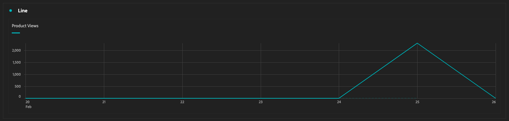
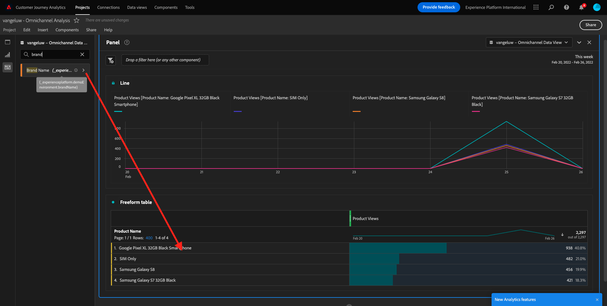
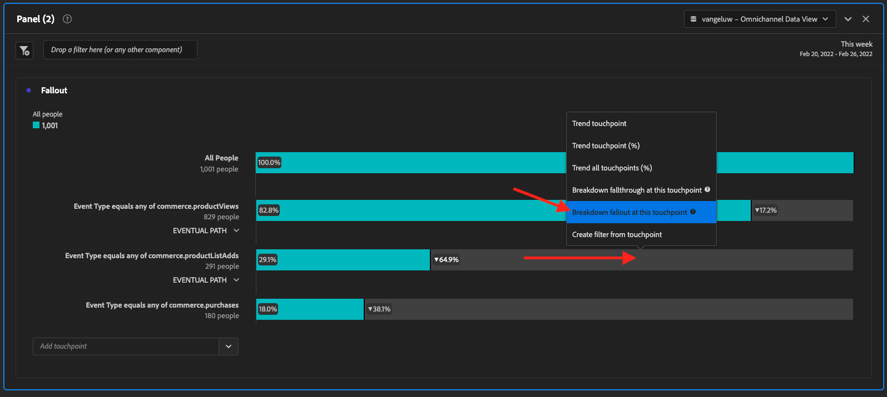

# 4.5 Visualisation avec Customer Journey Analytics

## Objectifs

- Présentation de l’interface utilisateur d’Analysis Workspace
- Découvrez certaines fonctionnalités qui rendent Analysis Workspace si différent.
- Découvrez comment analyser dans CJA à l’aide d’Analysis Workspace

## Contexte

Au cours de cet exercice, vous utiliserez Analysis Workspace dans CJA pour analyser les consultations de produits, les entonnoirs de produits, la perte de clientèle, etc.

Utilisons le projet que vous avez créé dans [4.4 Data Preparation dans Analysis Workspace](./ex4.md), alors allez à [https://analytics.adobe.com](https://analytics.adobe.com).

Ouvrez votre projet `yourLastName - Omnichannel Analysis`.

Une fois votre projet ouvert et la vue de données `CJA Bootcamp - Omnichannel Data View` sélectionnée, vous êtes prêt à commencer à créer vos premières visualisations.

## Combien de consultations de produits y a-t-il quotidiennement ?

Tout d&#39;abord, nous devons sélectionner les dates appropriées pour analyser les données. Accédez au menu déroulant du calendrier sur le côté droit de la zone de travail. Cliquez dessus et sélectionnez la période applicable.

>[!IMPORTANT]
>
>Les données les plus récemment disponibles ont été ingérées le 19/09/2022. Sélectionnez une période incluant cette date.

Dans le menu de gauche (zone de composants), recherchez la mesure calculée **Consultations de produit**. Sélectionnez-la et faites-la glisser sur la zone de travail, en haut à droite du tableau à structure libre.

La dimension **Jour** sera automatiquement ajoutée pour créer votre première table. Maintenant, vous pouvez voir que votre question a reçu une réponse instantanément.

Cliquez ensuite avec le bouton droit sur le résumé de la mesure.

Cliquez sur **Visualiser**, puis sélectionnez **Ligne** comme visualisation.

Vous verrez vos consultations de produits par jour.

Vous pouvez modifier la portée temporelle au jour le jour en cliquant sur **Paramètres** dans la visualisation.

Cliquez sur le point en regard de **Line** pour **Gérer le Source de données**.

Cliquez ensuite sur **Verrouiller la sélection** et sélectionnez **Éléments sélectionnés** pour verrouiller cette visualisation afin qu’elle affiche toujours une chronologie des consultations de produits.

## Les 4 produits les plus consultés

Quels sont les 4 produits les plus consultés ?

N’oubliez pas d’enregistrer le projet de temps à autre.

| SE | Couper court |
| ----------------- |-------------| 
| Windows | Ctrl + S |
| Mac | Commande + S |

Commençons à trouver les 4 premiers produits consultés. Dans le menu de gauche, recherchez la Dimension **Nom du produit** -

Déplacez maintenant **Nom du produit** pour remplacer la dimension **Jour** :

Cela sera le résultat

Essayez ensuite de ventiler l’un des produits par nom de marque. Recherchez **brandName** et faites-le glisser sous le premier nom de produit.

Effectuez ensuite une ventilation à l’aide du niveau de fidélité. Recherchez **Loyalty Level** et faites-le glisser sous le nom de la marque.

Vous verrez alors :

Enfin, vous pouvez ajouter d’autres visualisations. Sur le côté gauche, sous Visualisations, recherchez `Donut`. Prenez `Donut`, faites-le glisser sur la zone de travail sous la visualisation **Ligne**.

Ensuite, dans le tableau, sélectionnez les lignes de 3 **Loyalty Level** de la ventilation que nous avons effectuée sous **Google Pixel XL 32 Go Black Smartphone** > **Citi Signal**. Lors de la sélection des 3 lignes, maintenez le bouton **CTRL** (sous Windows) ou le bouton **Commande** (sous Mac) enfoncé.

Le graphique en anneau est alors modifié :

Vous pouvez même adapter la conception pour la rendre plus lisible, en réduisant un peu le graphique **Line** et le graphique **Donut** afin qu’ils puissent s’adapter les uns aux autres :

Cliquez sur le point en regard de **Anneau** pour **Gérer le Source de données**.
Cliquez ensuite sur **Verrouiller la sélection** pour verrouiller cette visualisation afin qu’elle affiche toujours une chronologie des consultations de produit.

Pour en savoir plus sur les visualisations à l’aide d’Analysis Workspace, cliquez ici :

- [https://experienceleague.adobe.com/docs/analytics/analyze/analysis-workspace/visualizations/freeform-analysis-visualizations.html](https://experienceleague.adobe.com/docs/analytics/analyze/analysis-workspace/visualizations/freeform-analysis-visualizations.html)
- [https://experienceleague.adobe.com/docs/analytics/analyze/analysis-workspace/visualizations/t-sync-visualization.html](https://experienceleague.adobe.com/docs/analytics/analyze/analysis-workspace/visualizations/t-sync-visualization.html)

## Entonnoir d’interaction de produit, de l’affichage à l’achat

Il y a de nombreuses façons de résoudre cette question. L’une d’elles consiste à utiliser le type d’interaction du produit et à l’utiliser sur un tableau à structure libre. Une autre méthode consiste à utiliser une **visualisation Abandons**. Utilisons la dernière comme nous voulons visualiser et analyser en même temps.

Fermez le panneau actuel en cliquant ici :

Ajoutez maintenant un nouveau panneau vierge en cliquant sur **+ Ajouter un panneau vierge**.

Cliquez sur la visualisation **Abandon**.

Sélectionnez la même période que dans l’exercice précédent.

Vous verrez alors ceci.

Recherchez la dimension **Type d’événement** sous les composants sur le côté gauche :

Cliquez sur la flèche pour ouvrir la dimension :

Vous verrez tous les types d’événement disponibles.

Sélectionnez l’élément **commerce.productViews** et faites-le glisser sur le champ **Ajouter un point de contact** dans la **visualisation des abandons**.

Faites de même avec **commerce.productListAdds** et **commerce.achats** et déposez-les dans le champ **Ajouter un point de contact** à l’intérieur de la **visualisation des abandons**. Votre visualisation se présente désormais comme suit :

Vous pouvez faire beaucoup de choses ici. Voici quelques exemples : comparez au fil du temps, comparez chaque étape par appareil ou comparez-la par fidélité. Cependant, si nous voulons analyser des éléments intéressants comme les raisons pour lesquelles les clients n’achètent pas après avoir ajouté un article à leur panier, nous pouvons utiliser le meilleur outil dans CJA : cliquez avec le bouton droit de la souris.

Cliquez avec le bouton droit sur le point de contact **commerce.productListAdds**. Cliquez ensuite sur **Ventiler les abandons à ce point de contact**.

Un nouveau tableau à structure libre sera créé pour analyser les actions des personnes qui n’ont pas effectué d’achat.

Modifiez le **Type d’événement** par **Nom de page**, dans le nouveau tableau à structure libre, pour afficher les pages qu’il consultent au lieu de la page de confirmation d’achat.

## Que font les visiteurs sur le site avant d’accéder à la page Annuler le service ?

Encore une fois, il existe de nombreuses façons d’effectuer cette analyse. Utilisons l’analyse de flux pour commencer la partie découverte.

Fermez le panneau actuel en cliquant ici :

Ajoutez maintenant un nouveau panneau vierge en cliquant sur **+ Ajouter un panneau vierge**.

Cliquez sur la visualisation **Flux**.

Vous verrez alors :

Sélectionnez la même période que dans l’exercice précédent.

Recherchez la dimension **Nom de page** sous les composants sur le côté gauche :

Cliquez sur la flèche pour ouvrir la dimension :

Vous trouverez toutes les pages consultées. Recherchez le nom de la page : **Annuler le service**.
Faites glisser **Annuler le service** et déposez-le dans le champ Visualisation du flux au milieu :

Vous verrez alors :

Analysons maintenant si les clients qui ont consulté la page **Annuler le service** sur le site web ont également appelé callcenter et quel en a été le résultat.

Sous les dimensions, revenez en arrière, puis recherchez **Type d’interaction d’appel**.
Faites glisser **Type d’interaction d’appel** pour remplacer la première interaction à droite dans la **Visualisation de flux**.

Vous voyez maintenant le ticket d’assistance des clients qui ont appelé le centre d’appel après avoir visité la page **Annuler le service**.

Ensuite, sous les dimensions, recherchez **Appel de ressenti**.  Faites-la glisser et déposez-la pour remplacer la première interaction à droite dans la **visualisation Flux**.

Vous verrez alors :

Comme vous pouvez le voir, nous avons exécuté une analyse omnicanal à l’aide de la visualisation Flux. Grâce à cela, nous avons trouvé que certains clients qui pensaient annuler leur service, avaient un sentiment positif après avoir appelé le centre d&#39;appel. Avons-nous peut-être changé d&#39;avis avec une promotion ?

## Comment les clients avec un contact Callcenter positif se comportent-ils par rapport aux indicateurs clés de performance principaux ?

Commençons par segmenter les données pour obtenir uniquement les utilisateurs avec des appels **positifs**. Dans CJA, les segments sont appelés filtres. Accédez aux filtres dans la zone de composant (à gauche) et cliquez sur **+**.

Dans le créateur de filtres, attribuez un nom au filtre.

| Nom | Description |
| ----------------- |-------------| 
| Sentiment d’appel - positif | Sentiment d’appel - positif |

Sous les composants (dans le Créateur de filtres), recherchez **Raisonnement des appels** et faites-le glisser dans la définition du Créateur de filtres.

Sélectionnez maintenant **positive** comme valeur pour le filtre.

Modifiez la portée pour qu’elle soit de niveau **Personne**.

Pour terminer, cliquez simplement sur **Enregistrer**.

Vous serez alors de retour ici. Si ce n’est pas encore fait, fermez le panneau précédent.

Ajoutez maintenant un nouveau panneau vierge en cliquant sur **+ Ajouter un panneau vierge**.

Sélectionnez la même période que dans l’exercice précédent.

Cliquez sur **Table à structure libre**.

Déposez maintenant le filtre que vous venez de créer.

Temps nécessaire pour ajouter certaines mesures. Commencez par **Consultations produits**. Effectuez un glisser-déposer dans le tableau à structure libre. Vous pouvez également supprimer la mesure **Events**.

Faites de même avec **Personnes**, **Ajouter au panier** et **Achats**. Vous finirez avec une table comme celle-ci.

Grâce à la première analyse de flux, une nouvelle question est venue à l&#39;esprit. Nous avons donc décidé de créer ce tableau et de vérifier certains indicateurs de performance clés par rapport à un segment pour répondre à cette question. Comme vous pouvez le constater, le temps d’accès aux informations est beaucoup plus rapide que l’utilisation de SQL ou d’autres solutions de BI.

## Customer Journey Analytics et Analysis Workspace recap

Comme vous l’avez appris dans ce laboratoire, Analysis Workspace assemble les données de tous les canaux afin d’analyser l’ensemble du parcours client. N’oubliez pas également que vous pouvez importer des données dans le même espace de travail qui n’est pas assemblé au parcours.
Il peut être très utile d’importer des données déconnectées dans votre analyse pour donner un contexte au parcours. Certains exemples incluent des données NPS, des enquêtes, des événements Facebook Ads ou des interactions hors ligne (non identifiées).

Étape suivante : [4.6 From insights to action](./ex6.md)

[Retour au flux utilisateur 4](./uc4.md)

[Revenir à tous les modules](./../../overview.md)
