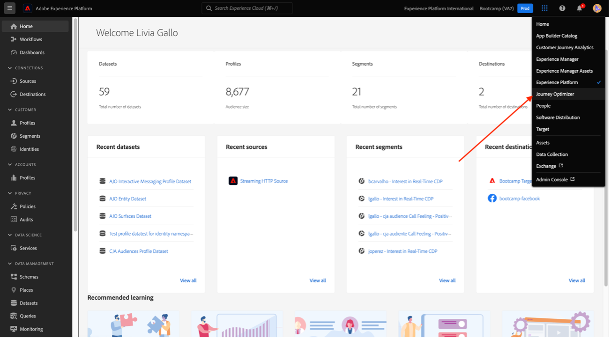

# 4.6 Des insights aux actions

## Objectifs

- Comprendre comment créer une audience à partir d’une vue collectée dans Customer Journey Analytics
- Utilisation de cette audience dans Real-Time CDP et Adobe Journey Optimizer

## 4.6.1 Création d’une audience et publication de celle-ci

Dans votre projet, vous avez créé un filtre appelé **Sentiments d’appel** et vous avez pu afficher le nombre d’utilisateurs pour lesquels leurs appels au centre d’appel sont classés comme **positifs**. Vous pouvez désormais créer un segment avec ces utilisateurs et les activer dans des parcours ou des canaux de communication.

La première étape est : dans le panneau créé lors du dernier exercice, sélectionnez la ligne **1. Appelez l’impression : positive**, cliquez avec le bouton droit et sélectionnez l’option **Créer une audience d’après la sélection** :

Attribuez ensuite un nom à votre audience en suivant le modèle **votreNom - appel d’audience CJA se sentant positif** :

Notez qu’il est possible de disposer d’un aperçu de l’audience en cours de création :

Enfin, cliquez sur **Publish**.

## 4.6.2 Utilisation de l’audience dans le cadre d’un segment

Revenez à Adobe Experience Platform, accédez à **Segments > Parcourir** et vous pourrez voir que votre segment créé dans CJA est prêt et disponible pour être utilisé dans vos activations et parcours !

Utilisons maintenant ce segment dans une activation Facebook et dans un parcours client !

## 4.6.3 Utilisation de votre segment dans Real-Time CDP en temps réel

Dans Adobe Experience Platform, accédez à **Segments > Parcourir** et recherchez l’audience que vous avez créée dans CJA :

Cliquez sur votre segment, puis sur **Activer à la destination** :

Sélectionnez la destination nommée **bootcamp-facebook**, puis cliquez sur **Suivant**.

Cliquez à nouveau sur **Suivant**.

Sélectionnez l&#39;option **Origine de votre audience** et définissez-la sur **Directly from clients**, puis cliquez sur **Suivant**.

Cliquez sur **Terminer**.

Votre segment est maintenant connecté à Facebook et ses audiences personnalisées. Utilisons maintenant ce même segment dans Adobe Journey Optimizer.

## 4.6.4 Utilisation de votre segment dans Adobe Journey Optimizer

Dans Adobe Experience Platform, cliquez sur **Journey Optimizer**, puis, dans le menu de gauche, cliquez sur **Parcours** et commencez à créer un parcours en cliquant sur **Créer un Parcours**.

Ensuite, dans le menu de gauche, sous **Événements**, sélectionnez **Qualification de segment** et faites-le glisser vers le parcours :

Sous Segment, cliquez sur **Modifier** pour sélectionner un segment :

Sélectionnez l’audience que vous avez créée précédemment dans CJA et cliquez sur **Enregistrer**.

Prêt ! À partir de là, vous pouvez créer un parcours pour les clients qui remplissent les critères de ce segment.

[Retour au flux utilisateur 4](./uc4.md)

[Voltar para todos os módulos](./../../overview.md)
