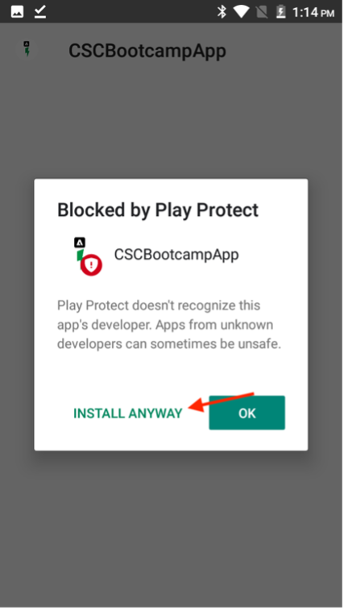

# Vérification de l’application mobile

## Android

- Téléchargez l’application mobile à partir de [here](https://tinyurl.com/CSCBootcampApp) sur votre appareil Android. Vous pouvez le télécharger sur un [Émulateur Android](https://developer.android.com/studio/run/emulator) ou votre appareil Android physique.

- Ouvrez le fichier téléchargé en appuyant dessus.

- Dans la fenêtre contextuelle, cliquez sur le bouton d’installation, puis confirmez en cliquant sur &quot;Installer de toute façon&quot;.

- Une fois l’application installée, ouvrez-la en cliquant sur le bouton &quot;Ouvrir&quot;.

## iOS

>[!WARNING]
>
> Vérifiez que vous êtes connecté au réseau Wi-Fi Bootcamp. Ceci est essentiel, car l’application ne fonctionnera que si vous êtes sur le même réseau Wi-Fi.

Comme il ne s’agit pas d’une application officiellement distribuée, la configuration d’iOS est quelque peu différente de celle à laquelle vous êtes habitué.

- Téléchargez l’application Expo Go à partir du [App Store](https://itunes.apple.com/app/apple-store/id982107779).

- Dans l’application iPhone Camera, analysez le code QR que l’équipe d’Adobe projetera au bootcamp. Lorsque vous y êtes invité, cliquez sur le bouton qui s’affiche.

- Cela chargera une page web qui vous permet d’ouvrir l’application sur votre iPhone. Cliquez sur le bouton &quot;Expo Go&quot; pour l’ouvrir dans l’application que vous venez de télécharger.

- Dans la boîte de dialogue qui s’affiche, sélectionnez &quot;Ouvrir&quot; afin que l’application Expo Go puisse être chargée avec les informations correctes.

- Une fois l’application Expo Go ouverte, elle vous invite à rechercher des périphériques sur le réseau local. Comme mentionné précédemment, cela est nécessaire afin que nous puissions télécharger l’application depuis les appareils de notre Adobe vers votre téléphone. Cliquez sur &quot;Autoriser&quot; pour charger ceci.

- Il se peut que vous obteniez une page d’erreur au début. Il vous suffit de cliquer sur le bouton &quot;Réessayer&quot; pour charger enfin l’application sur votre appareil. Veuillez noter que la fermeture de l’application Expo Go ou la déconnexion de votre appareil du réseau Wi-Fi empêchera l’application de répondre.

## Navigation dans l’application

Dans l’application, vous pouvez sélectionner votre équipe dans la liste déroulante. Cela se chargera dynamiquement dans le contenu que vous avez créé dans AEM. Si le contenu ne vous convient pas, vous pouvez toujours le mettre à jour dans le fragment de contenu créé précédemment, puis republier le contenu. Les modifications seront alors répercutées dans l’application.

Étape suivante : [Phase 3 - Diffusion : Création d’une page dans AEM](./page-in-aem.md)

[Revenir à la phase 2 - Production : Création de contenu d’application mobile](../production/app.md)

[Revenir à tous les modules](../../overview.md)
