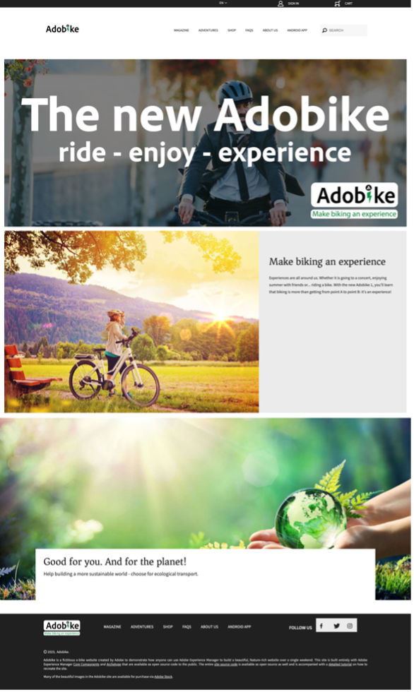
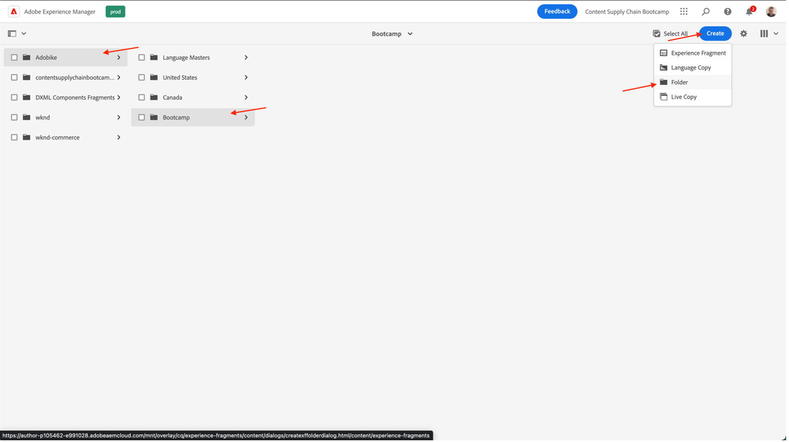
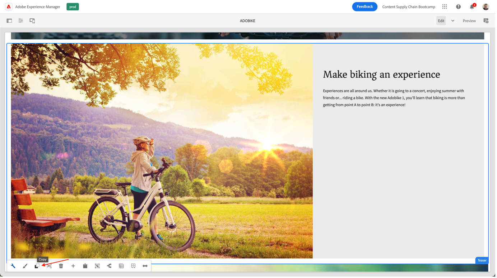
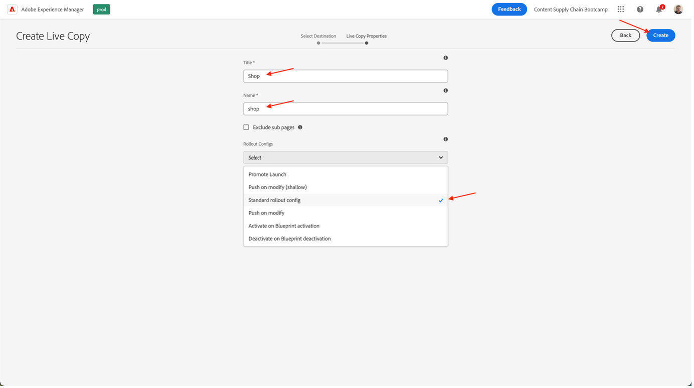

# Création d’une page dans AEM

AEM fournit deux environnements : l’environnement de création et l’environnement Publish. Ces fonctions interagissent pour vous permettre de rendre le contenu disponible sur votre site web, afin que vos visiteurs puissent le découvrir.

L’environnement de création fournit les mécanismes de création, de mise à jour et de révision de ce contenu avant de le publier :

- Un auteur crée et révise le contenu (qui peut être de plusieurs types, par exemple, pages, ressources, publications, etc.)
- qui sera, à un moment donné, publié sur votre site web.

En tant qu’auteur, vous devez organiser votre site web dans AEM. Cela implique de créer et de nommer vos pages de contenu afin que :

- Vous pouvez facilement les trouver dans l’environnement de création.
- Les visiteurs de votre site peuvent facilement les parcourir dans l’environnement de publication.

La structure d’un site web peut être considérée comme une arborescence contenant vos pages de contenu. Les noms de ces pages de contenu sont utilisés pour former les URL, tandis que le titre s’affiche lorsque le contenu de la page est affiché. Dans l’exemple ci-dessous, l’URL accessible pour la page sera /content/adobike/language-masters/en.html

Examinons comment ajouter de nouvelles pages à un site web existant et comment réutiliser du contenu.

## Créer la page d&#39;accueil

Comme expliqué dans la section précédente, AEM hiérarchie de pages  fonctionne comme une arborescence. Cela signifie que nous allons commencer par la page au niveau le plus élevé : la page d&#39;accueil.

- Accédez à l’auteur AEM sur [https://author-p71057-e991028.adobeaemcloud.com/](https://author-p71057-e991028.adobeaemcloud.com/) et connectez-vous avec les informations d’identification que nous avons fournies.

- Dans le menu AEM, sélectionnez Navigation > Sites.

- Commençons par parcourir l’arborescence existante jusqu’à l’emplacement où nous souhaitons créer notre page d’accueil. Naviguez dans l’arborescence en sélectionnant &quot;Adobe vélo&quot; dans la première colonne, puis &quot;Bootcamp&quot; dans la seconde colonne. Ensuite, pour créer une page sous cette page, cliquez sur le bouton &quot;Créer&quot; et sélectionnez &quot;Page&quot; dans le menu qui s&#39;affiche.

- Un nouvel écran s’ouvre alors pour configurer notre nouvelle page. Tout d’abord, nous pouvons sélectionner un modèle de page. Les modèles de page dans AEM permettent de définir la structure d’une page et de définir le contenu qui peut être utilisé sur cette page. Comme nous voulons créer la page d’accueil, qui est une landing page, nous allons sélectionner le Modèle de landing page, puis cliquer sur le bouton &quot;Suivant&quot; pour continuer.

- Dans l’écran suivant, vous pourrez remplir votre page avec des informations initiales. Le plus important est le titre (une propriété obligatoire, indiquée par un signe \* ), qui est destiné à donner un nom significatif à votre page. Si vous ne remplissez pas le &quot;Nom&quot;, AEM génèrera automatiquement l’URL sur laquelle votre page sera disponible, en suivant les bonnes pratiques d’optimisation pour les moteurs de recherche. Dans ce cas, vous pouvez laisser ce champ vide. D’autres propriétés peuvent également être renseignées. Vous pouvez explorer les autres onglets, mais dans ce cas, ne remplissez pas d’autres propriétés pour l’instant. Lorsque vous êtes prêt à créer votre page, cliquez simplement sur le bouton &quot;Créer&quot;.

- AEM va maintenant créer votre page. Une fois cette opération terminée, vous obtiendrez une fenêtre contextuelle qui vous permet d’ouvrir la page nouvellement créée en cliquant sur le bouton &quot;Ouvrir&quot;.

- Vous accédez désormais à l’éditeur AEM. Il s’agit d’un éditeur &quot;Ce que vous voyez est ce que vous obtenez&quot; (ou WYSIWYG), dans lequel vous pouvez faire glisser des composants sur une page pour créer votre page. Regardons la navigation :
  
   - Sur le côté gauche, vous disposez du panneau latéral avec les ressources que vous pouvez utiliser sur vos pages, les composants (ou blocs de création) que vous pouvez utiliser sur cette page et d’une arborescence pratique qui vous indique comment votre page est structurée. Cliquez sur l’une de ces icônes pour ouvrir leur vue.
   - Sur le côté droit s’affiche le &quot;conteneur de mises en page&quot;. Il s’agit d’une zone dans laquelle vous pouvez déposer les composants souhaités.
   - Renseignons notre page avec du contenu. N’hésitez pas à remplir la page d’accueil à votre gré. Dans l’exemple ci-dessous, nous avons utilisé un composant d’image lié à la page du produit, ainsi que deux composants de teaser.

## Réutilisation d’expériences en exploitant des fragments d’expérience

Nous avons maintenant créé la page d’accueil, qui est entièrement prête pour notre lancement Adobe. Cependant, une partie du contenu, par exemple les points de vente uniques de notre vélo, peut être réutilisée sur plusieurs pages.

Idéalement, nous ne souhaitons créer cette expérience de points de vente uniques qu’une seule fois afin de pouvoir la gérer de manière centralisée et garantir une expérience personnalisée mais cohérente. Dans AEM, nous pouvons le faire avec les &quot;fragments d’expérience&quot;. Un fragment d’expérience est un groupe d’un ou de plusieurs composants comprenant un contenu et une disposition pouvant être référencés dans les pages. Ils peuvent contenir n’importe quel composant.

Mettons ceci immédiatement à profit :

- Accédez à l’auteur AEM sur [https://author-p71057-e991028.adobeaemcloud.com/](https://author-p71057-e991028.adobeaemcloud.com/) et connectez-vous avec les informations d’identification que nous avons fournies.

- Dans le menu AEM, sélectionnez Navigation > Fragments d’expérience.

- Dans l’écran suivant, créons un dossier que votre équipe peut utiliser pour stocker leurs expériences réutilisables. En mode Colonne, accédez à Adobe vélo \> Bootcamp, puis cliquez sur les boutons Créer > Dossier .

- Dans les fenêtres contextuelles, indiquez au dossier le nom de votre équipe. Vous pouvez laisser le champ Nom vide, AEM le génère automatiquement. Une fois le dossier nommé, cliquez sur le bouton Créer pour le créer.

- Vous devriez maintenant voir votre dossier s’afficher dans la fenêtre contextuelle. Cliquez dessus, puis sur le bouton Créer \> Fragment d’expérience .

- Sélectionnez tout d’abord un modèle de fragment d’expérience. Tout comme les pages, les fragments d’expérience peuvent être basés sur plusieurs modèles, chacun prévoyant une expérience prédéfinie. Dans notre cas, puisque nous voulons réutiliser le contenu de notre site web, nous allons choisir un &quot;modèle de variation web du fragment d’expérience&quot; en cochant la case située en haut à gauche, puis en cliquant sur le bouton &quot;Suivant&quot;.

- Donnez un titre significatif à votre fragment d’expérience, par exemple &quot;USPs Adobe&quot;, puis cliquez sur le bouton Créer .

- Une fois votre fragment d’expérience créé, cliquez sur le bouton &quot;Ouvrir&quot; dans le modal afin que nous puissions ajouter du contenu dans notre fragment d’expérience.

- Tout comme lors de la modification d’une page, vous pouvez voir un conteneur de mises en page dans lequel vous pouvez ajouter du contenu.

- Ce que nous allons faire, c&#39;est copier les composants depuis la page d&#39;accueil. Dans un nouvel onglet, accédez à la page d’accueil comme expliqué dans le chapitre précédent, sélectionnez le composant sur lequel vous souhaitez effectuer une copie, puis cliquez sur l’icône Copier.

- Ensuite, de nouveau dans le fragment d’expérience, cliquez sur le conteneur de mises en page et cliquez sur le bouton Coller .

>[!NOTE]
>
> Conseil : AEM permet d’utiliser le &quot;mode de mise en page&quot; dans n’importe quel fragment d’expérience ou de page. Cela vous permet de redimensionner les composants et d’optimiser les expériences pour n’importe quel appareil.

- Dans le menu supérieur, ouvrez la liste déroulante et sélectionnez &quot;Mise en page&quot; pour passer en mode de mise en page.

- Vous pouvez ensuite sélectionner n’importe quel composant et le redimensionner en faisant simplement glisser les poignées des deux côtés du composant pour l’accrocher aux colonnes visibles à l’écran.

- Par défaut, vous modifiez tous les points d’arrêt. Cependant, si vous souhaitez modifier un point d’arrêt spécifique, vous pouvez sélectionner un appareil correspondant dans la barre d’outils située en haut de la page. Le point d’arrêt pour lequel vous créez une application est alors mis en surbrillance.

- Comme vous pouvez le voir, une mise en page à deux colonnes sur mobile n’a pas l’air géniale. Créons une disposition en une seule colonne sur mobile. Comme vous pouvez le constater sur un ordinateur de bureau, notre expérience reste la même, mais sur les appareils mobiles, nous avons désormais une meilleure expérience avec une seule colonne de contenu.

- Enfin, nous pouvons désormais réutiliser cette expérience sur la page d’accueil. Faites glisser et déposez un composant &quot;Fragment d’expérience&quot; sur la page à l’emplacement où vous souhaitez que votre contenu s’affiche. Vous pouvez supprimer le contenu sur lequel nous avons copié, car nous l’utiliserons dans le fragment d’expérience.

- Ouvrez la boîte de dialogue de configuration du composant de fragment d’expérience et utilisez le sélecteur de chemin pour sélectionner l’emplacement où vous avez créé votre fragment d’expérience.

 correct

- Et enfin, nous avons maintenant notre expérience réutilisable sur notre page.

## Création de la page de produits

Lorsque vous utilisez Adobe Commerce intégré à AEM, vous pouvez disposer d’une page de détails de produit générique qui est utilisée lorsque vous naviguez sur le site à partir des vues d’ensemble générées. Cependant, nous voulons parfois aussi prévoir une page inspirante qui combine du contenu spécifique à un produit avec du contenu inspirant. Copions le magasin tel qu&#39;il a été préfabriqué par nous, puis créons une page de produit inspirante.

- Accédez à l’auteur AEM sur [https://author-p71057-e991028.adobeaemcloud.com/](https://author-p71057-e991028.adobeaemcloud.com/) et connectez-vous avec les informations d’identification que nous avons fournies.

- Dans le menu AEM, sélectionnez Navigation > Sites.

- Dans la présentation de la colonne, accédez au site web prédéfini : Adobe > Principal de langue > Adobe > Magasin. Sélectionnez ensuite la page Shop avec la case à cocher et cliquez sur Créer \> Live Copy. Sans entrer dans trop de détails, une copie de la page que vous pouvez utiliser sur votre site sera créée afin de pouvoir réutiliser les pages et le contenu déjà existants, à l’aide de l’AEM Multi Site Manager.

- Dans l’écran qui s’affiche, sélectionnez le site de votre équipe comme destination en cochant la case en regard de son nom. Cliquez ensuite sur le bouton Suivant .

- Comme nous n’allons pas aller plus loin dans Multi Site Manager, vous pouvez simplement prendre en charge cette configuration.\
  Titre : Shop\
  Nom : shop\
  Configurations de déploiement : configuration de déploiement standard\
  Une fois la Live Copy configurée, cliquez sur le bouton Créer .

>[!NOTE]
>
> Vous souhaitez en savoir plus sur les Live Copies ? Consultez [&quot;Création et synchronisation de Live Copies&quot;.](https://experienceleague.adobe.com/docs/experience-manager-cloud-service/content/sites/administering/reusing-content/msm/creating-live-copies.html?lang=fr)

- Une fois que vous avez terminé, vous devriez maintenant voir le magasin disponible sur votre site web. Sélectionnez-le, puis cliquez sur Créer \> Page pour créer notre page de produit inspirante.

- Puisque nous voulons afficher les informations sur les produits sur la page, créons maintenant une page à l’aide du modèle de page de produits. Sélectionnez-le, puis cliquez sur le bouton Suivant .

- Renseignez les métadonnées de la page, puis cliquez sur le bouton Créer , comme pour la page d’accueil. Une fois créée, vous pouvez ouvrir la page en cliquant sur le bouton d’ouverture. Comme vous pouvez le constater, un composant Détails du produit est déjà renseigné.

- Tout d’abord, nous allons ajouter notre fragment d’expérience que nous avons créé précédemment. Ensuite, nous pouvons ajouter tout contenu supplémentaire que nous voulons toujours sur la page. Enfin, nous allons configurer le composant Détails du produit pour afficher notre produit Adobe en sélectionnant l’outil de recherche de produit dans la boîte de dialogue de configuration, puis en sélectionnant notre catégorie Adobe et en cochant la case en regard du produit. Cliquez ensuite sur le bouton Ajouter .

- Nous disposons désormais de notre page d’inspiration complète, y compris des informations centralisées sur le contenu et les produits provenant d’Adobe Commerce.

Étape suivante : [Phase 3 - Diffusion : Campaign GO/NO-GO](./go-nogo.md)

[Revenir à la phase 3 - Diffusion : Vérifier l’application mobile](./app.md)

[Revenir à tous les modules](../../overview.md)
