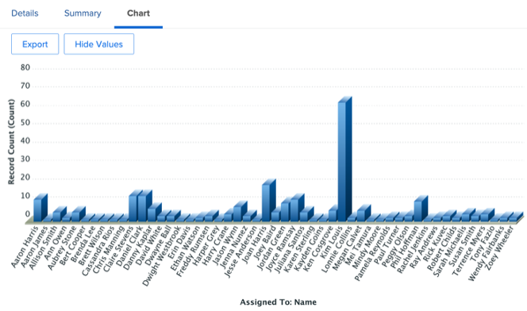

# Statistiques pour un gestionnaire marketing

## Vue hebdomadaire du chef de projet

Dans la colonne de gauche, cliquez sur &quot;Vue hebdomadaire du chef de projet&quot; :

Cela couvre un large éventail de rapports, toujours cliquables/exploitables pour plus de détails :

- Les **tâches prévues cette semaine par projet**

- Les **jalons à venir de la gestion de projet** :

- **Problèmes en cours par priorité**

- **Tâches en retard par département**

- **Tâches en retard par l’individu**

## Informations relatives à SCRUM

Dans la colonne de gauche, cliquez sur &quot;État de l’itération&quot;

Si vos équipes fonctionnent avec la méthodologie SCRUM, il s’agit d’un jeu de rapports de gestion intéressant :

- **Vitesse par itération**

- **Vitesse moyenne par équipe**

- **Totaux des heures d’itérations actuelles terminées par cessionnaire**

- **Itérations par équipe**

## Rapports d’efficacité

Toujours dans la colonne de gauche, cliquez sur &quot;Efficacité&quot;.

- **Ratio planifié/non planifié** (du travail effectué)

- **Demandes terminées par semaine**

## Informations sur le projet en vol

Toujours dans la colonne de gauche, cliquez sur &quot;Marketing - Projets en cours&quot;.

- **État des projets en vol**

- **Projets Par Condition Par Mois**

- Liste, état d&#39;avancement et détails financiers des **projets en vol**

## Visualiser les dépendances (entre projets)

Pour revenir à la ligne &quot;PIN&quot;, cliquez sur &quot;Portfolio vue Gant&quot; :

Vous disposez ici d’une **vue Graphique général d’un groupe de projets** avec des dépendances possibles (prédécesseurs) entre les projets.

## Informations sur l’intégration tierce

>[!NOTE]
>
> Il s’agit d’un exemple d’intégration à un logiciel tiers. Il s’agit d’une intégration avec Adobe Campaign à titre d’illustration. Il importe les résultats des campagnes terminées dans Adobe Campaign.

Sur la ligne &quot;PIN&quot;, cliquez sur &quot;Résumé de campagne&quot; :

- **Adobe Campaign Summary**

- **Adobe Campaign envoyée aux ouvertures**

- **Adobe Campaign s’ouvre sur les clics**

Étape suivante : [Conclusion](../../conclusion.md)

[Revenir à la phase 4 - Informations pour un chef de projet](./project-manager.md)

[Revenir à tous les modules](../../overview.md)
