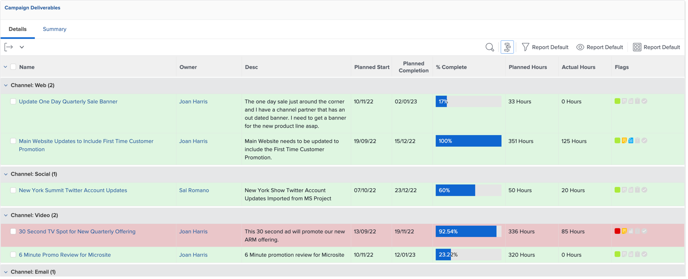
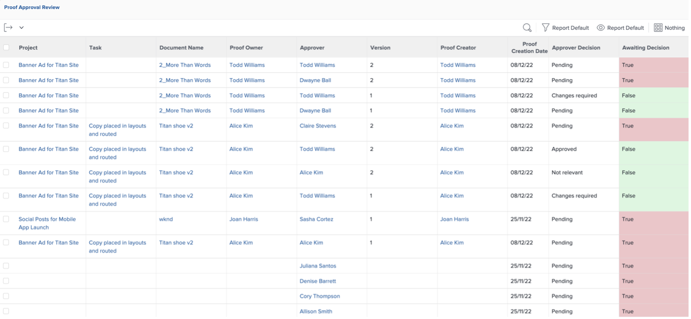

# Informations pour un chef de projet

## Rapports de progression de projet interactif

Sur la ligne &quot;PIN&quot;, cliquez sur &quot;Sensibilisation aux applications mobiles&quot;, puis sur &quot;Mesures&quot; :

Vous disposez ici d’une vue graphique de l’état d’un projet/campagne unique.

>[!NOTE]
>
> Pour plus d’informations, il est possible de cliquer sur chaque zone. C’est le cas pour la plupart des informations dans Workfront. Allez-y !

## Rapports spécifiques à une campagne

Sur la ligne &quot;PIN&quot;, cliquez sur &quot;Projets :

Dans la colonne de gauche, cliquez sur &quot;État de la campagne&quot; :

La partie supérieure vous donne des informations sur une seule campagne portant sur 1/ Campagne **planifiée par rapport aux** heures passées et 2/ La **condition de campagne** pour chaque canal :

La partie inférieure vous donne des informations sur l’état **Livrables de campagne** :

## Informations sur plusieurs projets

Toujours dans la colonne de gauche, cliquez sur &quot;Surveillance&quot;.

La partie supérieure vous donne des informations sur l’état d’un groupe de projets, à la fois du point de vue **État des tâches** et du point de vue **Condition du projet** :

La partie inférieure affiche tous les **approbations à risque** et devra être pourchassée :

## Tableau de bord du contenu

Toujours dans la colonne de gauche, cliquez sur &quot;TABLEAU DE BORD DU CONTENU&quot; :

La partie supérieure donne de bons renseignements sur l’état **de l’approbation du BAT du document** (est-elle approuvée, combien de versions avons-nous besoin, etc.)

La partie inférieure est une **révision de l’approbation du BAT** qui donne un autre angle de vue aux états d’approbation du BAT :

Étape suivante : [Phase 4 - Statistiques pour un gestionnaire marketing](./marketing-manager.md)

[Revenir à la phase 4 - Statistiques : présentation](./overview.md)

[Revenir à tous les modules](../../overview.md)
