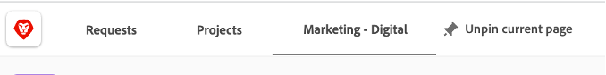
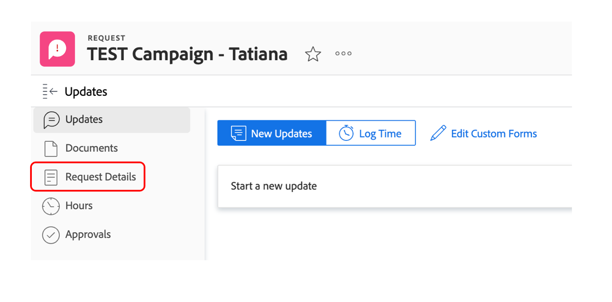
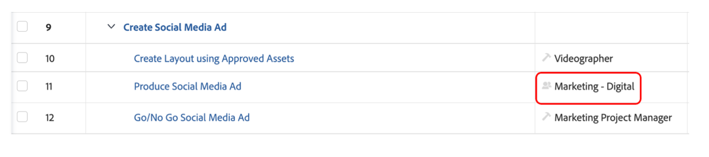

# Planification

>[!NOTE]
>
> Pendant le Bootcamp, vous porterez plusieurs casquettes : Requestor, chef de projet, Designer et Upper Management. Vous obtiendrez ainsi un aperçu de l’expérience utilisateur de chaque profil.

Regardons maintenant la plateforme de gestion du travail, Adobe Workfront. Workfront rend vos objectifs visibles à l&#39;ensemble de l&#39;organisation afin que chacun puisse stratégiquement donner la priorité au travail, suivre les progrès et mesurer les résultats. Et au fur et à mesure que vos objectifs évoluent, Workfront transmet l&#39;information aux équipes qui exécutent le travail sur le terrain. Le résultat ? Alignement, concentration et rapidité accrue de la réussite.

Connectez-vous à votre profil Workfront en accédant à [adobebootcampemea-02032301.testdrive.workfront.com](https://adobebootcampemea-02032301.testdrive.workfront.com) et en vous connectant avec les informations d’identification que l’équipe d’Adobe vous a fournies.

Cette page de connexion s’affiche.  Connectez-vous avec votre adresse e-mail professionnelle que vous avez inscrite au bootcamp en tant que nom d’utilisateur :

Une fois la connexion établie, vous serez confronté à cette page d’accueil :

## Préparation de Workfront pour l’utilisation

Nous allons maintenant préparer notre page d’accueil comme si nous utilisions Workfront régulièrement.  Cela signifie que nous allons aller chercher des pages pertinentes pour notre workflow de plus tard et les &quot;Négocier&quot; en haut de notre page d&#39;accueil.

Tout d&#39;abord, allons chercher la page de la charge de travail de notre ÉQUIPE.  Cliquez sur le gaufre en haut à droite et sélectionnez &quot;Équipes&quot;.

Une fois que notre ÉQUIPE (Marketing - Numérique) est à l&#39;écran, il vous suffit de l&#39;attribuer à votre ruban supérieur :

Votre ruban supérieur doit maintenant ressembler à ceci :

Épinglons maintenant un projet que nous allons analyser plus en détail plus tard.  Cliquez sur la page Projets PINNED , puis sur le bouton de recherche.  Saisissez &quot;Campagne de sensibilisation aux applications mobiles&quot; et cliquez sur le nom du projet :

Une fois le projet à votre écran, écrivez-le sur votre ruban supérieur comme nous l’avons fait auparavant :

Votre ruban supérieur doit maintenant ressembler à ceci :

Enfin, cliquez une fois de plus sur le gaufre supérieur droit et sélectionnez PORTFOLIOS.

Cliquez sur le bouton de recherche et saisissez &quot;TRANSFORM&quot;.  Cliquez sur le Portfolio &quot;Transformer l’expérience client&quot; pour l’ouvrir :

Une fois le Portfolio ouvert, épinglez-le sur votre ruban supérieur :

Votre ruban supérieur doit maintenant ressembler à ceci :

Nous sommes maintenant prêts à démarrer notre workflow avec une interface qui nous montre exactement ce dont nous avons besoin de manière régulière.

## Demandeur

Nous allons maintenant commencer la prise de travail réelle avec le chapeau du demandeur. Un demandeur, par exemple un responsable de produit, nous souhaitons formaliser une demande pour notre nouvelle campagne Adobe Campaign et fournir les informations du résumé marketing.

- En haut à gauche, cliquez sur Requêtes :

- Cliquez ensuite sur &quot;Nouvelle demande&quot; :

- Pour le type de requête, sélectionnez &quot;Requêtes marketing&quot;, puis &quot;CSB - Requêtes de campagne&quot; :

- Saisissez le sujet : &quot;Adobe Campaign - \*équipe\*&quot; (indiquez le numéro de votre équipe). Vous pouvez ajouter une description et une priorité.

- Tout ce qui se trouve sous l’en-tête &quot;CSB - résumé de campagne marketing&quot; est entièrement personnalisable. Dans ce cas, il s’agit de champs personnalisés que vous pouvez adapter à vos propres besoins de mémoire marketing. Voici les champs Brief que nous avons créés pour ce Bootcamp :

- Commençons par remplir le résumé :

   - Définissez la date de début sur 01/06/2023 - Définissez la date de fin sur 30/06/2023 :

  

   - Sélectionnez AEM Assets, car certaines ressources pourront être utilisées dans cette campagne :

  

   - Sur &quot;Nouveau contenu&quot;, notez que si vous cliquez sur Oui, un champ supplémentaire (conditionnel) s’affiche avec un avertissement de ligne de temps :

  

   - Puisque nous sommes dans un délai serré, changeons notre choix en &quot;NON&quot; :

  

   - Sur les canaux, nous avons choisi de pré-sélectionner certains par défaut. Et ce sont celles dont nous aurons besoin pour l&#39;étape suivante, donc aucun changement n&#39;est nécessaire ici :

  

   - Adobe Commerce, sélectionnez oui :

  

- Enfin, dans la section des documents, vous pouvez ajouter toute documentation appropriée à votre demande.  Ici, nous allons utiliser le connecteur AEM pour vous montrer comment obtenir du contenu existant à partir de notre instance AEM Assets.

   - Cliquez sur &quot;Ajouter ou lier des fichiers&quot; et sélectionnez Lien dans &quot;experience-manager&quot;.

  

   - Vous êtes maintenant confronté aux dossiers AEM Assets et vous pouvez les parcourir (et/ou utiliser le moteur de recherche) pour obtenir les documents/ressources dont vous avez besoin pour votre requête :

  

   - N’hésitez pas à joindre tous les éléments d’AEM Assets qui, selon vous, pourraient être pertinents pour ce projet, le cas échéant. Lorsque vous avez terminé, cliquez sur &quot;Lien&quot; pour créer un lien vers les ressources ou sur &quot;Fermer&quot; si vous ne liez aucun dossier.

  

- Nous avons terminé notre demande et sommes prêts à la soumettre :

## Chef de projet

Maintenant que nous avons soumis notre demande en tant que &quot;Demandeur&quot; (par exemple, Gestionnaire de produits), nous allons changer de chapeau et porter celui du Gestionnaire de projets.

- Cliquez sur le logo &quot;Adobe&quot; et vous accédez à la page &quot;Nouvelles demandes marketing&quot; (il s’agit de la page d’accueil type &quot;Gestionnaire de projets&quot;) :

- Dans la section &quot;Marketing - Nouvelles requêtes de campagne&quot;, vous trouverez la requête que vous venez de créer :

- Cliquez sur le nom de la requête :

- Cliquez sur &quot;Détails de la demande&quot; :

- Faites défiler jusqu’à la section &quot;CSB - Résumé de campagne marketing&quot; et développez-le :

- Vous pouvez voir tous les détails du résumé du demandeur et, avec ces informations, vous pouvez démarrer un plan de projet basé sur un modèle.
   - Dans la partie supérieure, en regard de votre nom de demande, cliquez sur les trois points :

  

   - Cliquez sur &quot;Convertir en projet à partir d’un modèle&quot; :

  

   - Sélectionnez &quot;CSB - Campagne marketing&quot;, puis cliquez sur &quot;Utiliser le modèle&quot; :

  

   - Cliquez sur &quot;Convertir en projet&quot; en bas de la page :

  

- Notre workflow de projet Campaign est désormais basé sur le modèle. Épinglons notre projet pour plus tard. Cliquez sur &quot;Epingler la page en cours&quot; :

- Quelques points ciblés :

1. Notion de durée : c’est la fenêtre d’opportunité pour terminer une tâche.\
   Notion des heures planifiées : il s’agit du temps réel nécessaire pour terminer une tâche.

1. Notion de prédécesseurs (ou dépendances) : il s’agit des contraintes que les tâches peuvent avoir entre elles (généralement, cette tâche ne peut pas être lancée avant que l’autre ne soit terminée). Ce qui nous permet d’obtenir un diagramme de Gant clair avec le chemin critique de chaque projet. Cliquez sur l’icône ci-dessous pour afficher le diagramme de Gant :
   

1. Notion d’affectations : au moment de la création du projet, les affectations sont toujours généralistes car elles proviennent d’un modèle. Elles sont faites soit sur les rôles de travail - représentés par l’icône en forme de marteau (c’est-à-dire un groupe de personnes ayant les compétences nécessaires pour accomplir cette tâche particulière), soit sur les équipes - représentées par l’icône des personnes (c’est-à-dire un groupe défini par votre société). C&#39;est maintenant le moment d&#39;assigner ces tâches à des individus.

- Aujourd&#39;hui, nous allons nous concentrer sur les pré-affectations des équipes et sur la façon de les assigner aux individus.

- Comme vous pouvez le constater, la tâche 11 &quot;Produire une publicité pour les médias sociaux&quot; est assignée à l&#39;équipe &quot;Marketing - Digital&quot; :
  

- Voyons comment cela se répercute sur la planification de cette équipe en ouvrant sa page de gestion des ressources. Cliquez sur le code PIN &quot;Marketing - Digital&quot; en haut de la page :
  

- Vous disposez maintenant de la vue Planification des équipes :

1. La partie supérieure couvre le travail non assigné pour cette équipe particulière. Il répertorie les projets pour lesquels l’équipe a une ou plusieurs affectations dans et, en cliquant sur la flèche ici, vous avez la visibilité des tâches exactes qui doivent être couvertes par le projet :
   

1. La partie inférieure couvre le travail assigné pour les personnes de l&#39;équipe, mais pas seulement : elle indique en effet la charge de travail réelle de chaque membre de l&#39;équipe, mais aussi son planning (par exemple Lun-Fri ou Lun-Sat), ses vacances, etc.
   

- Pour assigner une tâche à une personne, faites glisser la tâche de la partie supérieure vers la ligne d’une personne dans la partie inférieure. Découvrez comment la charge de travail de Bea a été ajustée et les détails de ses affectations de tâches ont été ajoutés :
  

Étape suivante : [Phase 1 - Planification : autres travaux préparatoires](./prework.md)

[Revenez au résumé créatif](../../creative-brief.md)

[Revenir à tous les modules](../../overview.md)
