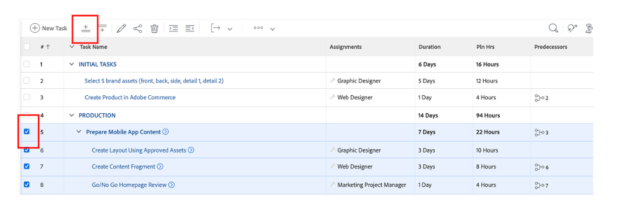

# Autres prétâches

## Sélection de Brand Assets

Comme décrit dans le dossier créatif, il y a des ressources nécessaires pour lancer efficacement notre campagne. Ces ressources de marque seront ajoutées à la campagne dans Workfront afin que nous y ayons accès de manière centralisée.

- Développez la tâche 1, &quot;TÂCHES INITIALES&quot;, puis ouvrez la tâche &quot;Sélectionner 5 ressources de marque (avant, arrière, etc.)&quot; en cliquant dessus.

- Cliquez sur &quot;Documents&quot;, puis sur &quot;Ajouter nouveau :

- Sélectionnez &quot;Expérience-manager&quot;. Cela nous permettra de sélectionner des ressources de marque déjà disponibles sur AEM Assets :

- Une fois la hiérarchie AEM Dossier affichée, accédez au chemin suivant : experience-manager > Adobe Assets > Blocs de vélo Sélectionnez 5 ressources, puis cliquez sur &quot;Lien&quot;.

- Nous avons maintenant nos ressources de marque sur notre tâche. Cela signifie que nous pouvons définir la tâche 2 comme 100 % terminée :

## Démonstration d’Adobe Commerce

Adobe Commerce est l’un des nombreux produits de Adobe Experience Cloud qui peuvent vous aider à offrir les meilleures expériences numériques à vos clients. Cependant, il y avait tout simplement trop peu de temps pour tout faire ensemble pendant le bootcamp.

Cette vidéo vous fait connaitre Adobe Commerce et montre le produit que nous avons créé pour l’utiliser pendant le bootcamp. Dans un scénario réel, vous téléchargerez les ressources de marque sélectionnées précédemment dans Adobe Commerce vers la configuration du produit.

>[!VIDEO](https://video.tv.adobe.com/v/3418945?quality=12&learn=on)

Une fois cette tâche terminée, vous pouvez marquer la tâche 3 comme étant 100 % terminée dans Workfront.

## Des campagnes flexibles sont une condition préalable

Lors de la révision de notre plan de travail, nous avons remarqué un petit problème : notre responsable produit (le demandeur) a mis à jour une demande qu’il a oubliée pour une &quot;bannière de page d’accueil du produit&quot;.  Nous l&#39;ajouterons à notre plan de projet.

- Accédez à la liste Tâches et ajoutez notre tâche &quot;Créer une bannière de page d’accueil de produit&quot; juste sous la tâche 4 &quot;PRODUCTION&quot;. Pour ce faire, sélectionnez la tâche &quot;Préparer le contenu de l’application mobile&quot; et cliquez sur &quot;Ajouter la tâche au-dessus de l’icône&quot; :

- Attribuez à la tâche ajoutée un nom significatif, tel que &quot;Créer une bannière de page d’accueil de produit&quot;.

- Maintenant que nous avons créé la tâche, ajoutons du contenu à la tâche. Cliquez sur les trois points à droite du titre de votre projet et sélectionnez &quot;Joindre un modèle&quot; :

- Sélectionnez &quot;Créer une bannière de page d’accueil de produit&quot; et cliquez sur &quot;Personnaliser et joindre&quot; :

- Dans l’écran de personnalisation, veillez à mentionner la tâche &quot;Créer une bannière de page d’accueil de produit&quot; en tant que parent :

- Enfin, veillez à marquer la tâche parent &quot;Créer une page d’accueil de produit&quot; avec un prédécesseur de la tâche 3, car aucune production ne peut être lancée tant que le produit n’a pas été créé dans Adobe Commerce :

Nous avons maintenant une campagne qui est terminée et planifiée, ce qui signifie que nous pouvons maintenant commencer par la production et la diffusion de notre campagne !

Étape suivante : [Phase 2 - Production : créer une bannière de page d’accueil de produit](../production/banner.md)

[Revenir à la phase 1 - Planification](./planning.md)

[Revenir à tous les modules](../../overview.md)
