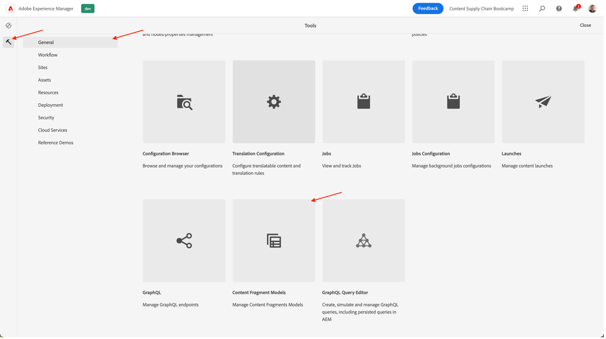
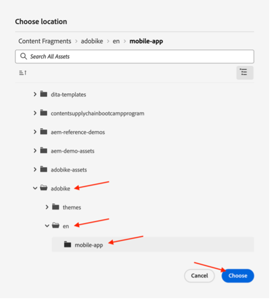

# Création de contenu d’application mobile

## Qu’est-ce que la diffusion de contenu sans interface ?

Avec un système de gestion de contenu sans interface, le serveur principal et le front-end sont désormais découplés. La partie sans tête est le serveur principal de contenu, car un CMS sans tête est un système de gestion de contenu principal uniquement, conçu et créé explicitement comme un référentiel de contenu qui rend le contenu accessible via une API, pour l’affichage sur n’importe quel appareil.

Le serveur frontal, qui est développé et géré indépendamment, récupère du contenu du serveur principal sans interface à l’aide d’une API de diffusion de contenu, généralement au format JSON. Par exemple, il peut s’agir d’une application web ou, dans notre cas, d’une application mobile.

Un serveur principal CMS sans interface nécessite généralement que le contenu soit structuré en fonction d’un modèle ou d’un schéma. Cela facilite les applications clientes qui demandent le contenu approprié pour le rendu d’une expérience. Certains CMS, comme AEM, peuvent présenter du contenu structuré et non structuré au format JSON.

Une caractéristique clé de cette topologie est que le contenu diffusé par le CMS sans tête au format JSON est du contenu pur, sans informations de conception ou de mise en page. Dans une mise en oeuvre CMS sans interface, toute la mise en forme et la mise en page sont conservées par l’application frontale découplée.

L’un des principaux avantages d’une topologie CMS sans interface réside dans la possibilité de réutiliser du contenu sur plusieurs canaux, qui peut utiliser différentes implémentations frontales côté client. Cela peut rendre le processus de développement frontal plus efficace. Mais cela signifie également que le processus de développement de l’expérience frontale peut devenir très codé et centré sur l’informatique, et que l’informatique en est propriétaire.

## Comment la diffusion de contenu sans interface en AEM fonctionne-t-elle ?

AEM as a Cloud Service est un outil flexible pour le modèle d’implémentation sans interface utilisateur graphique qui offre trois fonctionnalités puissantes :

1. Modèles de contenu
   - Les modèles de contenu sont une représentation structurée du contenu.
   - Les modèles de contenu sont définis par les architectes d’informations dans l’éditeur de modèle de fragment de contenu AEM.
   - Les modèles de contenu servent de base pour les fragments de contenu.
1. Fragments de contenu
   - Les fragments de contenu sont créés à partir d’un modèle de contenu.
   - Créé par les auteurs de contenu à l’aide de l’éditeur de fragment de contenu AEM.
   - Les fragments de contenu sont stockés dans AEM Assets et gérés dans l’interface utilisateur d’administration d’Assets.
1. API de contenu pour la diffusion
   - L’API GraphQL d’AEM prend en charge la diffusion de fragments de contenu.
   - L’API REST AEM Assets prend en charge les opérations CRUD de fragment de contenu.
   - La diffusion directe de contenu est également possible avec l’ [exportation JSON du composant principal de fragment de contenu](https://experienceleague.adobe.com/docs/experience-manager-core-components/using/components/content-fragment-component.html?lang=en).

## Exercice

Pour ce bootcamp, nous allons nous concentrer sur la partie &quot;contenu&quot; - après tout, c&#39;est la chaîne d&#39;approvisionnement de contenu que nous recherchons. Nous avons déjà prévu un modèle de contenu, ainsi que les API de diffusion nécessaires, afin que vous puissiez vous concentrer sur ce qui est important.

Explorons d&#39;abord notre modèle de contenu : c&#39;est le &quot;contrat&quot; que nous avons avec le CMS sans tête, pour que nous sachions quel contenu peut nous arriver et dans quel format.

- Accédez à l’auteur AEM sur [https://author-p105462-e991028.adobeaemcloud.com/](https://author-p105462-e991028.adobeaemcloud.com/) et connectez-vous avec les informations d’identification que nous avons fournies.

- Dans le menu AEM, sélectionnez Outils > Général > Modèles de fragment de contenu.

- Sur l’écran suivant, vous trouverez un aperçu de tous les sites qui utilisent du contenu sans interface utilisateur. Cela vous permet de maintenir la gouvernance sur plusieurs sites sans interface, sans avoir à craindre qu’ils n’interférent entre eux. Dans notre cas, nous travaillons avec notre site Adobe, alors sélectionnez ce modèle.

- Dans ce dossier, nous pouvons voir du contenu technique sans tête que nous utilisons sur le site web d’Adobe. Vous souhaitez en savoir plus ? N&#39;hésitez pas à tendre la main. Pour l&#39;instant, concentrons-nous sur la tâche avant les mains : l&#39;application mobile. Pointez sur la carte Page d’accueil de l’application mobile, puis cliquez sur l’icône représentant un crayon pour ouvrir le modèle de contenu.

- Dans l’éditeur de modèle de fragment de contenu, vous pouvez afficher les détails d’un modèle de contenu spécifique. Dans notre cas, nous pouvons voir la page d’accueil de notre application mobile du logo Adobe, un en-tête, du texte libre facultatif et un produit proposé en option. Tous ces éléments sont faciles à configurer et à mettre à jour. Ainsi, si votre modèle de contenu nécessite des éléments supplémentaires, vous pouvez le faire sans interférence du développeur côté CMS.

>[!WARNING]
>
> **Veuillez noter que la modification du modèle de contenu a des implications plus bas dans la ligne**, car l’application mobile dépend de la réception de certaines informations pour pouvoir afficher les éléments corrects. Soyez très prudent lors de la mise à jour ou de la suppression de champs. L’ajout de champs ne doit avoir aucun impact.

Maintenant que nous avons une idée de ce dont notre contenu devrait exister, nous pouvons faire notre fragment de contenu.

- Cliquez sur le logo AEM dans le coin supérieur gauche pour ouvrir la navigation, puis accédez à Navigation > Fragments de contenu.

- Dans l’interface suivante, vous obtenez un aperçu de tout le contenu existant dans AEM. Les filtres sur la gauche peuvent être utilisés pour réduire la recherche si vous recherchez un fragment de contenu spécifique. Pour créer un fragment de contenu, nous cliquerons sur le bouton &quot;Créer&quot; en haut à droite.

- Dans le modal qui s’ouvre, vous verrez que certains champs ne sont pas encore modifiables. C’est logique : en fonction de l’endroit où nous créons notre fragment, différents modèles seront disponibles.
  
   - Tout d’abord, sélectionnez l’emplacement où nous allons créer le fragment en cliquant sur l’icône de dossier en regard du champ &quot;Emplacement&quot;. Développez l’arborescence de contenu en cliquant sur les dossiers &quot;adobike&quot; \> &quot;en&quot; \> &quot;mobile-app&quot;, puis confirmez votre sélection en cliquant sur le bouton &quot;Choisir&quot;.
     
   - Vous remarquerez que le champ &quot;Modèle de fragment de contenu&quot; est désormais modifiable. Cliquez sur la flèche en regard du champ pour ouvrir la liste déroulante et sélectionnez le modèle de contenu que nous avons examiné précédemment : &quot;Page d’accueil de l’application mobile&quot;.
   - Donnez ensuite un titre significatif à votre fragment de contenu (astuce : indiquez votre numéro d’équipe pour retrouver facilement votre contenu). Vous remarquerez que le champ &quot;Nom&quot; est automatiquement renseigné. Il s’agit du nom que le système utilise pour identifier votre fragment et qui ne doit pas être modifié.
   - Enfin, cliquez sur le bouton &quot;Créer et ouvrir&quot;, qui, comme son nom l’indique, crée le fragment de contenu et l’ouvre afin que vous puissiez le modifier immédiatement.

- Dans cet exemple, votre équipe peut décider du contenu que vous souhaitez afficher dans l’application mobile. 
   - Veillez à sélectionner votre équipe et à pouvoir vérifier votre contenu ultérieurement dans l’application mobile.
   - Pour sélectionner des ressources d’image, cliquez sur l’icône de dossier pour rechercher la bonne image dans AEM Assets.
   - Pour le produit présenté, cliquez sur l’icône de recherche de produit afin de sélectionner facilement notre produit Commerce &quot;Adobe 1&quot;, de sorte que les détails liés au commerce soient chargés dans l’application.
   - Veillez à cliquer sur le bouton &quot;Enregistrer&quot; lorsque vous avez terminé d’enregistrer tout le contenu créé et de publier vos modifications.
     

Maintenant que nous avons prévu l’application mobile avec du contenu, nous sommes prêts à diffuser notre campagne.

Étape suivante : [Phase 3 - Diffusion : vérification de l’application mobile](../delivery/app.md)

[Revenir à la phase 2 - Production : créer une publicité sur les médias sociaux](./social.md)

[Revenir à tous les modules](../../overview.md)
