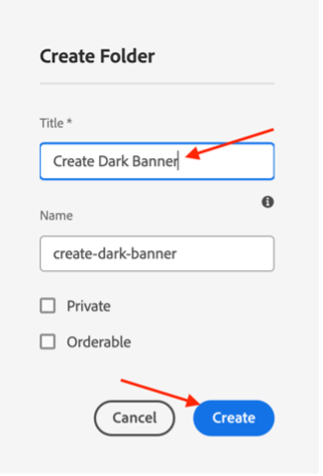
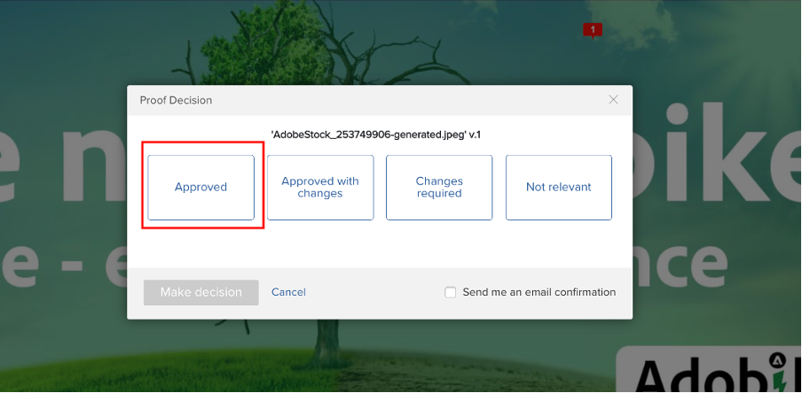

# Créer une bannière de page d’accueil de produit

## Production de la bannière

L’automatisation du contenu apporte à Experience Manager Assets la puissance de Adobe Creative Cloud, ce qui permet aux marketeurs d’automatiser la production de ressources à grande échelle, ce qui accélère considérablement la création de variations. Utilisons ces fonctionnalités pour générer une bannière à utiliser sur la page d’accueil.

- Accédez à l’auteur AEM sur [https://author-p105462-e991028.adobeaemcloud.com/](https://author-p105462-e991028.adobeaemcloud.com/) et connectez-vous avec les informations d’identification que nous avons fournies.

- Sur la page d’accueil, accédez à Outils > Assets > Profils de traitement.

- Dans l’interface, vous verrez tous les profils de traitement existants. Ils peuvent être utilisés pour activer certaines automatisations.

- Les éléments suivants vous intéressent :
   - Adobe Banner Dark : crée une bannière Adobe avec une superposition sombre, en fonction de la ressource sélectionnée.

     
   - Bannière Adobe Light : crée une bannière Adobe avec une superposition légère, en fonction de la ressource sélectionnée.

     
   - Bannière Adobe Banner Green : crée une bannière Adobe avec une superposition verte, en fonction de la ressource sélectionnée.

     

- Une fois que vous avez choisi le type de bannière à créer, sélectionnez ce profil de traitement, puis sélectionnez &quot;Appliquer le profil au(x) dossier(s)&quot;.

- Sur l’écran suivant, accédez au dossier de votre équipe dans AEM Assets. Ensuite, dans la partie supérieure gauche, sélectionnez le bouton &quot;Créer&quot; pour créer un dossier et lui donner un nom significatif, par exemple &quot;Créer une bannière sombre&quot;.

- Après avoir créé le dossier, cochez la case en regard de son nom, puis cliquez sur le bouton &quot;Appliquer&quot; en haut à droite.

Maintenant que nous avons effectué la configuration nécessaire, générons notre bannière.

- Cliquez sur le logo AEM dans le coin supérieur gauche pour ouvrir la navigation, puis accédez à Navigation > Assets > Fichiers.

- Recherchez le dossier &quot;Adobe Assets généré&quot; et ouvrez-le en cliquant sur la carte. C’est là que les bannières générées s’affichent.

- Ouvrez un nouvel onglet et accédez à nouveau à AEM Assets. Ensuite, accédez au dossier auquel nous avons appliqué le profil de traitement.

- Dans le dossier , téléchargez l’image pour laquelle vous souhaitez créer une bannière en la faisant glisser et en la déposant sur votre navigateur ou en cliquant sur Créer des fichiers dans le coin supérieur droit de l’interface.

- Patientez une minute pendant le traitement de votre ressource, puis rechargez votre écran. Si votre ressource apparaît dans l’état &quot;Nouveau&quot;, vous savez qu’elle a été traitée.

- Revenez à l’onglet précédent et rechargez l’écran ici également. Vous devez remarquer qu’une nouvelle ressource est indiquée dans l’état &quot;Nouveau&quot;. C&#39;est notre bannière générée, tout cela à partir de la gestion des actifs numériques (DAM) ! Ne le vois-tu pas encore ? Patientez une autre minute, puis rechargez votre écran.

>[!NOTE]
>
> Vous n&#39;êtes pas satisfait du résultat ? N’hésitez pas à appliquer un autre profil de traitement à votre dossier et à charger à nouveau votre ressource pour générer une autre bannière (ou à charger une autre ressource, bien sûr). Pendant le rechargement, le système vous demandera ce que vous souhaitez faire de la ressource existante, puis sélectionnez &quot;Remplacer&quot;.
> 

Nous avons maintenant notre bannière générée que nous pourrons utiliser ultérieurement lors de la diffusion de notre campagne. Veillez à publier la bannière en la sélectionnant, puis en cliquant sur le bouton &quot;Quick Publish&quot; sur le ruban.

## Suivi dans Workfront

Si vous avez besoin d’un processus de révision et d’approbation formel et auditable de votre Assets, Workfront est l’endroit idéal.

>[!NOTE]
>
> Bien que nous le mentionnions ici explicitement, il est prévu de mettre à jour les tâches dans Workfront une fois que vous les aurez terminées. Vous devez toujours vous efforcer d’obtenir un flux Créer > Révision > Approuver .

- Revenons à notre projet et développez l’accordéon &quot;Go/No Go Banner Review&quot; pour ouvrir la tâche en cliquant dessus :

- Cliquez sur la section documents de la tâche (colonne de gauche), puis sur le dossier lié AEM Assets &quot;Final&quot;. Sélectionnez votre ressource en cliquant sur sa zone et sur &quot;Créer un bon à tirer&quot;. Un bon à tirer est la capacité de relire le contenu, par exemple image, texte, vidéo, site web, etc., de manière structurée et collaborative, où les commentaires, les corrections, les modifications des parties prenantes concernées sont collectés, les versions et les résultats peuvent être comparés et approuvés de manière définitive, générés par un seul clic.

- Comme nous voulons un processus d&#39;approbation élaboré, sélectionnez &quot;Bon à tirer avancé&quot;.

>[!NOTE]
>
> Nous allons décider manuellement qui va examiner et/ou approuver notre BAT dans ce camp. Dans la plupart des cas pratiques réels, nous utiliserions un modèle prédéfini de flux de validation déjà défini pour chaque type de BAT.

- Par défaut, nous sommes dans un type de workflow &quot;de base&quot; et nous allons sélectionner votre spécialiste Workfront Bootcamp comme validant et approbateur. Saisissez le nom de votre spécialiste Workfront Bootcamp où est indiqué &quot;Saisissez le nom du contact ou l’adresse électronique à ajouter à un destinataire :

- Définissez-les comme &quot;Réviseur et approbateur&quot; :

- Cliquez sur &quot;Créer un bon à tirer&quot;. Workfront mettra quelques instants à générer le BAT :

- Votre spécialiste Workfront a maintenant reçu une nouvelle notification l’informant qu’il dispose d’un bon à tirer à vérifier et/ou à approuver :

- Après avoir cliqué sur la notification, ils devront faire face à votre BAT et pourront faire quelques commentaires et/ou valider ce BAT.

   - Il peut cliquer sur &quot;Ajouter un commentaire&quot; en haut de l&#39;écran s&#39;il y a des remarques :

  

   - Ils pourront alors non seulement ajouter des commentaires, mais aussi utiliser la petite barre d&#39;outils pointeurs pour définir clairement la zone à modifier.

  

   - En ajoutant le commentaire, ils peuvent vous faire savoir que vous devez effectuer un travail supplémentaire sur une nouvelle version du BAT. Actualisez votre onglet Workfront et une nouvelle notification vous en informera. Une fois que vous savez quelles modifications vous devez effectuer, apportez vos modifications dans AEM, puis venez télécharger votre nouvelle version ici :

  

   - Sélectionnez votre ressource mise à jour (si aucune modification n’est nécessaire dans le scénario bootcamp, téléchargez à nouveau la même ressource) et cliquez sur &quot;Lier&quot; :

  

   - Cliquez ensuite sur &quot;créer un BAT&quot; sur la droite.

  

   - Une fois le BAT généré (cela peut prendre quelques instants), votre spécialiste Workfront recevra une notification et pourra examiner et, je l’espère, approuver cette nouvelle version.  Par exemple, en utilisant le bouton de comparaison des BAT, ils peuvent afficher une comparaison côte à côte de V1 et V2 avec tous les commentaires qui ont été faits.

  

  

  

Nous disposons désormais d’une approbation officielle pour l’utilisation de notre bannière. Il est facile de suivre où nous en sommes dans le processus, et les mises à jour que vous déclenchez automatiquement les notifications, afin que vous puissiez travailler le plus efficacement possible.

Étape suivante : [Phase 2 - Production : créer une publicité de médias sociaux](./social.md)

[Revenir à la phase 1 - Planification : autres tâches préalables](../planning/prework.md)

[Revenir à tous les modules](../../overview.md)
