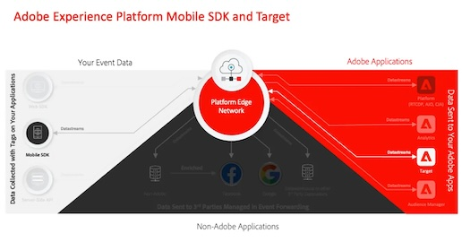

# Tutoriels sur la collecte de données

La collecte de données est la nouvelle génération de fonctionnalités de gestion de SDK mobiles et de balises de sites web d’Adobe. La collecte de données offre aux clients un moyen simple de déployer et de gérer les solutions d’analyse, de marketing et de publicité nécessaires pour offrir des expériences client pertinentes. Utilisez ces vidéos et tutoriels pour découvrir cette technologie essentielle.

## Guides de mise en œuvre

<table>
<tr>
  <td>
    
    

      <a href="https://experienceleague.adobe.com/fr/docs/platform-learn/implement-web-sdk/overview" target="_blank">
    <strong>Mise en œuvre d’Experience Cloud avec Web SDK</strong>
    </a>
    

    

    <em>Utilisation des balises pour implémenter Platform Web SDK</em>
    

  </td>
  <td>
    
    

      <a href="https://experienceleague.adobe.com/fr/docs/platform-learn/implement-mobile-sdk/overview" target="_blank">
    <strong>Implémenter Experience Cloud dans les applications mobiles</strong>
    </a>
    

    

    <em>Utilisation des balises pour implémenter Platform Mobile SDK</em>
    

  </td>
  <td>
    
    

      <a href="https://experienceleague.adobe.com/fr/docs/platform-learn/migrate-target-to-websdk/introduction" target="_blank">
    <strong>Implémenter des bibliothèques héritées avec des balises</strong>
    </a>
    

    

    <em>Utiliser les balises pour implémenter les anciennes bibliothèques Analytics, Target et Audience Manager</em>
    

  </td>
</tr>
</table>

## Guides de migration

<table>
<tr>
  <td>
    
    

      <a href="https://experienceleague.adobe.com/fr/docs/platform-learn/migrate-target-to-websdk/introduction" target="_blank">
    <strong>Migration d’Adobe Target vers Web SDK</strong>
    </a>
    

    

    <em>Remplacer at.js par Web SDK</em>
    

  </td>
  <td>
    
    

      <a href="https://experienceleague.adobe.com/fr/docs/platform-learn/migrate-analytics-to-websdk/migration-to-websdk-overview" target="_blank">
    <strong>Migration d’Adobe Analytics vers Web SDK dans les balises</strong>
    </a>
    

    

    <em>Remplacez AppMeasurement.js par Web SDK avec des balises</em>
    

  </td>
  <td>
      
    </a>
    

      <strong>Migration de Adobe Audience Manager vers Web SDK</strong>
    

    

    <em>Remplacez <a href="https://experienceleague.adobe.com/fr/docs/audience-manager/user-guide/migrate-to-web-sdk/dil-extension-to-web-sdk" target="_blank">dil.js</a> ou <a href="https://experienceleague.adobe.com/fr/docs/audience-manager/user-guide/migrate-to-web-sdk/appmeasurement-to-web-sdk" target="_blank">mettez à jour le transfert côté serveur</a></em>
    

  </td>
</tr>
<tr>
  <td>
    
    

      <a href="https://experienceleague.adobe.com/fr/docs/platform-learn/migrate-target-to-mobile-sdk-decisioning/overview" target="_blank">
    <strong>Migration d’Adobe Target vers Mobile SDK sur Edge Network</strong>
    </a>
    

    

    <em>Remplacez l’extension Target par l’extension Offer Decisioning and Target</em>
    

  </td>
  <td>
  </td>
  <td>
  </td>
  </tr>
</table>

*Apple, le logo Apple, l’iPad, l’iPhone, l’iPod et l’iPod touch sont des marques déposées d’Apple Inc., enregistrées aux États-Unis et dans d’autres pays. Swift et le logo Swift sont des marques déposées d’Apple Inc.*
