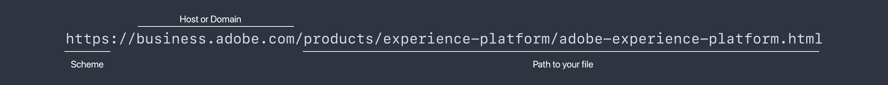

# API 101 - Présentation de base des API

API signifie Application Programming Interface. Ça signifie exactement ce qu&#39;il dit : il y a des interfaces entre les programmes et ces interfaces permettent à ces programmes de communiquer. Lorsque les programmeurs développent des applications logicielles, ils ont souvent besoin de leur logiciel pour communiquer avec d&#39;autres logiciels ou matériels. L’API définit les éléments suivants : quoi, comment, quand, où et pourquoi pour ces communications et interactions.

Les API sont un moyen de résoudre les problèmes métier liés aux logiciels. Dans la plupart des entreprises, c&#39;est un effort collaboratif. Collaborer est toujours plus facile avec une compréhension partagée des termes, concepts et étapes clés.

Si vous envisagez de cliquer sur un lien d’une page web, le navigateur utilise plusieurs API lorsque vous cliquez sur le lien. Le navigateur reconnaît le clic, demande la page que vous souhaitez consulter, récupère la page sur Internet, puis l’affiche à l’écran. Il existe de nombreuses petites étapes intermédiaires, mais votre navigateur est un logiciel qui communique et interagit avec diverses API simplement pour vous montrer une page web. Dans cet article, nous allons mettre en évidence les termes, concepts et étapes importants lors de l’utilisation ou de la discussion d’API.

À la fin de cet article, vous devriez avoir une compréhension claire de ces termes, concepts et étapes fondamentaux. La documentation des API peut être exhaustive et les discussions sur l’utilisation des API pour traiter des cas d’utilisation spécifiques peuvent être très détaillées. La navigation dans la documentation et la discussion des API est plus facile et plus productive grâce à des fondamentaux clairs et une compréhension partagée.

>[!NOTE]
>
> Bien qu’il y ait de nombreuses API, l’accent sera mis ici sur les API Web et de navigateur : en fait, lorsqu’une application logicielle interagit avec une autre sur Internet.

## Termes et concepts de l’API

Que signifie un mot ou une expression, et comment puis-je y penser simplement et facilement ? Dans une API, la partie &quot;application&quot; signifie une application ou un programme logiciel. La partie &quot;interface de programmation&quot; fait référence à la manière et à l’endroit où une application interagit avec une autre application à certaines fins. Dans notre exemple de page web, lorsque vous cliquez sur un lien, le navigateur envoie une demande à un serveur pour la page web.


Dans cette capture d’écran, le curseur de la souris survole le lien Adobe Experience Platform. En bas se trouve la barre d’état du navigateur web qui indique &quot;l’adresse&quot; de la page que le navigateur obtiendra. En d’autres termes, cliquer sur le lien Adobe Experience Platform indique au navigateur d’&quot;obtenir cette page pour que je puisse la voir ici sur mon écran&quot;.

Lorsqu’un utilisateur clique sur un lien, le navigateur envoie une requête à un serveur pour obtenir une page. Il s’agit d’une requête `GET`, l’une des méthodes de requête couramment utilisée avec les API web. Une chose dont le navigateur a besoin pour répondre à la demande est l’&quot;adresse&quot; de la page - où se trouve-t-il sur le web ?

### Parties d’une URL


La plupart des navigateurs ont une &quot;barre d’adresse&quot; qui affiche une partie ou la totalité de l’&quot;adresse&quot; d’une page web. Lorsque le navigateur &quot;récupère&quot; la page du lien sur lequel nous avons cliqué, il affiche &quot;l’adresse&quot; de la page dans cette barre d’adresse. Quelle est donc l&#39;&quot;adresse&quot; d&#39;une page web ?

Le `https://business.adobe.com/products/experience-platform/adobe-experience-platform.html` ci-dessus est l&#39;adresse d&#39;une page sur le web, et il s&#39;appelle une URL ou un localisateur de ressource Uniforme. Les URL peuvent faire référence à une page telle que celle-ci, un fichier image, une vidéo ou d’autres types de fichiers.



Cette adresse, l’URL, comporte des parties spécifiques qui sont très pertinentes pour les API web et de navigateur.

**Scheme**

La `scheme` ci-dessus est également appelée `protocol` avec des API web et elle est généralement `http` ou `https`. Le protocole de transfert HTTP ou HyperText est la manière dont les ressources telles que les pages web sont transférées d’un serveur web à un navigateur web. HTTPS est la version sécurisée, où le transfert se produit sur Internet à l&#39;aide de la sécurité destinée à empêcher toute interférence avec la ressource transférée. Il est courant de voir une petite icône de verrouillage dans la barre d’adresse du navigateur lors de l’affichage d’une page via HTTPS.

Pour les API web, les transferts de ces ressources se font par le biais de requêtes HTTP, c’est-à-dire des requêtes via HTTP.

**Hôtes et domaines**

`business.adobe.com` est l’hôte de la ressource demandée. Lorsque vous cliquez sur notre exemple de lien, le navigateur utilise cette partie de l’URL pour trouver le serveur sur lequel la page est hébergée. Ce n’est pas toujours exactement la même chose que le serveur web, mais à un niveau de base, nous pouvons le considérer comme le serveur sur lequel le navigateur obtiendra la page que nous avons demandée.

Les noms de domaine font partie du système de noms de domaine, plus connu sous le nom de DNS. La plupart des gens considèrent `adobe.com` ou `example.com` comme un &quot;nom de domaine&quot;, mais certaines parties sont pertinentes pour les API. `www.adobe.com` et `business.adobe.com` peuvent être appelés noms de domaine, mais les parties `www.` et `business.` sont appelées sous-domaines. Les API interagissent souvent avec une URL qui inclut un sous-domaine du type `api.example.com` ou `sub.www.example.com`.

Il est très courant de voir le terme _host_ faire référence à un nom de domaine complet incluant tout sous-domaine tel que `business.adobe.com`. Il est également courant de voir les termes _domain_ ou _domain name_ lorsqu’ils font référence à un hôte sans sous-domaine tel que `adobe.com`. Il n’est pas important ici de mémoriser les termes spécifiques pour chaque partie et variation d’un hôte. Mais il est important de savoir que ces termes sont couramment utilisés afin de pouvoir clarifier les détails pertinents de votre entreprise et de vos discussions.

**Origine**

Origin est un autre terme qui est lié aux parties d’une URL. À un niveau de base, une origine correspond à peu près à `scheme` plus `host` plus `domain` comme `https://business.adobe.com`. Les différentes valeurs représentent souvent des origines différentes comme `https://business.adobe.com` et `http://business.adobe.com` ne sont pas la même origine car elles ont des schémas différents. `https://www.adobe.com` et `https://business.adobe.com` ne sont pas non plus de même origine dans de nombreuses utilisations en raison des différents sous-domaines.

**Chemin**

La dernière partie de l’exemple d’URL ci-dessus est le `path` de la ressource : la page de notre exemple. La partie `/products/experience-platform/` représente généralement des dossiers ou des répertoires sur le serveur web. Tout comme nous avons des dossiers ou des répertoires sur nos ordinateurs pour les documents et les photos, nous avons aussi des dossiers sur les serveurs web pour organiser le contenu. Enfin, la partie `/adobe-experience-platform.html` est le nom du fichier : la page web.

D’autres parties plus détaillées d’une URL seront mises en évidence dans la partie suivante de cette série.

### API tierces

Les API Web sont parfois appelées API tierces. Pensez à ceci comme aux parties impliquées dans une transaction. Dans notre exemple de lien, vous (ou plus spécifiquement votre navigateur), êtes le premier dans la requête de la page. Le serveur web est le second. Où est le troisième ?

Il est courant qu’une page web contienne du contenu ou des ressources provenant d’autres hôtes ou sources. Dans ce cas, lorsque votre navigateur commence à afficher la page, il envoie un autre ensemble de requêtes à ces autres hôtes, ou &quot;tiers&quot;, qui hébergent ces ressources. C’est très courant, en particulier pour le contenu multimédia tel que les vidéos ou les images, mais aussi pour les données qui doivent être mises à jour au moment de leur affichage ou de leur utilisation. L’obtention de l’heure actuelle, de la météo actuelle ou d’un message de bienvenue personnalisé pour une personne spécifique sont autant d’exemples où une API tierce peut fournir la ressource appropriée au bon moment. Il est courant que ces requêtes proviennent de ces API tierces.

## Utilisations courantes des API web

Outre l’heure, la météo ou le contenu personnalisé, il existe de nombreuses utilisations pour les API web. Les plateformes de médias sociaux comme Twitter, TikTok, Facebook, LinkedIn, Snapchat, Pinterest et d’autres disposent d’une variété d’API que les programmeurs peuvent utiliser avec leurs applications. Et bien sûr, Adobe a aussi [une grande variété d&#39;API](https://developer.adobe.com/apis) que les programmeurs utilisent pour que leurs logiciels puissent interagir avec les produits et services d&#39;Adobe. Les produits et services logiciels accèdent à d’autres produits et services logiciels par l’intermédiaire de ces API.

## Exemples d’API

Les API de navigateur permettent aux programmeurs d’interagir directement avec les fonctionnalités du navigateur. L’API de batterie permet au logiciel de vérifier l’état de la batterie d’un appareil afin qu’il puisse vous alerter si nécessaire. L’API Presse-papiers permet au logiciel de copier ou coller le contenu avec le Presse-papiers de votre périphérique. L’API plein écran permet aux logiciels de présenter l’option permettant d’afficher la vue en plein écran de l’appareil, comme YouTube.

L’API Adobe Experience Platform Data Access est une API web qui permet aux programmeurs d’accéder aux fichiers de jeux de données de Adobe Experience Platform et de les télécharger afin qu’ils puissent utiliser les données de profil client dans leurs propres programmes. Il est très courant que des API comme celle-ci fassent partie d’un processus d’automatisation logicielle où le logiciel est programmé pour effectuer une séquence d’étapes en utilisant plusieurs API en combinaison. Il peut s’agir souvent d’une économie de coûts importante par rapport à l’exécution manuelle de ces mêmes étapes.

## Points de terminaison API

Lorsque les programmeurs &quot;utilisent&quot; un navigateur ou une API web dans leurs programmes, ils envoient généralement des requêtes pour envoyer ou recevoir des ressources, comme notre exemple de navigateur demandant une page web. La documentation de l’API répertorie souvent des &quot;points de terminaison&quot; pour ces requêtes, par exemple : `https://platform.adobe.io/data/foundation/export/files/{dataSetFileId}`. Il s’agit du modèle spécifique ou &quot;point de terminaison&quot; de l’API d’accès aux données de Platform qu’un programmeur utilisera pour obtenir un fichier de jeu de données.

`{dataSetFileId}` entouré de ces accolades représente une valeur que le programmeur doit envoyer dans la requête. Ainsi, l’URL de la requête API réelle ressemblerait à quelque chose comme `https://platform.adobe.io/data/foundation/export/files/xyz123brb` où `xyz123brb` doit être un identifiant valide du fichier de jeu de données que le programmeur souhaite recevoir.

En d’autres termes, tout comme le navigateur obtient une page à une URL spécifique, les requêtes d’API obtiennent des ressources d’un point de terminaison spécifique, ou en envoient des vers, comme cet exemple de jeu de données.

## Méthodes de requête HTTP

À ce stade, il devrait être clair que les API web effectuent des demandes de ressources telles que des pages web ou des jeux de données. Comme la plupart des concepts logiciels, ces requêtes HTTP suivent des modèles répétables. Une demande est envoyée d’une application logicielle à une autre application logicielle qui évalue la demande, puis répond : le navigateur demande une page à un serveur web et répond avec le contenu de la page.

L’ensemble du processus, de la demande à la réponse, implique de nombreuses étapes plus petites et très détaillées, mais les méthodes de la demande sont simples. Les méthodes de requête définissent l’opération demandée.

**`GET`**

La méthode de requête `GET` est utilisée lors de la demande d’une réponse qui fournit une ressource, comme notre page web et des exemples de jeux de données. Lorsque nous cliquons sur un lien dans un navigateur ou appuyez sur un lien sur un appareil mobile, nous effectuons une requête `GET` en arrière-plan.

**`POST`**

La méthode `POST` envoie des données avec la requête. Il peut sembler étrange qu’une &quot;requête&quot; envoie des données, mais l’idée est que l’exécution de la requête API demande au point de terminaison (le logiciel de réception) d’accepter la requête, et, dans le cas d’un `POST`, d’accepter également les données envoyées. Les données envoyées sont généralement écrites dans un entrepôt de données, tel qu’une base de données ou un fichier, afin de pouvoir être enregistrées.

**`PUT`**

La méthode de requête `PUT` est similaire à `POST` puisqu’elle envoie des données, mais si les données envoyées existent déjà au point de terminaison, un `PUT` mettra à jour les données existantes en les remplaçant. Un `POST` ne se met pas à jour, il envoie simplement, de sorte que plusieurs requêtes `POST` peuvent créer plusieurs enregistrements des données envoyées, au lieu de mettre à jour un enregistrement existant.

**`PATCH`**

La méthode de requête `PATCH` est utilisée pour envoyer des données qui mettent à jour une partie d’un enregistrement existant, comme lorsque nous changeons notre adresse en mettant à jour notre profil de compte. Avec une requête `POST`, un profil supplémentaire peut être créé et avec un `PUT`, le profil existant peut être remplacé, mais en utilisant la méthode `PATCH`, nous mettons simplement à jour la partie appropriée de l’enregistrement existant, comme notre adresse.

**`DELETE`**

La méthode de requête `DELETE` supprime une ressource spécifiée dans la requête, comme si nous cliquions sur un lien pour supprimer entièrement notre profil de compte.

Il existe plusieurs autres méthodes, mais il s’agit de la liste des méthodes les plus courantes lorsque vous utilisez des API.

### Exemple de requête

Maintenant que vous disposez des termes, concepts et étapes de base impliqués dans les API, nous pouvons consulter un exemple de requête d’API en pratique.

La page de notre exemple de navigateur a une URL de `https://business.adobe.com/products/experience-platform/adobe-experience-platform.html`. Lorsque l’utilisateur clique sur le lien Adobe Experience Platform, le navigateur effectue une requête `GET` pour cette page. Puisque nous avons le navigateur pour effectuer le travail pour nous, il nous suffit de cliquer sur , mais si un programmeur souhaite que cette demande se produise dans une application logicielle, il doit fournir tous les détails nécessaires pour que la demande d’API soit satisfaite.

Voici à quoi cela peut ressembler dans le code :

```js
fetch(
  "https://business.adobe.com/products/experience-platform/adobe-experience-platform.html",
  {
    headers: {
      accept:
        "text/html,application/xhtml+xml,application/xml;q=0.9,image/webp,image/apng,*/*;q=0.8,application/signed-exchange;v=b3;q=0.9",
      "accept-language": "en-US,en;q=0.9",
      "sec-ch-ua":
        '" Not A;Brand";v="99", "Chromium";v="101", "Microsoft Edge";v="101"',
      "sec-fetch-dest": "document",
      "sec-fetch-mode": "navigate",
      "sec-fetch-site": "none",
      "sec-fetch-user": "?1",
      "upgrade-insecure-requests": "1",
    },
    referrerPolicy: "strict-origin-when-cross-origin",
    body: null,
    method: "GET",
    mode: "cors",
    credentials: "include",
  }
);
```

Dans le code ci-dessus, vous pouvez voir le `URL` demandé par le navigateur et la méthode de requête `method: "GET"` se trouve tout en bas. Les autres lignes de code font également partie de la requête, mais ne sont pas incluses dans cet article.


*[API] : interface de programmation d’application
*[URL] : localisateur de ressource uniforme
*[HTTP] : protocole de transfert HyperText
*[DNS] : système de noms de domaine
