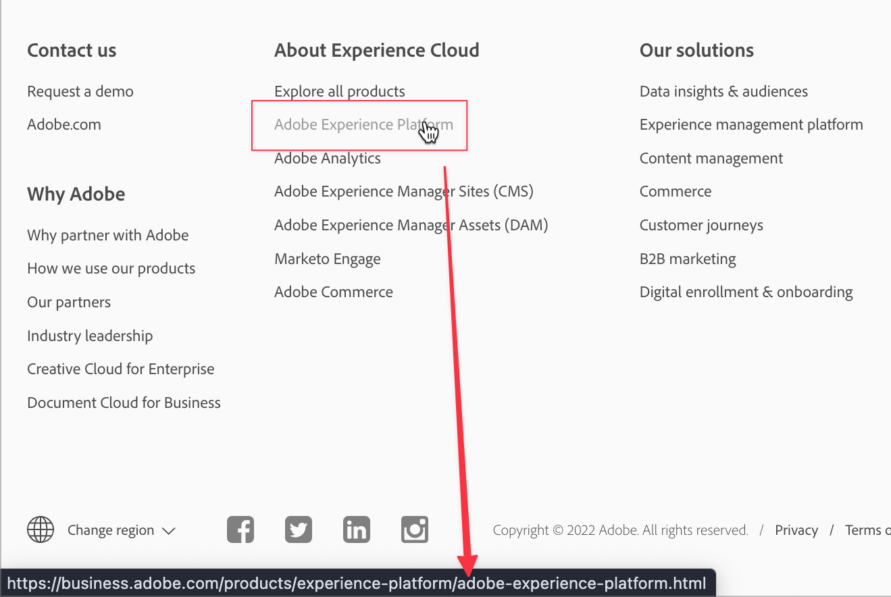
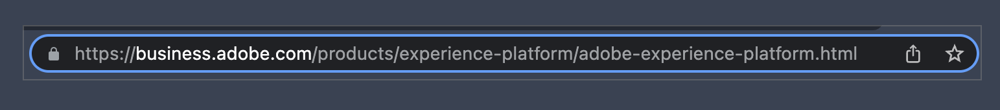
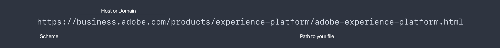

# API 101 - Présentation des API

API signifie Application Programming Interface (interface de programmation d&#39;application). Cela signifie exactement ce que cela dit : il y a des interfaces entre les programmes et ces interfaces permettent à ces programmes de communiquer. Lorsque les programmeurs développent des applications logicielles, ils ont souvent besoin de leur logiciel pour communiquer avec d&#39;autres logiciels ou matériels. L’API définit le quoi, le comment, le quand, le où et la raison de ces communications et interactions.

Les API sont un moyen de résoudre des problèmes d’activité avec un logiciel. Dans la plupart des entreprises, il s&#39;agit d&#39;un effort de collaboration. La collaboration est toujours plus facile avec une compréhension commune des termes, concepts et étapes clés.

Si vous envisagez de cliquer sur un lien dans une page web, le navigateur utilise plusieurs API lorsque vous cliquez sur le lien. Le navigateur reconnaît le clic, effectue la demande pour la page que vous souhaitez consulter, récupère la page sur Internet, puis l’affiche sur votre écran. Il existe de nombreuses petites étapes intermédiaires, mais votre navigateur est un logiciel qui communique et interagit avec diverses API simplement pour vous montrer une page web. Dans cet article, nous allons mettre en évidence les termes, concepts et étapes importants lors de l’utilisation des API ou de la discussion à leur sujet.

À la fin de cet article, vous devriez avoir une compréhension claire de ces termes, concepts et étapes fondamentaux. La documentation des API peut être exhaustive et les discussions sur l’utilisation des API pour répondre à des cas d’utilisation spécifiques peuvent être très détaillées. Parcourir la documentation et discuter des API est plus facile et plus productif avec des principes de base clairs et une compréhension commune.

>[!NOTE]
>
> Bien qu’il existe de nombreuses API, nous nous concentrerons ici sur les API Web et de navigateur : en gros, lorsqu’une application logicielle interagit avec une autre sur Internet.

## Termes et concepts de l’API

Que signifie un mot ou une expression, et comment puis-je y réfléchir simplement et facilement ? Dans une API, la partie « application » désigne une application logicielle, ou un programme. La partie « interface de programmation » fait référence à la manière et à l’endroit où une application interagit avec une autre application à certaines fins. Dans notre exemple de page web, lorsque vous cliquez sur un lien, le navigateur envoie une requête à un serveur pour la page web.



Dans cette capture d’écran, le curseur de la souris survole le lien Adobe Experience Platform. En bas se trouve la barre d’état du navigateur web qui indique l’« adresse » de la page que le navigateur obtiendra. En d’autres termes, cliquer sur le lien Adobe Experience Platform indique au navigateur de « récupérer cette page pour que je puisse la voir ici à l’écran ».

Lorsqu’un utilisateur clique sur un lien, le navigateur envoie une requête à un serveur pour obtenir une page. Il s’agit d’une requête `GET`, l’une des méthodes de requête couramment utilisées avec les API web. Une chose dont le navigateur a besoin pour répondre à la demande est la page « address » : où est-elle sur le web ?

### Parties d’une URL



La plupart des navigateurs disposent d’une « barre d’adresse » qui affiche une partie ou la totalité de l’« adresse » d’une page web. Lorsque le navigateur « récupère » la page pour le lien sur lequel nous avons cliqué, il affiche « l’adresse » de la page dans cette barre d’adresse. Quelle est donc l’« adresse » d’une page web ?

Cette `https://business.adobe.com/fr/products/experience-platform/adobe-experience-platform.html` ci-dessus correspond à l’adresse d’une page sur le web, appelée URL ou localisateur de ressources uniforme. Les URL peuvent faire référence à une page comme celle-ci, à un fichier image, à une vidéo ou à d’autres types de fichiers.



Cette adresse, l’URL, comporte des parties spécifiques qui sont très pertinentes pour les API web et de navigateur.

**Schéma**

La `scheme` ci-dessus est également appelée `protocol` avec des API web et est généralement `http` ou `https`. Le protocole HTTP ou HyperText Transfer Protocol permet de transférer des ressources telles que des pages web d’un serveur web vers un navigateur web. HTTPS est la version sécurisée, où le transfert se produit sur Internet en utilisant la sécurité destinée à empêcher les interférences avec la ressource en cours de transfert. Il est courant de voir une petite icône de cadenas dans la barre d’adresse du navigateur lors de l’affichage d’une page en HTTPS.

Pour les API web, les transferts de ces ressources s’effectuent par le biais de requêtes HTTP, c’est-à-dire des requêtes via HTTP.

**Hôtes et domaines**

Le `business.adobe.com` est l’hôte de la ressource demandée. Lorsque le navigateur clique sur notre lien d’exemple, il utilise cette partie de l’URL pour trouver le serveur sur lequel la page est hébergée. Ce n&#39;est pas toujours exactement la même chose que le serveur web, mais à la base, nous pouvons le considérer comme le serveur sur lequel le navigateur obtiendra la page que nous avons demandée.

Les noms de domaine font partie du système de noms de domaine, mieux connu sous le nom de DNS. La plupart des gens considèrent `adobe.com` ou `example.com` comme un « nom de domaine », mais il existe des parties pertinentes pour les API. `www.adobe.com` et `business.adobe.com` peuvent être appelés noms de domaine, mais les parties `www.` et `business.` sont appelées sous-domaines. Les API interagissent souvent avec une URL qui inclut un sous-domaine tel que `api.example.com` ou `sub.www.example.com`.

Il est très courant de voir le terme _hôte_ faire référence à un nom de domaine complet, y compris tout sous-domaine comme `business.adobe.com`. Il est également courant de voir les termes _domaine_ ou _nom de domaine_ lorsqu’il s’agit d’un hôte sans le sous-domaine comme `adobe.com`. La mémorisation des termes spécifiques à chaque partie et variation d’un hôte n’est pas importante ici. Toutefois, il est important de savoir que ces termes sont couramment utilisés afin de pouvoir clarifier tous les détails pertinents pour votre entreprise et vos discussions.

**Origine**

Origine est un autre terme à connaître qui est étroitement lié aux parties d’une URL. À la base, une origine correspond à peu près au `scheme` plus le `host` plus le `domain` comme `https://business.adobe.com/fr`. Des valeurs différentes représentent souvent des origines différentes, comme `https://business.adobe.com/fr`, et `http://business.adobe.com/fr` ne sont pas de la même origine, car elles ont des schémas différents. `https://www.adobe.com` et `https://business.adobe.com/fr` ne sont pas non plus la même origine dans de nombreuses utilisations en raison des différents sous-domaines.

**Chemin**

Le dernier élément de l’exemple d’URL ci-dessus est la `path` à la ressource, la page dans notre exemple. La partie `/products/experience-platform/` représente généralement des dossiers ou des répertoires sur le serveur web. Tout comme nous avons des dossiers ou des répertoires sur nos ordinateurs pour les documents et les photos, nous avons également des dossiers sur les serveurs Web pour organiser le contenu. Enfin, la partie `/adobe-experience-platform.html` correspond au nom du fichier, à savoir la page web.

D’autres parties plus détaillées d’une URL seront mises en évidence dans la partie suivante de cette série.

### API tierces

Les API web sont parfois appelées API tierces. Pensez à cela comme aux parties impliquées dans une transaction. Dans notre exemple de lien, vous (ou plus précisément votre navigateur) êtes la première partie dans la demande de la page. Le serveur web est le second intervenant. Où est la troisième ?

Il est courant qu’une page web inclue du contenu ou des ressources provenant d’autres hôtes ou sources. Dans ce cas, lorsque votre navigateur commence à afficher la page, il effectue un autre ensemble de requêtes aux autres hôtes, ou « tiers », qui hébergent ces ressources. C’est très courant, en particulier pour le contenu multimédia comme les vidéos ou les images, mais aussi pour les données qui doivent être mises à jour au moment où elles sont consultées ou utilisées. L’obtention de l’heure actuelle, de la météo actuelle ou d’un message de bienvenue personnalisé pour une personne spécifique sont autant d’exemples où une API tierce peut fournir la bonne ressource au bon moment. Il est courant que ces requêtes proviennent de ces API tierces.

## Utilisations courantes des API web

Outre l’heure de la journée, la météo ou le contenu personnalisé, les API web ont de nombreuses utilisations. Les plateformes de médias sociaux comme Twitter, TikTok, Facebook, LinkedIn, Snapchat, Pinterest et d&#39;autres ont une variété d&#39;API que les programmeurs peuvent utiliser avec leurs applications. Bien entendu, Adobe dispose également d’[une grande variété d’API](https://developer.adobe.com/apis) que les programmeurs utilisent afin que leurs logiciels puissent interagir avec les produits et services Adobe. Les produits et services logiciels accèdent à d’autres produits et services logiciels par le biais de ces API.

## Exemples d’API

Les API du navigateur permettent aux programmeurs d&#39;interagir directement avec les fonctionnalités du navigateur. L’API Battery permet au logiciel de vérifier l’état de la batterie d’un appareil pour qu’il puisse vous alerter si nécessaire. L’API Presse-papiers permet au logiciel de copier ou coller avec le presse-papiers de votre appareil. L’API Plein écran permet au logiciel de présenter l’option permettant d’étendre la vue au plein écran de l’appareil, comme YouTube.

L’API Data Access Adobe Experience Platform est une API web qui permet aux programmeurs d’accéder aux fichiers de jeux de données et de les télécharger depuis Adobe Experience Platform afin qu’ils puissent utiliser les données de profil client dans leurs propres programmes. Il est très courant que des API comme celle-ci fassent partie d&#39;un processus d&#39;automatisation logicielle où le logiciel est programmé pour exécuter une séquence d&#39;étapes à l&#39;aide de plusieurs API en combinaison. Cela permet souvent de réaliser des économies importantes par rapport à l’exécution manuelle de ces mêmes étapes.

## Points d’entrée de l’API

Lorsque les programmeurs « utilisent » un navigateur ou une API web dans leurs programmes, ils effectuent généralement des requêtes pour envoyer ou recevoir des ressources, comme dans l’exemple de navigateur qui demande une page web. La documentation de l’API répertorie souvent des « points d’entrée » pour ces requêtes, par exemple : `https://platform.adobe.io/data/foundation/export/files/{dataSetFileId}`. Il s’agit du modèle spécifique ou du « point d’entrée » de l’API Data Access Platform qu’un programmeur utilisera pour obtenir un fichier de jeu de données.

Le `{dataSetFileId}` entouré de ces accolades représente une valeur que le programmeur doit envoyer dans la requête. Ainsi, l’URL dans la requête d’API réelle ressemblerait à `https://platform.adobe.io/data/foundation/export/files/xyz123brb` où l’`xyz123brb` doit être un identifiant valide du fichier de jeu de données que le programmeur souhaite recevoir.

En d’autres termes, tout comme le navigateur obtient une page à une URL spécifique, les requêtes d’API obtiennent des ressources d’un point d’entrée spécifique comme cet exemple de jeu de données ou les envoient à ce point d’entrée spécifique.

## Méthodes de requête HTTP

À ce stade, il doit être clair que les API web effectuent des requêtes pour des ressources telles que des pages web ou des jeux de données. Comme la plupart des concepts logiciels, ces requêtes HTTP suivent des modèles répétables. Une requête est envoyée par une application logicielle à une autre application logicielle qui évalue la requête, puis répond : le navigateur demande une page à un serveur web et répond avec le contenu de la page.

L’ensemble du processus, de la requête à la réponse, implique de nombreuses étapes plus petites et très détaillées, mais les méthodes de requête sont simples. Les méthodes de requête définissent l’opération demandée.

**`GET`**

La méthode de requête `GET` est utilisée lors de la requête d’une réponse qui fournit une ressource, comme notre page web et des exemples de jeux de données. Lorsque nous cliquons sur un lien dans un navigateur ou appuyez sur un lien sur un appareil mobile, nous envoyons une requête `GET` en coulisse.

**`POST`**

La méthode `POST` envoie des données avec la requête. Il peut sembler étrange qu’une « requête » envoie des données, mais l’idée est que l’exécution de la requête API demande au point d’entrée (le logiciel récepteur) d’accepter la requête et, dans le cas d’une `POST`, d’accepter également les données envoyées. Les données envoyées sont généralement écrites dans un magasin de données tel qu’une base de données ou un fichier afin de pouvoir être enregistrées.

**`PUT`**

La méthode de requête `PUT` est similaire à `POST` puisqu’elle envoie des données, mais si les données envoyées existent déjà au point d’entrée , un `PUT` met à jour les données existantes en les remplaçant. Un `POST` ne met pas à jour, il envoie simplement, de sorte que plusieurs requêtes `POST` peuvent créer plusieurs enregistrements des données envoyées, au lieu de mettre à jour n’importe quel enregistrement existant.

**`PATCH`**

La méthode de requête `PATCH` est utilisée pour envoyer des données qui mettent à jour une partie d’un enregistrement existant, comme lorsque nous modifions notre adresse en mettant à jour notre profil de compte. Avec une requête `POST`, un profil supplémentaire pourrait être créé, et avec un `PUT`, le profil existant pourrait être remplacé, mais en utilisant la méthode `PATCH`, nous mettons simplement à jour la partie pertinente de l&#39;enregistrement existant, comme notre adresse.

**`DELETE`**

La méthode de requête `DELETE` supprime une ressource spécifiée dans la requête, comme si nous cliquions sur un lien pour supprimer entièrement notre profil de compte.

Il en existe plusieurs autres, mais il s’agit d’une liste des méthodes les plus courantes lorsque vous utilisez des API.

### Exemple de requête

Maintenant que vous disposez des termes, concepts et étapes de base impliqués dans les API, nous pouvons examiner un exemple de requête d’API en pratique.

La page de l’exemple de navigateur comporte une URL de `https://business.adobe.com/fr/products/experience-platform/adobe-experience-platform.html`. Lorsque l’utilisateur clique sur le lien Adobe Experience Platform, le navigateur effectue une requête `GET` pour cette page. Puisque nous avons le navigateur pour faire le travail pour nous, tout ce que nous avons à faire est de cliquer, mais si un programmeur veut que cette demande se produise dans une application logicielle, il doit fournir tous les détails requis pour que la demande d&#39;API soit satisfaite avec succès.

Voici à quoi cela peut ressembler dans le code :

```js
fetch(
  "https://business.adobe.com/fr/products/experience-platform/adobe-experience-platform.html",
  {
    headers: {
      accept:
        "text/html,application/xhtml+xml,application/xml;q=0.9,image/webp,image/apng,*/*;q=0.8,application/signed-exchange;v=b3;q=0.9",
      "accept-language": "en-US,en;q=0.9",
      "sec-ch-ua":
        '" Not A;Brand";v="99", "Chromium";v="101", "Microsoft Edge";v="101"',
      "sec-fetch-dest": "document",
      "sec-fetch-mode": "navigate",
      "sec-fetch-site": "none",
      "sec-fetch-user": "?1",
      "upgrade-insecure-requests": "1",
    },
    referrerPolicy: "strict-origin-when-cross-origin",
    body: null,
    method: "GET",
    mode: "cors",
    credentials: "include",
  }
);
```

Dans le code ci-dessus, vous pouvez voir le `URL` demandé par le navigateur. En bas, près du bas, se trouve la méthode de requête `method: "GET"`. Les autres lignes de code font également partie de la requête, mais ne relèvent pas de cet article.


*[API] : interface de programmation d’applications
*[URL] : localisateur de ressources uniforme
*[HTTP] : HyperText Transfer Protocol
*[DNS] : système de noms de domaine
