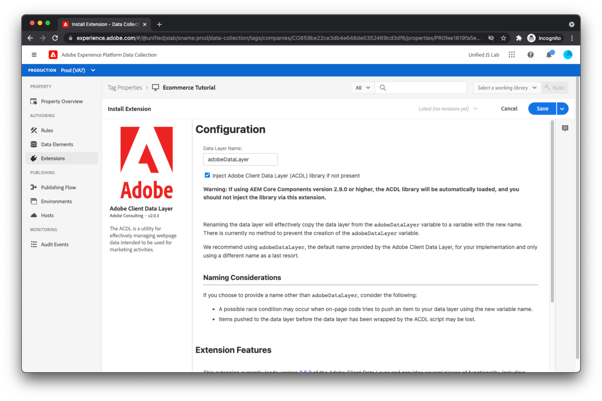

# Création d’une propriété de balise Adobe Experience Platform et installation d’extensions

Maintenant que le code sur la page envoie des données et des événements dans la couche de données, il est temps pour le marketeur de lire les données de la couche de données et d’envoyer ces données à Adobe Experience Platform. Cela nécessite généralement deux bibliothèques JavaScript :

* Adobe de la couche de données client : Lors des étapes précédentes, vous avez créé un tableau de couche de données et y avez inséré des objets. Pour accéder aux données, vous devez charger la bibliothèque JavaScript de la couche de données client Adobe, qui permet d’être informé des modifications et événements de la couche de données et fournit également des moyens simples d’accès aux données.
* SDK Web Adobe Experience Platform : Cette bibliothèque JavaScript communique avec Adobe Experience Platform Edge Network. Le SDK traite l’identité, le consentement, la collecte de données, la personnalisation, les audiences, etc.

Bien que vous puissiez charger ces bibliothèques individuelles sur votre site web et les utiliser directement, nous vous recommandons d’utiliser [Balises Adobe Experience Platform](https://experienceleague.adobe.com/docs/experience-platform/tags/home.html?lang=fr). Avec les balises, vous pouvez incorporer un seul script dans votre HTML et utiliser l’interface utilisateur Balises pour déployer la couche de données client Adobe et le SDK Web Adobe Experience Platform. Les balises vous permettent également de créer des règles pour l’envoi de données, entre autres. Ce tutoriel utilise les balises à cet effet et suppose que vous comprenez de base le fonctionnement des balises.

## Création d’une propriété dans les balises

Si ce n&#39;est déjà fait, [création d’une propriété dans les balises](https://experienceleague.adobe.com/docs/experience-platform/tags/admin/companies-and-properties.html#create-or-configure-a-property).

## Installation de l’extension Adobe Client Data Layer

Installez l’extension Adobe Client Data Layer en accédant au catalogue d’extensions, en recherchant l’extension et en cliquant sur les [!UICONTROL Installer] bouton . Un écran de configuration devrait s’afficher.

Pour ce tutoriel, il n’est pas nécessaire de modifier les valeurs par défaut. Cliquez sur [!UICONTROL Enregistrer].

## Installer l’extension Adobe Experience Platform Web SDK

Installez ensuite l’extension SDK Web Adobe Experience Platform en recherchant l’extension dans le catalogue d’extensions et en cliquant sur les [!UICONTROL Installer] bouton . Un écran de configuration devrait s’afficher.

Dans [Création d’un flux de données](../configure-the-server/create-a-datastream.md), vous avez créé un flux de données auquel Adobe Experience Platform Edge Network fait référence pour déterminer où envoyer vos données entrantes. Lors de l’exécution de requêtes du SDK Web Adobe Experience Platform vers Edge Network, vous devez indiquer la banque de données Edge Network à référencer.

Pour ce faire, recherchez la variable [!UICONTROL Datastream] et sélectionnez le flux de données que vous avez créé précédemment. Les mêmes environnements de flux de données que ceux que vous avez vus dans [Création d’un flux de données](../configure-the-server/create-a-datastream.md).

Comme décrit dans [Création d’un flux de données](../configure-the-server/create-a-dataset.md), ces environnements de jeux de données ont une relation avec les environnements de balises. Supposons que vous ayez terminé l’installation de l’extension du SDK Web de Adobe Experience Platform, que vous créiez une bibliothèque de balises contenant l’extension, puis que vous publiiez la bibliothèque dans un environnement de développement de balises. Lorsque la bibliothèque de balises est chargée sur votre page web et que l’extension Adobe Experience Platform Web SDK envoie une requête à Edge Network, l’extension inclut la variable [!UICONTROL Environnement de développement] ID d’environnement de la banque de données. Edge Network, à son tour, utilise cet identifiant pour lire la configuration de la variable [!UICONTROL Environnement de développement] environnement de flux de données et transférez les données vers les produits d’Adobe appropriés.

Actuellement, vous n’avez qu’un environnement de flux de données de développement, un environnement de flux de données intermédiaire et un environnement de flux de données de production. C’est pourquoi l’interface utilisateur de configuration de l’extension les affiche toutes présélectionnées et non modifiables. Il est toutefois possible de créer plusieurs environnements de développement de flux de données (un pour vous et un pour votre collègue, peut-être) à l’aide de l’interface utilisateur de flux de données. Si vous disposez de plusieurs environnements de flux de données de développement, vous pouvez sélectionner celui que vous souhaitez utiliser pour cette propriété de balise.

Enfin, faites défiler la page vers le bas et désélectionnez la case [!UICONTROL Activer la collecte de données de clic]. Par défaut, le SDK effectue automatiquement le suivi des liens pour vous. Toutefois, dans ce tutoriel, nous vous montrerons comment effectuer le suivi de vos propres clics sur les liens à l’aide d’informations de lien personnalisées.

Cliquez sur le bouton [!UICONTROL Enregistrer] pour terminer l’installation de l’extension SDK Web Adobe Experience Platform.

Les extensions appropriées ont été installées. Il est temps de créer des règles et des éléments de données.
