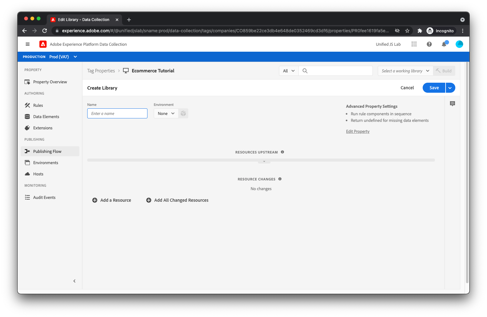

# Publication de la bibliothèque

Il est maintenant temps de déployer la bibliothèque de balises sur votre site web.

## créer une bibliothèque ;

Tout d’abord, vous devez créer une bibliothèque qui inclut les extensions, les règles et l’élément de données que vous avez créé. Pour créer une bibliothèque, sélectionnez [!UICONTROL Flux de publication] dans le menu de gauche.

Sélectionner [!UICONTROL Ajouter une bibliothèque].

Vous devriez voir la vue de création de bibliothèque.



Attribuez un nom à la bibliothèque, par exemple _Démonstration_. Sélectionner [!UICONTROL Développement] dans le [!UICONTROL Environnement] menu déroulant. Cliquez ensuite sur [!UICONTROL Ajouter toutes les ressources modifiées].

Vous devriez maintenant voir toutes vos extensions, règles et éléments de données répertoriés sous [!UICONTROL Modifications des ressources]. Cliquez sur [!UICONTROL Enregistrement et création pour le développement].

## Ajout du code incorporé à votre HTML

Vous devez maintenant ajouter une balise de script au HTML de page de produit qui charge la bibliothèque de balises nouvellement créée.

Commencer par cliquer sur [!UICONTROL Environnements] dans le menu de gauche. Vous devriez voir trois environnements différents répertoriés.


Cliquez sur l’icône de module dans la [!UICONTROL Développement] ligne d’environnement. Les instructions d’installation du script de bibliothèque Launch doivent s’afficher sur votre page.


Copiez la balise de script (il existe un bouton de copie dans le presse-papiers à des fins pratiques). Ouvrez le HTML de page de votre produit et insérez la balise de script avant la balise `</head>` balise . Votre HTML final doit se présenter comme suit :

```html
<!DOCTYPE html>
<html lang="en">
  <head>
    <title>Product Page</title>
    <script>
      window.adobeDataLayer = window.adobeDataLayer || [];
      window.adobeDataLayer.push({
        "event": "pageViewed",
        "web": {
          "webPageDetails": {
            "name": "Foam Roller",
            "siteSection": "Equipment"
          },
        },
        "productListItems": [
          {
            "SKU": "eqfr08",
            "currencyCode": "USD",
            "name": "Foam Roller",
            "priceTotal": 18.95
          }
        ]
      });
      window.adobeDataLayer.push({
        "event": "productViewed"
      });
      window.onAddToCartClick = function() {
        // In a real implementation, you would change this condition to 
        // only pass if a cart doesn't already exist. You would typically 
        // do this by checking a cookie or variable value.
        if (true) {
          window.adobeDataLayer.push({
            "event": "cartOpened",
          });
        }
        window.adobeDataLayer.push({
          "event": "productAddedToCart"
        });
      };
      window.onDownloadAppClick = function() {
        window.adobeDataLayer.push({
          "event": "downloadAppClicked",
          "eventInfo": {
            "web": {
              "webInteraction": {
                "URL": "https://example.com/download",
                "name": "App Download",
                "type": "download"
              }
            }
          }
        });
      };
    </script>
    <!--Swap this script tag with your own-->
    <script src="https://assets.adobedtm.com/xxxxxxxxxxxx/xxxxxxxxxxxx/launch-xxxxxxxxxxxx-development.min.js" async></script>
  </head>
  <body>
    <h1>Foam Roller</h1>
    <p>This foam roller is composed of durable material that holds its shape and delivers deep tissue therapy. Purchase now for only $18.95!</p>
    <button type="button" onclick="onAddToCartClick()">Add to cart</button>
    <a href="https://example.com/download" onclick="onDownloadAppClick()">Download the app</a>
  </body>
</html>
```

Consultez la section [documentation de publication pour les balises](https://experienceleague.adobe.com/docs/experience-platform/tags/publish/overview.html?lang=fr) si vous souhaitez en savoir plus sur le processus de publication.

Ensuite, vous allez tester votre nouvelle mise en oeuvre.
