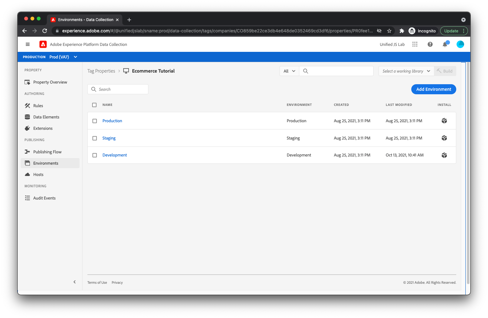

# Création dʼun flux de données

Les données que vous envoyez à partir de votre site web atteignent un ensemble de serveurs d’Adobe appelés [Adobe Experience Platform Edge](https://business.adobe.com/products/experience-platform/experience-platform-edge-network.html). Ce réseau est capable d’envoyer vos données à la variable [Jeu de données Adobe Experience Platform que vous avez créé précédemment](create-a-schema.md) et d’autres produits dans Adobe Experience Cloud. Ces produits Adobe peuvent également répondre avec des données à votre page web. Par exemple, Edge Network peut renvoyer du contenu de personnalisation à partir d’Adobe Target.

Pour configurer les produits Adobe pour lesquels Edge Network interrompt les données, vous devez créer un flux de données. Lorsqu’Edge Network reçoit des données de votre page web, il consulte le flux de données que vous avez créé, lit sa configuration, puis transmet les données aux produits d’Adobe appropriés.

Pour créer un flux de données, accédez d’abord au [!UICONTROL Datastreams] Afficher dans [!UICONTROL Collecte de données]. Cliquez sur [!UICONTROL Créer un flux de données] dans le coin supérieur droit. Attribuez un nom au flux de données.

L’écran suivant vous permet de configurer les produits Adobe qui doivent recevoir les données que vous envoyez depuis votre site web. Pour les besoins de ce tutoriel, activez uniquement Adobe Experience Platform, sélectionnez le jeu de données que vous avez précédemment créé (qui se trouvera dans la valeur par défaut [!UICONTROL Prod] sandbox), puis cliquez sur [!UICONTROL Enregistrer].

Votre flux de données a été créé.

## Environnements de flux de données

Les entreprises disposent généralement d’un chemin de promotion pour toutes les mises à jour de site web. Une personne de l’entreprise (un spécialiste du marketing ou un ingénieur, selon les modifications) teste généralement ses modifications dans un environnement de développement que seule cette personne utilise. Une fois que les modifications leur conviennent, elles sont promues dans un environnement d’évaluation où elles font l’objet d’autres tests. Enfin, les modifications sont publiées sur le site web de production que les utilisateurs voient. Les flux de données prennent en charge ce modèle de promotion.

Après avoir cliqué sur [!UICONTROL Enregistrer], vous devez avoir remarqué que trois environnements de flux de données ont été automatiquement créés pour vous : [!UICONTROL Environnement de développement], [!UICONTROL Environnement d’évaluation], et [!UICONTROL Environnement de production].

Si vous cliquez sur chaque environnement de flux de données, vous remarquerez qu’ils ont tous reçu la même configuration que celle que vous avez fournie. Ces environnements peuvent toutefois être personnalisés individuellement.

Si vous connaissez les balises Adobe Experience Platform, vous connaissez peut-être déjà bien le concept d’environnement de développement, d’évaluation et de production. Les environnements au sein des balises sont liés aux environnements au sein d’un flux de données. Lorsque vous déplacez une bibliothèque de balises par le biais du processus de publication Balises du développement à l’évaluation en passant par la production, l’environnement de flux de données utilisé passe automatiquement de [!UICONTROL Environnement de développement], à [!UICONTROL Environnement d’évaluation], à [!UICONTROL Environnement de production]. Cela vous permet, par exemple, d’envoyer des données dans un jeu de données pendant que vos modifications sont en cours de développement et d’envoyer des données à un autre jeu de données une fois vos modifications en production. Cela permet d’éviter que vos données de production ne contiennent les données de mémoire que vous pouvez générer pendant le processus de développement. Nous discuterons des environnements de flux de données ultérieurement lors de la configuration des extensions dans votre propriété de balise.

Le serveur est maintenant entièrement configuré pour recevoir les données de votre page web.
