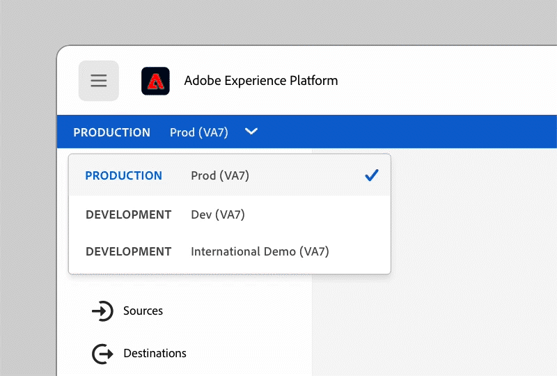

# Utilisation des sandbox

Découvrez comment les environnements de test Experience Platform offrent l’isolation des données et des environnements dans lesquels ils peuvent tester des fonctionnalités nouvelles ou existantes, travailler avec une approche &quot;fail fast&quot; (Échec rapide) et être en mesure de réinitialiser et de redémarrer les initiatives de développement.

>[!VIDEO](https://video.tv.adobe.com/v/29838/?quality=12&learn=on)

>[!NOTE]
>
>Depuis l’enregistrement de cette vidéo, le sélecteur d’environnement de test s’est déplacé en haut à droite de l’interface de l’Experience Cloud afin de vous donner plus d’espace vertical pour vous concentrer sur votre travail :
>
> 

Pour plus d’informations, consultez la [Guide d’utilisation des environnements de test](https://experienceleague.adobe.com/docs/experience-platform/sandbox/home.html?lang=fr).
