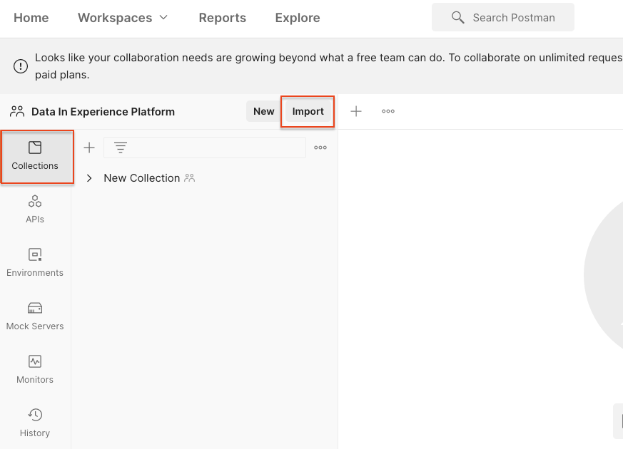

# Importation de données d’exemple dans Adobe Experience Platform

Découvrez comment configurer un environnement sandbox Experience Platform avec des données d’exemple. À l’aide d’une collection Postman, vous pouvez créer des groupes de champs, des schémas, des jeux de données, puis importer des données d’exemple dans Experience Platform.

## Exemple de cas d’utilisation de données

Les utilisateurs professionnels Experience Platform doivent souvent passer par une série d’étapes qui incluent l’identification des groupes de champs, la création de schémas, la préparation de données, la création de jeux de données, puis l’ingestion de données avant de pouvoir explorer les fonctionnalités marketing proposées par Experience Platform. Ce tutoriel automatise certaines étapes afin que vous puissiez intégrer des données dans un environnement de test Platform aussi rapidement que possible.

Ce tutoriel se concentre sur une marque fictive de vente au détail appelée Luma. Ils investissent dans Adobe Experience Platform afin de combiner les données de fidélité, de gestion de la relation client, de catalogue de produits et d’achat hors ligne dans des profils clients en temps réel et d’activer ces profils pour passer à un niveau de marketing supérieur. Nous avons généré des exemples de données pour Luma. Dans le reste de ce tutoriel, vous allez importer ces données dans l’un de vos environnements de test Experience Platform.

>[!NOTE]
>
>Le résultat final de ce tutoriel est un environnement de test contenant des données similaires au [Tutoriel Prise en main de Adobe Experience Platform pour les architectes de données et les ingénieurs de données](https://experienceleague.adobe.com/docs/platform-learn/getting-started-for-data-architects-and-data-engineers/overview.html?lang=fr). Il a été mis à jour en avril 2023 pour prendre en charge la variable [Défis liés à Journey Optimizer](https://experienceleague.adobe.com/docs/journey-optimizer-learn/challenges/introduction-and-prerequisites.html?lang=fr). Il a été mis à jour en juin 2023 afin de passer la méthode d’authentification à OAuth.

## Conditions préalables

* Vous avez accès aux API Experience Platform et savez comment vous authentifier. Si ce n’est pas le cas, passez en revue les [tutoriel](https://experienceleague.adobe.com/docs/platform-learn/tutorials/platform-api-authentication.html?lang=fr).
* Vous avez accès à un environnement de test de développement Experience Platform.
* Vous connaissez votre identifiant de client Experience Platform. Vous pouvez l’obtenir en effectuant une authentification [Requête API](https://experienceleague.adobe.com/docs/experience-platform/xdm/api/getting-started.html?lang=en#know-your-tenant_id)
ou en l’extrayant de l’URL lorsque vous vous connectez à votre compte Platform. Par exemple, dans l’URL suivante, le client est &quot;`techmarketingdemos`&quot; `https://experience.adobe.com/#/@techmarketingdemos/sname:prod/platform/home`.

## Utilisation de [!DNL Postman] {#postman}

### Configuration des variables d’environnement

Avant de suivre les étapes, assurez-vous d’avoir téléchargé la [Postman](https://www.postman.com/downloads/) application. C’est parti !

1. Téléchargez la [platform-utils-main.zip](../assets/data-generator/platform-utils-main.zip) qui contient tous les fichiers requis pour ce tutoriel.

   >[!NOTE]
   >
   >Données utilisateur contenues dans la variable [platform-utils-main.zip](../assets/data-generator/platform-utils-main.zip) est fictif et doit être utilisé à des fins de démonstration uniquement.

1. Dans votre dossier de téléchargements, déplacez le fichier `platform-utils-main.zip` vers l’emplacement souhaité sur votre ordinateur, puis décompressez-le.
1. Dans le `luma-data` , ouvrez tous les `json` dans un éditeur de texte et remplacez toutes les instances de `_yourTenantId` avec votre propre identifiant de client, précédé d’un trait de soulignement.
1. Ouvrir `luma-offline-purchases.json`, `luma-inventory-events.json`, et `luma-web-events.json` dans un éditeur de texte et mettez à jour tous les horodatages afin que les événements se produisent le dernier mois (par exemple, recherchez `"timestamp":"2022-11` et remplacer l’année et le mois)
1. Notez l’emplacement du dossier décompressé, car vous en aurez besoin ultérieurement lors de la configuration de la variable `FILE_PATH` [!DNL Postman] Variable d’environnement :

   >[!NOTE]
   > Pour obtenir le chemin d’accès au fichier sur votre Mac, accédez au `platform-utils-main` , cliquez avec le bouton droit sur le dossier et sélectionnez **Obtenir les informations** .
   >
   > 

   >[!NOTE]
   > Pour obtenir le chemin d’accès au fichier sous Windows, cliquez pour ouvrir l’emplacement du dossier souhaité, puis cliquez avec le bouton droit à droite du chemin d’accès dans la barre d’adresse. Copiez l’adresse pour obtenir le chemin du fichier.
   > 
   > 

1. Ouvrir [!DNL Postman] et créez un espace de travail à partir du **Espaces de travail** menu déroulant :\
   
1. Saisissez un **Nom** et facultatif **Résumé** pour votre espace de travail et cliquez sur **Créer Workspace**. [!DNL Postman] passera à votre nouvel espace de travail lorsque vous le créerez.
   
1. Maintenant, ajustez certains paramètres pour exécuter le [!DNL Postman] collections dans cet espace de travail. Dans l’en-tête de [!DNL Postman], cliquez sur l’icône d’engrenage et sélectionnez **Paramètres** pour ouvrir le modal paramètres. Vous pouvez également utiliser le raccourci clavier (CMD/CTRL + ,) pour ouvrir le modal.
1. Sous , `General` , mettez à jour le délai d’expiration de la requête en ms sur `5000 ms` et activez `allow reading file outside this directory`
   

   >[!NOTE]
   > Si les fichiers sont chargés à partir du répertoire de travail, il s’exécute correctement sur les appareils si les mêmes fichiers sont stockés sur les autres appareils. Cependant, si vous souhaitez exécuter des fichiers en dehors du répertoire de travail, un paramètre doit être activé pour indiquer la même intention. Si votre `FILE_PATH` n’est pas identique à [!DNL Postman]chemin du répertoire de travail de , cette option doit être activée.

1. Fermez la **Paramètres** du panneau.
1. Sélectionnez la variable **Environnements** puis sélectionnez **Importer**:
   
1. Importez le fichier d’environnement json téléchargé, `DataInExperiencePlatform.postman_environment`
1. Dans Postman, sélectionnez votre environnement dans la liste déroulante en haut à droite, puis cliquez sur l’icône représentant un oeil pour afficher les variables d’environnement :
   

1. Assurez-vous que les variables d’environnement suivantes sont renseignées. Pour savoir comment obtenir la valeur des variables d’environnement, consultez la section [Authentification aux API Experience Platform](/help/platform/authentication/platform-api-authentication.md) tutoriel pour des instructions détaillées.

   * `CLIENT_SECRET`
   * `API_KEY`—`Client ID` dans la console Adobe Developer
   * `SCOPES`
   * `TECHNICAL_ACCOUNT_ID`
   * `IMS`
   * `IMS_ORG`—`Organization ID` dans la console Adobe Developer
   * `SANDBOX_NAME`
   * `TENANT_ID`—veillez à commencer par un trait de soulignement, par exemple `_techmarketingdemos`
   * `CONTAINER_ID`
   * `platform_end_point`
   * `FILE_PATH`: utilisez le chemin d’accès au dossier local où vous avez décompressé le fichier `platform-utils-main.zip` fichier . Veillez à inclure le nom du dossier, par exemple `/Users/dwright/Desktop/platform-utils-main`

1. **Enregistrer** l’environnement mis à jour ;

### Importation de collections Postman

Ensuite, vous devez importer les collections dans Postman.

1. Sélectionner **Collections** et choisissez ensuite l&#39;option d&#39;import :

   

1. Importez les collections suivantes :

   * `0-Authentication.postman_collection.json`
   * `1-Luma-Loyalty-Data.postman_collection.json`
   * `2-Luma-CRM-Data.postman_collection.json`
   * `3-Luma-Product-Catalog.postman_collection.json`
   * `4-Luma-Offline-Purchase-Events.postman_collection.json`
   * `5-Luma-Product-Inventory-Events.postman_collection.json`
   * `6-Luma-Test-Profiles.postman_collection.json`
   * `7-Luma-Web-Events.postman_collection.json`

   

### Authentification

Vous devez ensuite vous authentifier et générer un jeton utilisateur. Veuillez noter que les méthodes de génération de jetons utilisées dans ce tutoriel ne peuvent être utilisées qu’à des fins hors production. La signature locale charge une bibliothèque JavaScript à partir d’un hôte tiers et la signature à distance envoie la clé privée à un service Web géré et détenu par un Adobe. Bien qu’Adobe ne stocke pas cette clé privée, les clés de production ne doivent jamais être partagées avec personne.

1. Ouvrez le `0-Authentication` , sélectionnez la collection `OAuth: Request Access Token` puis cliquez sur `SEND` pour authentifier et obtenir le jeton d’accès.

   

1. Passez en revue les variables d’environnement et notez que la variable `ACCESS_TOKEN` est désormais renseignée.

### Importer des données

Vous pouvez maintenant préparer et importer les données dans votre environnement de test Platform. Les collections Postman que vous avez importées feront le gros du travail !

1. Ouvrez le `1-Luma-Loyalty-Data` collection et cliquez sur **Exécuter** dans l’onglet d’aperçu pour démarrer un Runner Collection.

   

1. Dans la fenêtre du programme d’exécution de la collection, veillez à sélectionner l’environnement dans la liste déroulante, à mettre à jour le **Délai** to `4000ms`, vérifiez les **Enregistrer les réponses** et assurez-vous que l’ordre d’exécution est correct. Cliquez sur le bouton **Exécuter les données de fidélité Luma** button

   

   >[!NOTE]
   >
   >**1-Luma-Loyalty-Data** crée un schéma pour les données de fidélité des clients. Le schéma est basé sur la classe XDM Individual Profile, le groupe de champs standard et un groupe de champs et un jeu de données personnalisés. La collection crée un jeu de données à l’aide du schéma et charge des exemples de données de fidélité des clients dans Adobe Experience Platform.

   >[!NOTE]
   >
   >Si des requêtes de collection échouent lors de l’exécution de la collection Postman, arrêtez l’exécution et exécutez les requêtes de collection une par une.

1. Si tout se passe bien, toutes les requêtes de la variable `Luma-Loyalty-Data` la collection doit être transmise.

   

1. Nous allons maintenant nous connecter à [Interface de Adobe Experience Platform](https://platform.adobe.com/) et accédez aux jeux de données.
1. Ouvrez le `Luma Loyalty Dataset` et sous la fenêtre d’activité du jeu de données, vous pouvez afficher une exécution par lots réussie qui a ingéré 1 000 enregistrements. Vous pouvez également cliquer sur l’option d’aperçu du jeu de données pour vérifier les enregistrements ingérés. Vous devrez peut-être attendre plusieurs minutes pour confirmer que 1000 [!UICONTROL Nouveaux fragments de profil] ont été créées.
   
1. Répétez les étapes 1 à 3 pour exécuter les autres collections :
   * `2-Luma-CRM-Data.postman_collection.json` crée un schéma et un jeu de données renseigné pour les données CRM des clients. Le schéma est basé sur la classe XDM Individual Profile qui comprend les détails démographiques, les coordonnées personnelles, les détails de préférences et un groupe de champs d’identité personnalisé.
   * `3-Luma-Product-Catalog.postman_collection.json` crée un schéma et un jeu de données renseigné pour les informations du catalogue de produits. Le schéma est basé sur une classe de catalogue de produits personnalisée et utilise un groupe de champs de catalogue de produits personnalisé.
   * `4-Luma-Offline-Purchase-Events.postman_collection.json` crée un schéma et un jeu de données renseigné pour les données d’événement d’achat hors ligne des clients. Le schéma est basé sur la classe XDM ExperienceEvent et comprend une identité personnalisée et des groupes de champs Détails du commerce .
   * `5-Luma-Product-Inventory-Events.postman_collection.json` crée un schéma et un jeu de données renseigné pour les événements liés aux produits en stock et en rupture de stock. Le schéma est basé sur une classe d’événements professionnels personnalisée et un groupe de champs personnalisé.
   * `6-Luma-Test-Profiles.postman_collection.json` crée un schéma et un jeu de données rempli avec des profils de test à utiliser dans Adobe Journey Optimizer.
   * `7-Luma-Web-Events.postman_collection.json` crée un schéma et un jeu de données renseigné avec de simples données web historiques.

## Validation

Les exemples de données ont été conçus de sorte que, lorsque les collections sont exécutées, des profils clients en temps réel sont créés pour combiner des données provenant de plusieurs systèmes. Un bon exemple en est le premier enregistrement des jeux de données de fidélité, de gestion de la relation client et d’achat hors ligne. Recherchez ce profil pour confirmer que les données ont été ingérées. Dans le [Interface de Adobe Experience Platform](https://experience.adobe.com/platform/):

1. Accédez à **[!UICONTROL Profils]** > **[!UICONTROL Parcourir]**
1. Sélectionner `Luma Loyalty Id` comme la propriété **[!UICONTROL Espace de noms d’identité]**
1. Recherchez `5625458` comme la propriété **[!UICONTROL Valeur d’identité]**
1. Ouvrez le `Daniel Wright` profile

>[!TIP]
>
>Si vous ne voyez pas le profil, vérifiez la variable [!UICONTROL Jeux de données] pour confirmer que tous les jeux de données ont été créés et ingérés avec succès. Si cela semble correct, patientez quinze minutes et vérifiez si le profil est disponible dans la visionneuse.  En cas de problème lié à l’ingestion des données, vérifiez les messages d’erreur pour tenter de localiser le problème. Vous pouvez également essayer d’activer les diagnostics d’erreur sur le [!UICONTROL Jeux de données] et effectuez un glisser-déposer du fichier de données json pour ingérer à nouveau les données.

En parcourant les données de la variable **[!UICONTROL Attributs]** et **[!UICONTROL Événements]** onglets, vous devriez constater que le profil contient des données provenant des différents fichiers de données :

## Étapes suivantes

Si vous souhaitez en savoir plus sur Adobe Journey Optimizer, cet environnement de test contient tout ce dont vous avez besoin pour utiliser la variable [Défis liés à Journey Optimizer](https://experienceleague.adobe.com/docs/journey-optimizer-learn/challenges/introduction-and-prerequisites.html?lang=fr)

Si vous souhaitez en savoir plus sur les stratégies de fusion, la gouvernance des données, le service de requête et le créateur de segments, passez à [leçon 11 du tutoriel Prise en main des architectes et des ingénieurs de données](https://experienceleague.adobe.com/docs/platform-learn/getting-started-for-data-architects-and-data-engineers/create-merge-policies.html?lang=en). Les leçons précédentes de cet autre tutoriel vous ont permis de créer manuellement tous les éléments qui venaient d’être renseignés par ces collections Postman.

Si vous souhaitez créer un exemple de mise en oeuvre du SDK Web pour créer un lien vers cet environnement de test, accédez à la section
[Tutoriel sur la mise en oeuvre de Adobe Experience Cloud avec le SDK Web](https://experienceleague.adobe.com/docs/platform-learn/implement-web-sdk/overview.html?lang=fr). Après avoir configuré les leçons &quot;Configuration initiale&quot;, &quot;Configuration des balises&quot; et &quot;Configuration Experience Platform&quot; du tutoriel du SDK Web, connectez-vous au site web Luma à l’aide des dix premières adresses électroniques du `luma-crm.json` fichier utilisant le mot de passe `test` pour voir la fusion des fragments de profil avec les données chargées dans ce tutoriel.

Si vous souhaitez créer un exemple de mise en oeuvre du SDK Mobile pour créer un lien vers cet environnement de test, accédez à la section
[Tutoriel sur la mise en oeuvre de Adobe Experience Cloud dans les applications mobiles](https://experienceleague.adobe.com/docs/platform-learn/implement-mobile-sdk/overview.html?lang=fr). Après avoir configuré les leçons &quot;Configuration initiale&quot;, &quot;Mise en oeuvre de l’application&quot; et &quot;Experience Platform&quot; du tutoriel du SDK Web, connectez-vous au site web Luma à l’aide des premières adresses électroniques dans la `luma-crm.json` pour voir une fusion de fragments de profil avec des données chargées dans ce tutoriel.

## Réinitialisation de l’environnement Sandbox {#reset-sandbox}

La réinitialisation d’un sandbox hors production supprime toutes les ressources associées à ce sandbox (schémas, jeux de données, etc.) tout en conservant le nom et les autorisations associés du sandbox. Ce sandbox « propre » reste disponible avec le même nom auprès des utilisateurs qui y ont accès.

Suivez les étapes [here](https://experienceleague.adobe.com/docs/experience-platform/sandbox/ui/user-guide.html?lang=en#reset-a-sandbox) pour réinitialiser un environnement de test.
