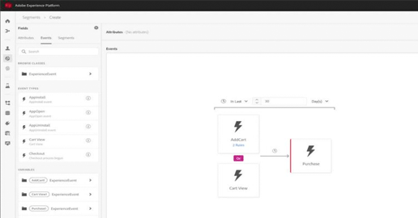

# Tutoriels Adobe Experience Platform

Adobe Experience Platform est l’un des meilleurs systèmes ouverts, flexibles et performants du marché permettant de créer et de gérer des solutions complètes qui optimisent l’expérience client. Experience Platform permet aux entreprises de centraliser et de normaliser les données et le contenu des clients à partir de n’importe quel système et d’appliquer la science des données et l’apprentissage automatique afin d’améliorer considérablement la conception et la diffusion d’expériences riches et personnalisées. Utilisez ces vidéos et tutoriels pour découvrir les nombreux composants d’Experience Platform.

## Nouveautés

* **[Configuration du contrôle d’accès basé sur les attributs (vidéo)](admin/configure-attribute-based-access-control.md)**

   *Limiter l’accès à des ressources spécifiques*
* **[Présentation de l’hygiène des données (vidéo)](/help/platform/data-hygiene/overview.md)**

   *Amélioration des pratiques de réduction des données*
* **[Suppression de jeux de données (vidéo)](/help/platform/data-hygiene/delete-datasets.md)**

   *Définition de la durée de vie des jeux de données*

## Sélections du personnel

<table style="margin-top: 0">
<tr>
  <td>
    
    

      <a href="intro-to-platform/a-customer-experience-powered-by-experience-platform.md">
    <strong>Expérience client optimisée par un Experience Platform</strong>
    </a>
    

    

    <em>Découvrez comment Platform peut être utilisé pour alimenter une expérience client</em>
    

  </td>
  <td>
    
    

      <a href="https://experienceleague.adobe.com/docs/platform-learn/getting-started-for-data-architects-and-data-engineers/overview.html">
    <strong>Prise en main pour les architectes de données et les ingénieurs de données</strong>
    </a>
    

    

    <em>Exercices pratiques pour commencer</em>
    

  </td>
  <td>
    
    

      <a href="sources/overview.md">
    <strong>Présentation des connecteurs source</strong>
    </a>
    

    

    <em>ingérer facilement vos données ;</em>
    

  </td>
   <!--
   <td>
    
    

      <a href="data-ingestion/create-datasets-and-ingest-data.md">
    <strong>Create Datasets and Ingest Data</strong>
    </a>
    

    

    <em>Ingest your dataset.</em>
    

  </td>
  <td>
    
    

      <a href="segments/create-segments.md">
    <strong>Create Segments</strong>
    </a>
    

    

    <em>Build segments based on your data.</em>
    

  </td>-->
</tr>
</table>

