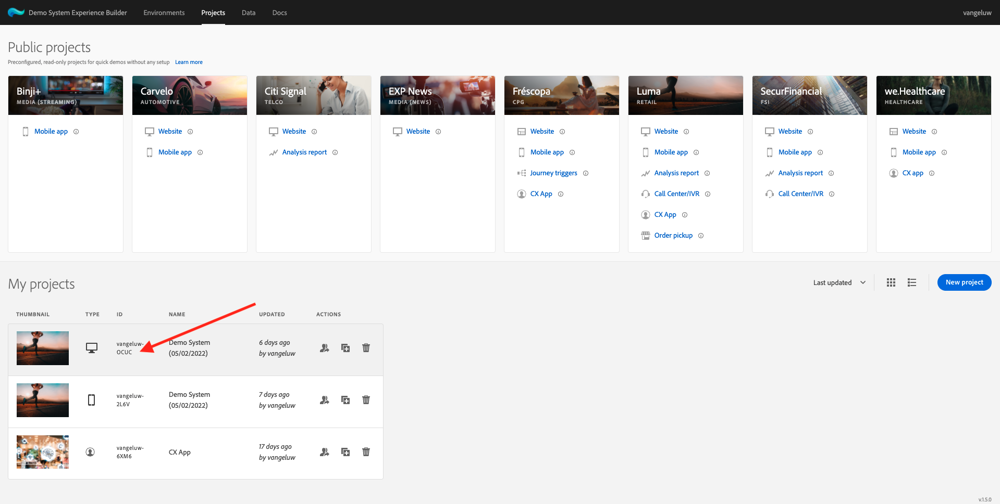
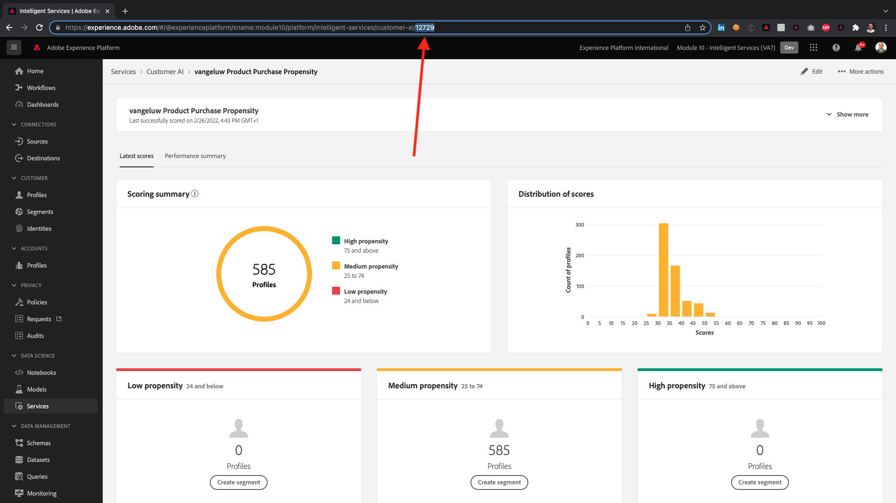

# Tutoriel technique complet pour Adobe Experience Platform - Comment l’achèvement est-il mesuré ?

Vous pouvez mettre à jour la fin du tutoriel technique complet pour Adobe Experience Platform à l’aide de l’extension Chrome qui a été créée.

Après avoir suivi les instructions du module 0, vous avez saisi la variable **ID de configuration** dans l’extension Chrome et vous vous êtes inscrit. Votre extension Chrome doit maintenant ressembler à ceci. Cliquez sur l’icône violette pour envoyer la fin d’un module.

Vous verrez alors :

En ouvrant le menu déroulant, vous pouvez sélectionner le module à terminer :

Pour terminer un module, vous devez fournir un bon à tirer.

Vous trouverez ci-dessous les bons à tirer de l’achèvement de chaque module.

## Prise en main

BAT attendu du module **Prise en main** est l’identifiant du projet Demo System pour le web que vous avez créé.

L’identifiant du projet Demo System pour le format web ressemble à ceci : `--demoProfileLdap-- - OCUC`.

Sélectionner **Prise en main** dans le menu déroulant, saisissez votre **Identifiant du projet Demo System** et cliquez sur le bouton **Envoyer** - .

## Collecte de données et SDK Web

BAT attendu du module **Collecte de données et SDK Web** est le nom de la propriété Collecte de données pour le Web.

Le nom de la propriété Data Collection pour le format web ressemble à ceci : `--demoProfileLdap-- - Demo System (05/02/2022) (enablement) 1644046719474`.

Sélectionner **Collecte de données et SDK Web** dans le menu déroulant, saisissez votre **Nom de la propriété de collecte de données pour le web** et cliquez sur le bouton **Envoyer** - .

## Ingestion des données

BAT attendu du module **Ingestion des données** est l’identifiant du jeu de données pour les 2 jeux de données que vous avez créés.

Le format de l’identifiant du jeu de données ressemble à ceci : **5f069724723ef41916a8b5d2**.

`--demoProfileLdap-- - Demo System - Event Dataset for Website`

`--demoProfileLdap-- - Demo System - Profile Dataset for Website`

Sélectionner **Ingestion des données** dans le menu déroulant, saisissez votre **Identifiant du jeu de données** pour les deux jeux de données dans les champs de saisie, puis cliquez sur le bouton **Envoyer** - .

## Profil client en temps réel

BAT attendu du module **Profil client en temps réel** est la valeur **Identifiant de segment** du segment que vous avez créé via l’interface utilisateur, `--demoProfileLdap-- - Male customers with interest in Montana Wind Jacket`.

Le format de l’identifiant de segment ressemble à ceci : **8cb7034d-d4ae-4d26-a61f-a76559c12457**.

Sélectionner **Profil client en temps réel** dans le menu déroulant, saisissez votre **Identifiant de segment** dans le champ de saisie et cliquez sur l’icône **Envoyer** - .

## Query Service

BAT attendu du module **Query Service** est l’identifiant du jeu de données pour votre `--demoProfileLdap--_callcenter_interaction_analysis` - jeu de données obtenu après avoir terminé le module.

Le format ressemble à ceci : **62076f68f14a9d194995d4e2**.

Sélectionner **Query Service** dans le menu déroulant, saisissez votre **Identifiant du jeu de données** dans le champ de saisie et cliquez sur l’icône **Envoyer** - .

## Intelligent Services

BAT attendu du module **Intelligent Services** est l’identifiant de votre **Service Customer AI de propension des achats de produits**.

Le format ressemble à ceci : **12729** et vous pouvez la récupérer à partir de l’URL lorsque vous avez ouvert votre service.

Sélectionner **Intelligent Services** dans le menu déroulant, saisissez votre **ID de service Customer AI** dans le champ de saisie et cliquez sur l’icône **Envoyer** - .

## Real-Time CDP

BAT attendu du module **Real-Time CDP** est l’identifiant de votre **Activité Adobe Target**.

Le format ressemble à ceci : **111804**.

Sélectionner **Real-Time CDP** dans le menu déroulant, saisissez votre **Identifiant d’activité Adobe Target** dans le champ de saisie et cliquez sur l’icône **Envoyer** - .

## AJO : Orchestration

BAT attendu du module **AJO : Orchestration** est l’eventID de votre `--demoProfileLdap--AccountCreationEvent`.

Le format ressemble à ceci : **227402c540eb8f8855c6b2333adf6d54d7153d9d7d56fa475a6866081c574736**.

Sélectionner **AJO : Orchestration** dans le menu déroulant, saisissez votre ** eventID** dans le champ de saisie, puis cliquez sur le bouton **Envoyer** - .

## AJO : Actions personnalisées

BAT attendu du module **AJO : Actions personnalisées** est l’eventID de votre événement. `--demoProfileLdap--GeofenceEntry`.

Le format ressemble à ceci : **fa42ab7982ba55f039eacec24c1e32e5c51b310c67f0fa559ab49b89b63f4934**.

Sélectionner **AJO : Actions personnalisées** dans le menu déroulant, saisissez votre **eventID** dans le champ de saisie et cliquez sur l’icône **Envoyer** - .

## AJO : Offres

BAT attendu du module **AJO : Offres** est l’identifiant de la variable **Offer Decision** que vous avez créé.

Vous trouverez la variable **Identifiant de décision d’offre**, qui ressemble à ceci : **xcore:offer-activity:1122fcc4603ea499**, ici :

Sélectionner **AJO : Offres** dans le menu déroulant, saisissez votre **Identifiant de décision d’offre** dans le champ de saisie et cliquez sur l’icône **Envoyer** - .

## AJO : Événements

BAT attendu du module **AJO : Événements** est l’eventID de votre `--demoProfileLdap--StoreEntryEvent`.

Le format ressemble à ceci : **e3a8f0bdc0b609667cd96a72a6b1e5aafa0ddaf6ccf121c574e6a2030860a633**.

Sélectionner **AJO : Événements** dans le menu déroulant, saisissez votre **eventID** dans le champ de saisie et cliquez sur l’icône **Envoyer** - .

## CJA

BAT attendu du module **CJA** est l’identifiant de votre projet ; `--demoProfileLdap-- - Omnichannel Analysis`.

Le format ressemble à ceci : **6217344f6249ac70c726db60**, vous pouvez le trouver dans l’URL lorsque vous avez ouvert votre projet.

Sélectionner **CJA** dans le menu déroulant, saisissez votre **Identifiant de projet** dans le champ de saisie et cliquez sur l’icône **Envoyer** - .

## CJA : BigQuery

BAT attendu du module **CJA : BigQuery** est l’identifiant de votre **BigQuery**-connection.

Vous trouverez la variable **ID de connexion BigQuery**, qui ressemble à ceci : **85a2394d-8b94-410c-a239-4d8b94b10c38**, ici :

Sélectionner **CJA : BigQuery** dans le menu déroulant, saisissez votre **ID de connexion BigQuery** dans le champ de saisie et cliquez sur l’icône **Envoyer** - .

## RTCDP : EventHub

BAT attendu du module **RTCDP : EventHub** est l’identifiant de votre **Centre d’événements Microsoft Azure** destination dans Adobe Experience Platform.

Vous trouverez la variable **ID de destination du centre d’événements Azure**, qui ressemble à ceci : **fa3f7ce5-86fd-4096-bf7c-e586fdc096ba**, ici :

Sélectionner **RTCDP : EventHub** dans le menu déroulant, saisissez votre **ID de destination du centre d’événements Azure** dans le champ de saisie et cliquez sur l’icône **Envoyer** - .

## Connexions RTCDP

BAT attendu du module **Connexions RTCDP** est votre **Identifiant de propriété de transfert d’événement**.

Vous trouverez la variable **Identifiant de propriété de transfert d’événement**, qui ressemble à ceci : **PR40f44184c888472e9c19d8d602aab0de**, ici :

Sélectionner **Connexions RTCDP** dans le menu déroulant, saisissez votre **Identifiant de propriété de transfert d’événement** dans le champ de saisie et cliquez sur l’icône **Envoyer** - .

## Apache Kafka

BAT attendu du module **Apache Kafka** est l’identifiant de votre connecteur source ; `--demoProfileLdap-- - Kafka`.

L’ID ressemble à ceci : **f843d50a-ee30-4ca8-a766-0e4f3d29a2f7** et vous pouvez le trouver ici :

Sélectionner **Apache Kafka** dans le menu déroulant, saisissez votre **Identifiant de flux** dans le champ de saisie et cliquez sur l’icône **Envoyer** - .

[Revenir à tous les modules](./overview.md)
