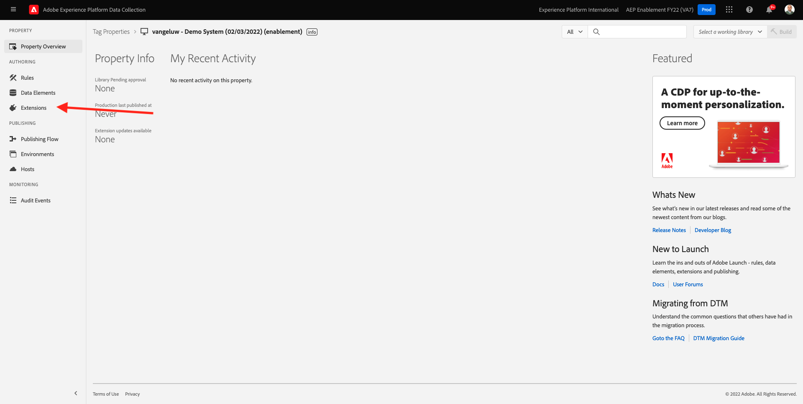
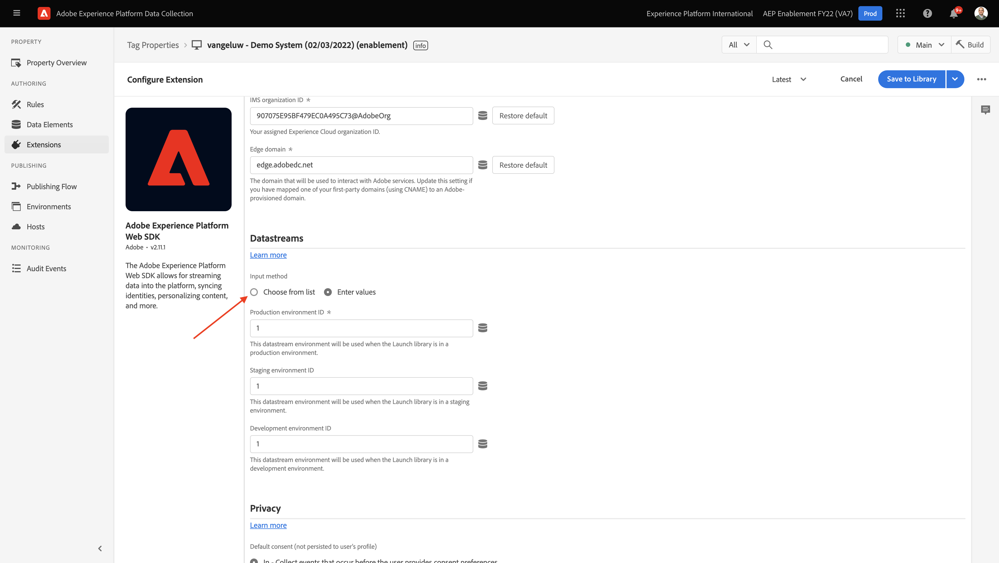
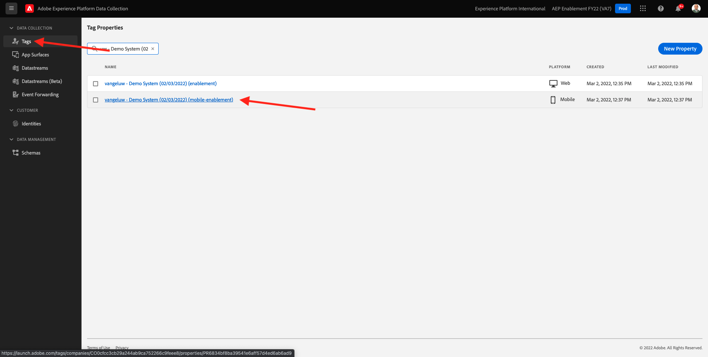
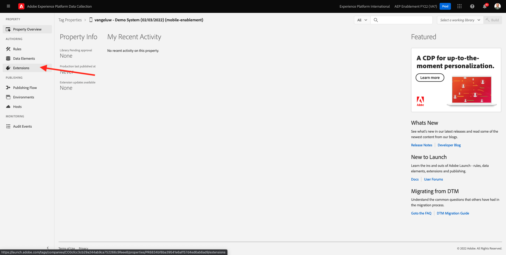

# 0.3 Création de la matrice de données

Accédez à [https://experience.adobe.com/#/data-collection/](https://experience.adobe.com/#/data-collection/). Après l’exercice précédent, vous disposez désormais de deux propriétés de collecte de données : un pour le web et un pour le mobile.

Ces propriétés sont presque prêtes à être utilisées, mais avant de pouvoir commencer à collecter des données à l’aide de ces propriétés, vous devez configurer un flux de données. Vous obtiendrez plus d’informations sur le concept d’un flux de données et sur ce qu’il signifie dans l’exercice 1.2.

Pour l&#39;instant, veuillez suivre ces étapes.

## 0.3.1 Création d’un flux de données pour le Web

Cliquez sur **[!UICONTROL Datastreams]** ou **[!UICONTROL Flux de données (bêta)]**.

Dans le coin supérieur droit de votre écran, sélectionnez le nom de votre environnement de test, qui doit être `--aepSandboxId--`.

Cliquez sur **[!UICONTROL Nouvelle structure de données]**.

Pour le **[!UICONTROL Nom convivial]**, puis, pour la description facultative, saisissez `--demoProfileLdap-- - Demo System Datastream`. Pour le schéma d’événement, sélectionnez **Système de démonstration - Schéma d’événement pour le site web (Global v1.1)**. Cliquez sur **Enregistrer**.

Vous verrez alors ceci. Cliquez sur **Ajouter un service**.

Sélectionner le service **[!UICONTROL Adobe Experience Platform]**, qui expose des champs supplémentaires. Vous verrez alors ceci.

Pour Jeu de données d’événement, sélectionnez **Système de démonstration - Jeu de données d’événement pour le site web (Global v1.1)** et pour le jeu de données de profil, sélectionnez **Système de démonstration - Jeu de données de profil pour le site web (Global v1.1)**. Cliquez sur **Enregistrer**.

Vous allez maintenant voir ceci.

C&#39;est tout pour le moment. Dans [Module 1](./../module1/data-ingestion-launch-web-sdk.md) vous en apprendrez plus sur le SDK Web et sur la configuration de toutes ses fonctionnalités.

Dans le menu de gauche, cliquez sur **[!UICONTROL Balises]**.

Filtrez les résultats de la recherche pour afficher vos deux propriétés de collecte de données. Ouvrez la propriété pour **Web** en cliquant dessus.

Vous verrez alors ceci. Cliquez sur **Extensions**.

Sur l’extension SDK Web Adobe Experience Platform, cliquez sur **Configurer**.

Vous verrez alors ceci. Pour **Datastreams**, une valeur factice est actuellement définie sur 1. Vous devez maintenant cliquer sur le bouton **Choisir parmi les listes** bouton radio. Dans la liste déroulante, sélectionnez le Datastream que vous avez créé précédemment.

Assurez-vous d’avoir sélectionné **Datastream**. CONSEIL : Vous pouvez filtrer facilement les résultats dans la liste déroulante en saisissant votre `--demoProfileLdap--`.

Faites défiler l’écran vers le bas jusqu’à ce que vous voyiez **Collecte de données**. Assurez-vous que la case à cocher de **Activer la collecte de données de clic** n’est pas activé. Cliquez sur **Enregistrer** pour enregistrer vos modifications.

Accédez à **Flux de publication**.

Cliquez sur le bouton **...** pour **Principal**, puis cliquez sur **Modifier**.

Cliquez sur **Ajouter toutes les ressources modifiées** puis cliquez sur **Enregistrement et création pour le développement**.

Vos modifications sont en cours de publication et seront prêtes dans quelques minutes.

## 0.3.2 Création d’un flux de données pour Mobile

Accédez à [https://experience.adobe.com/#/data-collection/](https://experience.adobe.com/#/data-collection/).

Cliquez sur **[!UICONTROL Datastreams]** ou **[!UICONTROL Flux de données (bêta)]**.

Dans le coin supérieur droit de votre écran, sélectionnez le nom de votre environnement de test, qui doit être `--aepSandboxId--`.

Cliquez sur **[!UICONTROL Nouvelle structure de données]**.

Pour le **[!UICONTROL Nom convivial]**, puis, pour la description facultative, saisissez `--demoProfileLdap-- - Demo System Datastream (Mobile)`. Pour le schéma d’événement, sélectionnez **Système de démonstration - Schéma d’événement pour l’application mobile (Global v1.1)**. Cliquez sur **Enregistrer**.

Cliquez sur **[!UICONTROL Enregistrer]**.

Vous verrez alors ceci. Cliquez sur **Ajouter un service**.

Sélectionner le service **[!UICONTROL Adobe Experience Platform]**, qui expose des champs supplémentaires. Vous verrez alors ceci.

Pour Jeu de données d’événement, sélectionnez **Système de démonstration - Jeu de données d’événement pour l’application mobile (Global v1.1)** et pour le jeu de données de profil, sélectionnez **Système de démonstration - Jeu de données de profil pour l’application mobile (Global v1.1)**. Cliquez sur **Enregistrer**.

Vous verrez alors ceci.

Votre flux de données est maintenant prêt à être utilisé dans la propriété du client de collecte de données Adobe Experience Platform pour Mobile.

Accédez à **Balises** et filtrez les résultats de la recherche pour afficher vos deux propriétés de collecte de données. Ouvrez la propriété pour **Mobile** en cliquant dessus.

Vous verrez alors ceci. Cliquez sur **Extensions**.

Sur le **Adobe Experience Platform Edge Network** extension, cliquez sur **Configurer**.

Vous verrez alors ceci. Vous devez maintenant sélectionner l’environnement de test et le flux de données corrects que vous venez de configurer. L’environnement de test à utiliser est : `--aepSandboxId--` et le flux de données est appelé `--demoProfileLdap-- - Demo System Datastream (Mobile)`.

Pour le **Domaine du réseau Edge**, utilisez le domaine par défaut qui est **edge.adobedc.net**.

Cliquez sur **Enregistrer** pour enregistrer vos modifications.

Accédez à **Flux de publication**.

Cliquez sur le bouton **...** en regard de **Principal**, puis cliquez sur **Modifier**.

Cliquez sur **Ajouter toutes les ressources modifiées**, puis cliquez sur **Enregistrement et création pour le développement**.

Vos modifications sont en cours de publication et seront prêtes dans quelques minutes.

Étape suivante : [0.4 Utilisation du site web](./ex4.md)

[Revenir au module 0](./getting-started.md)

[Revenir à tous les modules](./../../overview.md)