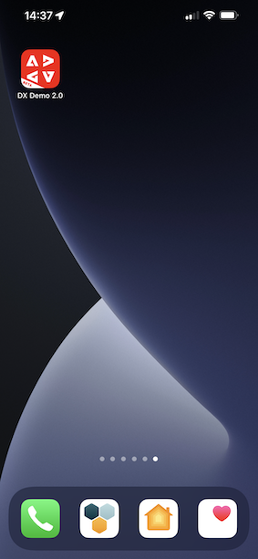
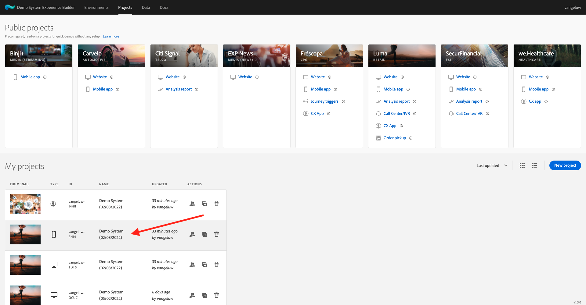
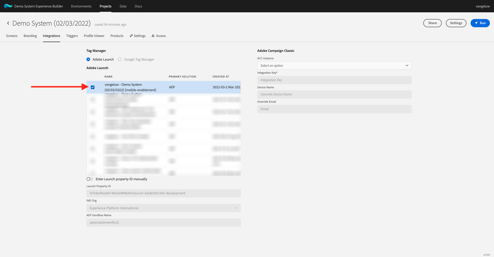

# 0.5 Utilisation de l’application mobile

## 0.5.1 Téléchargement de l’application

Accédez à [https://bit.ly/dx-demo-app](https://bit.ly/dx-demo-app) sur votre ordinateur. Vous verrez alors ceci.

Utilisez la variable **Appareil photo** sur votre smartphone pour installer l’application mobile pour le système d’exploitation de votre appareil. Pour cette activation, vous devez installer le **Version 2.x** qui utilise les SDK mobiles de Adobe Experience Platform.

>[!NOTE]
>
>Après avoir installé l’application pour la première fois sur un appareil iOS, un message d’erreur peut s’afficher lorsque vous essayez d’ouvrir l’application, indiquant : **Développeur d’entreprise non approuvé**. Pour résoudre ce problème, vous devez accéder à **Paramètres > Général > Gestion des périphériques > Adobe Systems Inc.** et cliquez sur **Trust Adobe Systems Inc.**.

Une fois l’application installée, elle se trouve sur l’écran d’accueil de votre appareil. Cliquez sur l’icône pour ouvrir l’application.

Lorsque vous utilisez l’application pour la première fois, vous serez invité à vous connecter à l’aide de votre Adobe ID. Terminez le processus de connexion.

Une fois connecté, une notification vous demande l’autorisation d’envoyer des notifications. Nous enverrons des notifications dans le cadre du tutoriel, alors cliquez sur **Autoriser**.

Vous verrez ensuite la page d’accueil de l’application. Accédez à **Paramètres**.

Dans les paramètres, vous verrez qu’actuellement une **Projet public** est chargé dans l’application. Cliquez sur **Projet personnalisé**.

Vous pouvez désormais charger un projet personnalisé. Cliquez sur le code QR pour charger facilement votre projet.

Après l’exercice 0.1, vous obteniez ce résultat. Cliquez pour ouvrir la **Projet de vente au détail mobile** qui a été créé pour vous.

Si vous avez accidentellement fermé la fenêtre de votre navigateur ou pour les futures sessions de démonstration ou d’activation, vous pouvez également accéder au projet de votre site web en accédant à [https://builder.adobedemo.com/projects](https://builder.adobedemo.com/projects). Une fois connecté avec votre Adobe ID, vous verrez ceci. Cliquez sur votre projet d’application mobile pour l’ouvrir.

Vous verrez alors ceci. Cliquez sur **Intégrations**.

Vous devez sélectionner la propriété de collecte de données pour le mobile qui a été créé dans l’exercice 0.1. Cliquez ensuite sur **Exécuter**.

Vous verrez alors cette fenêtre contextuelle, qui contient un code QR. Analysez ce code QR depuis l’application mobile.

L’ID de projet s’affiche alors dans l’application, après quoi vous pouvez cliquer sur **Enregistrer**.

Maintenant, revenez à **Accueil** dans l’application. Votre application est maintenant prête à être utilisée.

Vous avez maintenant terminé le module 0.

[Revenir au module 0](./getting-started.md)

[Revenir à tous les modules](./../../overview.md)
