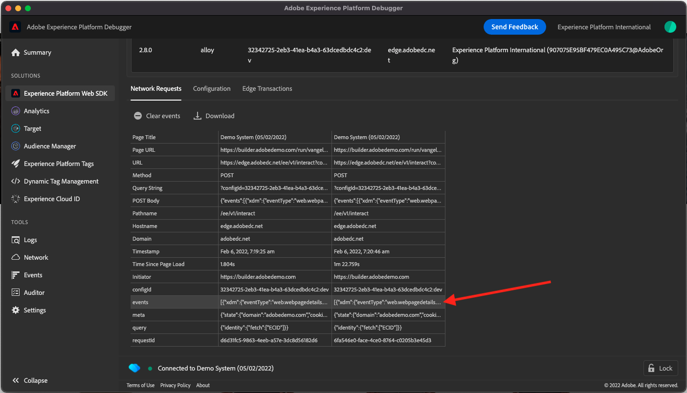

# 1.4 Collecte de données web côté client

## 1.4.1 Validation des données dans la requête

### Installation du débogueur Adobe Experience Platform

Le débogueur Experience Platform est une extension disponible pour les navigateurs Chrome et Firefox qui vous permet de voir la technologie d’Adobe mise en oeuvre dans vos pages web. Téléchargez la version de votre navigateur préféré :

- [Extension Firefox](https://addons.mozilla.org/fr/firefox/addon/adobe-experience-platform-dbg/)

- [Extension Chrome](https://chrome.google.com/webstore/detail/adobe-experience-platform/bfnnokhpnncpkdmbokanobigaccjkpob)

Si vous n’avez jamais utilisé le débogueur auparavant et que celui-ci est différent du débogueur Adobe Experience Cloud précédent, vous pouvez regarder cette vidéo de présentation de cinq minutes :

>[!VIDEO](https://video.tv.adobe.com/v/32156?quality=12&learn=on)

Étant donné que vous allez charger le site web de démonstration en mode incognito, vous devez vous assurer que l’Experience Platform Debugger est également disponible en mode incognito. Pour ce faire, accédez à **chrome://extensions** dans votre navigateur et ouvrez l’extension Experience Platform Debugger.

Vérifiez que ces deux paramètres sont activés :

- Mode Développeur
- Autoriser dans incognito

### Ouvrir le site web de démonstration

Accédez à [https://builder.adobedemo.com/projects](https://builder.adobedemo.com/projects). Une fois connecté avec votre Adobe ID, vous verrez ceci. Cliquez sur le projet de votre site web pour l’ouvrir.

Sur le **Screens** page, cliquez sur **Exécuter**.

Vous verrez alors votre site web de démonstration ouvert. Sélectionnez l’URL et copiez-la dans le presse-papiers.

Ouvrez une nouvelle fenêtre de navigateur incognito.

Collez l’URL de votre site web de démonstration, que vous avez copiée à l’étape précédente. Vous serez alors invité à vous connecter à l’aide de votre Adobe ID.

Sélectionnez le type de compte et procédez à la connexion.

Votre site web est alors chargé dans une fenêtre de navigateur incognito. Pour chaque démonstration, vous devez utiliser une fenêtre de navigateur incognito actualisée pour charger l’URL de votre site web de démonstration.

### Utilisez l’Experience Platform Debugger pour afficher les appels vers Edge

Assurez-vous que le site web de démonstration est ouvert et cliquez sur l’icône de l’extension Debugger Experience Platform.

Le débogueur s’ouvre et affiche les détails de l’implémentation créée dans votre propriété de collecte de données Adobe Experience Platform. N’oubliez pas que vous déboguez l’extension et les règles que vous venez de modifier.

Cliquez sur le bouton **[!UICONTROL Se connecter]** en haut à droite pour vous authentifier. Si un onglet de navigateur est déjà ouvert avec l’interface Collecte de données de Adobe Experience Platform, l’étape d’authentification sera automatique et vous n’aurez plus à saisir votre nom d’utilisateur et votre mot de passe.

Appuyez sur le bouton recharger de votre site web de démonstration pour connecter le débogueur à cet onglet spécifique.

Vérifiez que le débogueur est **[!UICONTROL Connexion à l’accueil]** comme illustré ci-dessus, puis cliquez sur le **[!UICONTROL lock]** pour verrouiller le débogueur sur le site web de démonstration. Si vous ne le faites pas, le débogueur continuera de changer pour afficher les détails de mise en oeuvre de tout onglet de navigateur actif, ce qui peut être déroutant.

Ensuite, accédez à n’importe quelle page du site web de démonstration comme, par exemple, la **Hommes** page de catégorie.

Cliquez maintenant sur **[!UICONTROL SDK Web Experience Platform]** dans le volet de navigation de gauche, pour afficher la variable **[!UICONTROL Requêtes réseau]**.

Chaque requête contient une **[!UICONTROL events]** ligne.

Cliquez pour ouvrir la **[!UICONTROL events]** ligne. Notez comment vous pouvez voir la variable **web.webpagedetails.pageViews** , ainsi que d’autres variables prêtes à l’emploi conformes à la variable **SDK Web ExperienceEvent XDM** format.

Ces types de détails de requête sont également visibles dans l’onglet Réseau. Filtrer les requêtes avec **interagir** pour localiser les requêtes envoyées par le SDK Web. Vous trouverez tous les détails de la charge utile XDM dans les en-têtes de charge utile de requête :

Étape suivante : [1.5 Mise en oeuvre d’Adobe Analytics et de Adobe Audience Manager](./ex5.md)

[Revenir au module 1](./data-ingestion-launch-web-sdk.md)

[Revenir à tous les modules](./../../overview.md)
