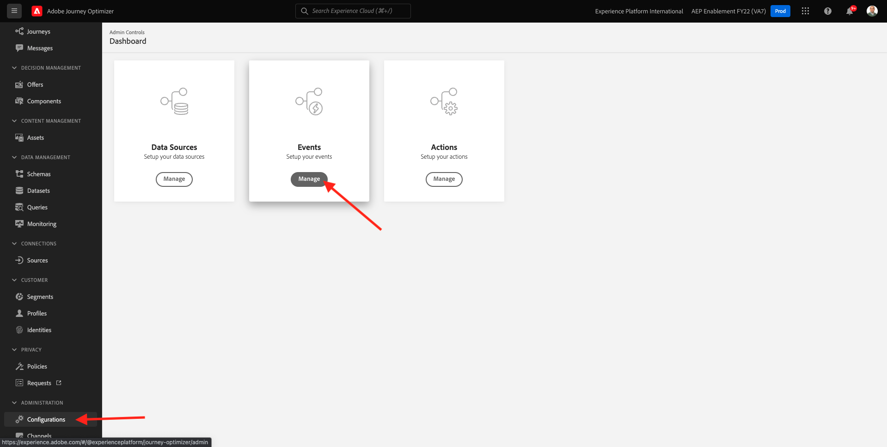
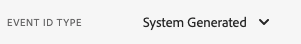
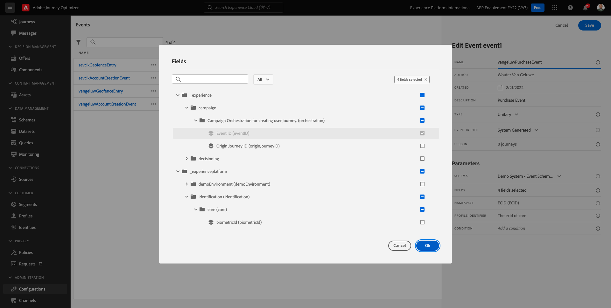
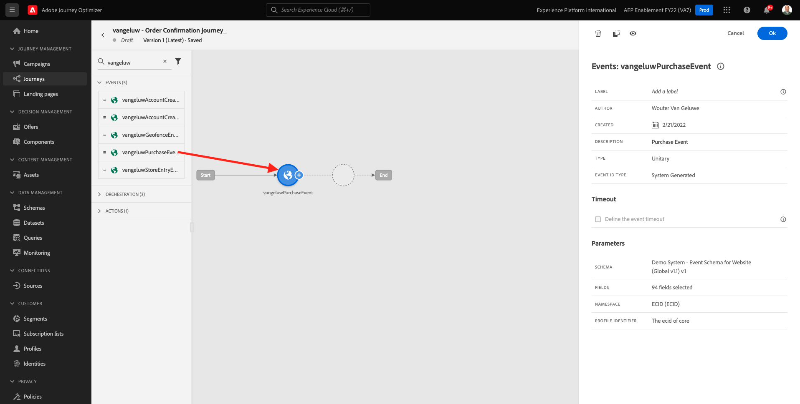
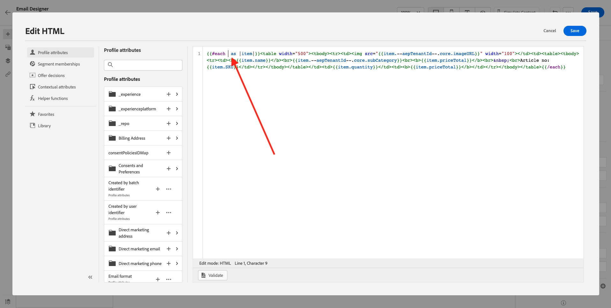
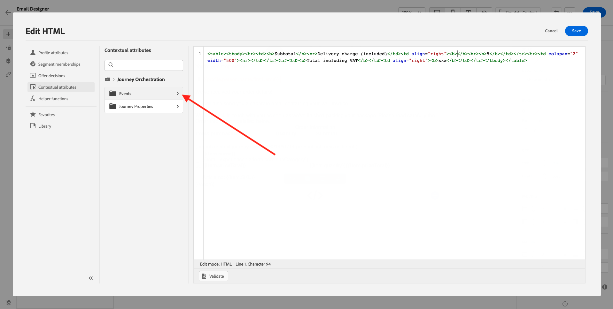
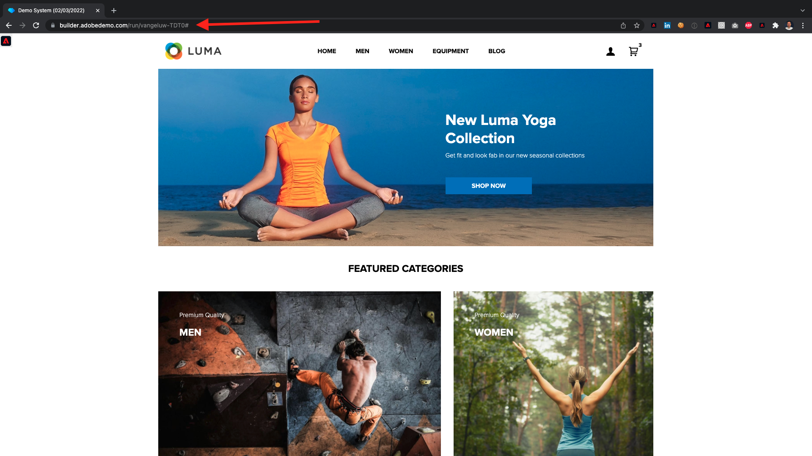
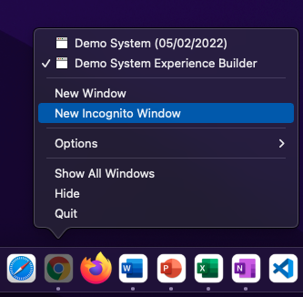

# 10.1 Configuration d’un parcours basé sur un déclencheur - Confirmation de commande

Connectez-vous à Adobe Journey Optimizer en accédant à [Adobe Experience Cloud](https://experience.adobe.com). Cliquez sur **Journey Optimizer**.


Vous serez redirigé vers le **Accueil**  dans Journey Optimizer. Tout d’abord, assurez-vous d’utiliser l’environnement de test approprié. L’environnement de test à utiliser est appelé `--aepSandboxId--`. Pour passer d’un environnement de test à un autre, cliquez sur **Production (VA7)** et sélectionnez l’environnement de test dans la liste. Dans cet exemple, l’environnement de test est nommé **Activation AEP FY22**. Vous serez alors dans le **Accueil** affichage de votre environnement de test `--aepSandboxId--`.


## 10.1.1 Création de votre événement

Dans le menu, accédez à **Configurations** et cliquez sur **Gérer** under **Événements**.



Sur le **Événements** vous verrez une vue similaire à celle-ci. Cliquez sur **Créer un événement**.


Une configuration d’événement vide s’affiche alors.


Tout d’abord, attribuez un nom à votre événement comme suit : `--demoProfileLdap--PurchaseEvent`, puis ajoutez une description comme celle-ci : `Purchase Event`.


Le suivant est la **Type d’événement** sélection. Sélectionner **Unitaire**.


Le suivant est la **Type d’identifiant d’événement** sélection. Sélectionner **Généré par le système**



La sélection de schéma suivante s’affiche. Un schéma a été préparé pour cet exercice. Veuillez utiliser le schéma `Demo System - Event Schema for Website (Global v1.1) v.1`.


Après avoir sélectionné le schéma, plusieurs champs sont sélectionnés dans la variable **Payload** . Cliquez sur le bouton **Modifier/crayon** pour ajouter des champs supplémentaires à cet événement.


Vous verrez alors cette fenêtre contextuelle. Vous devez maintenant cocher des cases supplémentaires pour accéder à des données supplémentaires lorsque cet événement est déclenché.



Tout d’abord, cochez la case sur la ligne. `--aepTenantId--`.


Faites ensuite défiler l’écran vers le bas et cochez la case sur la ligne. `productListItems`.


Faites ensuite défiler l’écran vers le bas et cochez la case sur la ligne. `commerce`.


Cliquez ensuite sur **Ok**.

Vous verrez ensuite que des champs supplémentaires ont été ajoutés à l’événement. Cliquez sur **Enregistrer**.


Votre nouvel événement est ensuite partagé et vous verrez maintenant votre événement dans la liste des événements disponibles.

Cliquez de nouveau sur votre événement pour ouvrir la variable **Modifier l’événement** à nouveau.
Passez la souris sur le **Payload** pour afficher à nouveau les 3 icônes. Cliquez sur le bouton **Afficher la charge utile** icône .


Vous verrez maintenant un exemple de la charge utile attendue. Votre événement comporte un eventID d’orchestration unique, que vous pouvez trouver en faisant défiler la page vers le bas dans cette payload jusqu’à ce que vous voyiez `_experience.campaign.orchestration.eventID`.


L’identifiant d’événement est ce qui doit être envoyé à Adobe Journey Optimizer pour déclencher le parcours que vous allez créer à l’étape suivante. Notez cet eventID, car vous en aurez besoin lors de l’une des étapes suivantes.
`"eventID": "ef6dd943c94fe1b4763c098ccd1772344662f2a9f614513106cb5ada8be36857"`

Cliquez sur **Ok**, suivie de **Annuler**.

Votre événement est maintenant configuré et prêt à être utilisé.

## 10.1.2 Création de votre parcours

Dans le menu, accédez à **Parcours** et cliquez sur **Créer un Parcours**.


Vous verrez alors ceci. Donnez un nom à votre parcours. Utilisez `--demoProfileLdap-- - Order Confirmation journey`. Cliquez sur **OK**.


Tout d’abord, vous devez ajouter votre événement comme point de départ de votre parcours. Rechercher votre événement `--demoProfileLdap--PurchaseEvent` et faites-le glisser sur la zone de travail. Cliquez sur **OK**.



Ensuite, sous **Actions**, recherchez le **Email** et l’ajouter à la zone de travail.


Définissez la variable **Catégorie** to **Marketing** et sélectionnez une surface d&#39;email permettant d&#39;envoyer des emails. Dans ce cas, la surface de l&#39;email à sélectionner est **Email**. Assurez-vous que les cases à cocher de **Clics sur l&#39;email** et **ouvertures de courrier électronique** sont toutes deux activées.


L’étape suivante consiste à créer votre message. Pour ce faire, cliquez sur **Modifier le contenu**.


Vous voyez maintenant ceci. Cliquez sur le bouton **Objet** Champ de texte.


Dans la zone de texte, commencez à écrire. **Merci pour votre commande,**


L’objet n’est pas encore terminé. Vous devez ensuite importer le jeton de personnalisation pour le champ. **Prénom** qui est stocké sous `profile.person.name.firstName`. Dans le menu de gauche, faites défiler l’écran vers le bas pour trouver le **Personne** > **Nom complet** >  **Prénom** et cliquez sur le champ **+** pour ajouter le jeton de personnalisation à l’objet. Cliquez sur **Enregistrer**.


Vous serez alors de retour ici. Cliquez sur **Concepteur d&#39;email** pour créer le contenu de l&#39;email.


Dans l’écran suivant, cliquez sur **Conception à partir de zéro**.


Dans le menu de gauche, vous trouverez les composants de structure que vous pouvez utiliser pour définir la structure de l&#39;email (lignes et colonnes).

Effectuez un glisser-déposer 8 fois par **Colonne 1:1** sur la zone de travail, qui doit vous donner :


Accédez à **Composants de contenu**.


Faites glisser et déposez un **Image** sur la première ligne. Cliquez sur **Parcourir**.


Accédez au dossier **enablement-assets**, sélectionnez le fichier **luma-logo.png** et cliquez sur **Sélectionner**.


Vous êtes maintenant de retour ici. Cliquez sur votre image pour la sélectionner, puis utilisez la méthode **Taille** curseur pour rendre l’image du logo un peu plus petite.


Accédez à **Composants de contenu** et faites glisser un **Image** sur la deuxième ligne. Sélectionnez la **Composant d’image** mais NE cliquez PAS sur Parcourir.


Coller cette URL d’image dans le champ **Source**: `https://parsefiles.back4app.com/hgJBdVOS2eff03JCn6qXXOxT5jJFzialLAHJixD9/29043bedcde632a9cbe8a02a164189c9_preparing.png`. Cette image est hébergée en dehors de l’Adobe.


Lorsque vous définissez la portée sur un autre champ, l’image est rendue et vous verrez ceci :


Ensuite, accédez à **Composants de contenu** et faites glisser un **Texte** sur la troisième ligne.


Sélectionner le texte par défaut dans ce composant **Veuillez saisir votre texte ici.** et remplacez-le par le texte ci-dessous :

```javascript
You’re one step closer!

Hi 

We've received your order details!

We will also send you a separate email containing your VAT Invoice.

We'll be back in touch with you as soon as we've finished packing your package. Please read carefully the Order Information detailed below.
```


Placez le curseur en regard du texte **Bonjour** et cliquez sur **Ajouter une personnalisation**.


Accédez au **Personne** > **Nom complet** > **Prénom** et cliquez sur le champ **+** pour ajouter le jeton de personnalisation à l’objet. Cliquez sur **Enregistrer**.


Vous verrez alors :


Ensuite, accédez à **Composants de contenu** et faites glisser un **Texte** sur la quatrième ligne.


Sélectionner le texte par défaut dans ce composant **Veuillez saisir votre texte ici.** et remplacez-le par le texte ci-dessous :

`Order Information`

Définissez la taille de la police sur **26 px** et centrer votre texte dans cette cellule. Vous obtiendrez alors ce qui suit :


Ensuite, accédez à **Composants de contenu** et faites glisser un **HTML** sur la cinquième ligne. Cliquez sur le composant HTML, puis sur **Afficher le code source**.


Dans le **Modifier le HTML** , collez ce HTML :

```<table><tbody><tr><td><b>Items purchased</b></td><td></td><td><b>Quantity</b></td><td><b>Subtotal</b></td></tr><tr><td colspan="4" width="500"><hr></td></tr></tbody></table>```

Cliquez sur **Enregistrer**.


Vous aurez alors ceci. Cliquez sur **Enregistrer** pour enregistrer votre progression.


Accédez à **Composants de contenu** et faites glisser un **HTML** sur la sixième ligne. Cliquez sur le composant HTML, puis sur **Afficher le code source**.


Dans le **Modifier le HTML** , collez ce HTML :

```{{#each xxx as |item|}}<table width="500"><tbody><tr><td></td><td><table><tbody><tr><td><b>{{item.name}}</b><br>{{item.--aepTenantId--.core.subCategory}}<br><b>{{item.priceTotal}}</b><br>&nbsp;<br>Article no: {{item.SKU}}</td></tr></tbody></table></td><td>{{item.quantity}}</td><td><b>{{item.priceTotal}}</b></td></tr></tbody></table>{{/each}}```

Vous obtiendrez alors ce qui suit :


Vous devez maintenant remplacer **xxx** par une référence à l’objet productListItems qui fait partie de l’événement qui déclenche le parcours.


Tout d’abord, supprimez **xxx** dans le code de votre HTML.



Dans le menu de gauche, cliquez sur **Attributs contextuels**. Ce contexte est transmis au message depuis le parcours.


Vous verrez alors ceci. Cliquez sur la flèche en regard de **Journey Orchestration** pour approfondir l’analyse.


Cliquez sur la flèche en regard de **Événements** pour approfondir l’analyse.


Cliquez sur la flèche en regard de `--demoProfileLdap--PurchaseEvent` pour approfondir l’analyse.


Cliquez sur la flèche en regard de **productListItems** pour approfondir l’analyse.


Cliquez sur le bouton **+** en regard de **Nom** pour l’ajouter à la zone de travail. Vous aurez alors ceci. Vous devez maintenant sélectionner  **.name** comme indiqué dans la capture d’écran ci-dessous, vous devez supprimer **.name**.


Vous aurez alors ceci. Cliquez sur **Enregistrer**.


Vous serez de retour dans le Concepteur d&#39;email maintenant. Cliquez sur **Enregistrer** pour enregistrer votre progression.


Ensuite, accédez à **Composants de contenu** et faites glisser un **HTML** sur la septième ligne. Cliquez sur le composant HTML, puis sur **Afficher le code source**.


Dans le **Modifier le HTML** , collez ce HTML :

```<table><tbody><tr><td><b>Subtotal</b><br>Delivery charge (included)</td><td align="right"><b>xxx</b><br><b>5</b></td></tr><tr><td colspan="2" width="500"><hr></td></tr><tr><td><b>Total including VAT</b></td><td align="right"><b>xxx</b></td></tr></tbody></table>```

Il existe 2 références de **xxx** dans ce code de HTML. Vous devez maintenant remplacer chaque **xxx** par une référence à l’objet productListItems qui fait partie de l’événement qui déclenche le parcours.


Tout d’abord, supprimez la première **xxx** dans votre code de HTML.


Dans le menu de gauche, cliquez sur **Attributs contextuels**.


Cliquez sur la flèche en regard de **Journey Orchestration** pour approfondir l’analyse.


Cliquez sur la flèche en regard de **Événements** pour approfondir l’analyse.



Cliquez sur la flèche en regard de `--demoProfileLdap--PurchaseEvent` pour approfondir l’analyse.


Cliquez sur la flèche en regard de **Commerce** pour approfondir l’analyse.


Cliquez sur la flèche en regard de **Commande** pour approfondir l’analyse.


Cliquez sur le bouton **+** en regard de **Prix total** pour l’ajouter à la zone de travail.


Vous aurez alors ceci. Supprimez maintenant la seconde **xxx** dans votre code de HTML.


Cliquez sur le bouton **+** en regard de **Prix total** pour l’ajouter à la zone de travail.


Vous pouvez également ajouter le champ **Devise** de dans **Commande** sur la zone de travail, comme vous pouvez le voir ici.
Lorsque vous avez terminé, cliquez sur **Enregistrer** pour enregistrer vos modifications.


Vous serez alors de retour dans le Concepteur d&#39;email. Cliquez sur **Enregistrer** encore une fois.


Revenez au tableau de bord du message en cliquant sur le bouton **flèche** en regard du texte de l’objet dans le coin supérieur gauche.


Cliquez sur la flèche dans le coin supérieur gauche pour revenir à votre parcours.


Cliquez sur **Ok** pour fermer votre action de courrier électronique.


Cliquez sur **Publier** pour publier votre parcours.


Cliquez sur **Publier** encore une fois.


Votre parcours est maintenant publié.


## 10.1.5 Mise à jour de la propriété du client de collecte de données Adobe Experience Platform

Accédez à [Collecte de données Adobe Experience Platform](https://experience.adobe.com/launch/) et sélectionnez **Balises**.

Il s’agit de la page Propriétés de la collecte de données Adobe Experience Platform que vous avez déjà vue.


Dans le module 0, Demo System a créé deux propriétés clientes pour vous : un pour le site web et un pour l’application mobile. Recherchez-les en recherchant `--demoProfileLdap--` dans le **[!UICONTROL Rechercher]** de la boîte. Cliquez pour ouvrir la **Web** .


Accédez à **Éléments de données**. Recherche et ouverture de l’élément de données **XDM - Achat**.


Vous verrez alors ceci. Accédez au champ **_experience.campaign.orchestration.eventID** et remplissez votre eventID ici. L’eventID à remplir ici est l’eventID que vous avez créé dans le cadre de l’exercice 10.1.2. Cliquez sur **Enregistrer** ou **Enregistrer dans la bibliothèque**.


Enregistrez vos modifications dans la propriété Client, puis publiez vos modifications en mettant à jour votre bibliothèque de développement.


Vos modifications sont maintenant déployées et peuvent être testées.

## 10.1.6 Testez votre email de confirmation de commande à l’aide du site web de démonstration.

Testons le parcours mis à jour en achetant un produit sur le site web de démonstration.

Accédez à [https://builder.adobedemo.com/projects](https://builder.adobedemo.com/projects). Une fois connecté avec votre Adobe ID, vous verrez ceci. Cliquez sur le projet de votre site web pour l’ouvrir.


Sur le **Screens** page, cliquez sur **Exécuter**.


Vous verrez alors votre site web de démonstration ouvert. Sélectionnez l’URL et copiez-la dans le presse-papiers.



Ouvrez une nouvelle fenêtre de navigateur incognito.



Collez l’URL de votre site web de démonstration, que vous avez copiée à l’étape précédente. Vous serez alors invité à vous connecter à l’aide de votre Adobe ID.


Sélectionnez le type de compte et procédez à la connexion.


Votre site web est alors chargé dans une fenêtre de navigateur incognito. Pour chaque démonstration, vous devez utiliser une fenêtre de navigateur incognito actualisée pour charger l’URL de votre site web de démonstration.


Cliquez sur l’icône représentant un logo d’Adobe dans le coin supérieur gauche de votre écran pour ouvrir la visionneuse de profils.


Consultez le panneau Visionneuse de profils et le profil client en temps réel avec le **ID Experience Cloud** comme identifiant Principal de ce client actuellement inconnu.


Accédez à la page Enregistrer/Connexion . Cliquez sur **CRÉATION D’UN COMPTE**.


Renseignez vos détails et cliquez sur **Enregistrer** après quoi vous serez redirigé vers la page précédente.


Ajoutez n’importe quel produit à votre panier, puis accédez au **Panier** page. Cliquez sur **Passez à la caisse.**.


Ensuite, vérifiez les champs de la page de passage en caisse et cliquez sur **Passage en caisse**.


Vous recevrez ensuite votre email de confirmation de commande dans les secondes.


Vous avez terminé cet exercice.

Étape suivante : [10.2 Configuration d’un parcours de newsletter par lots](./ex2.md)

[Revenir au module 10](./journeyoptimizer.md)

[Revenir à tous les modules](../../overview.md)
