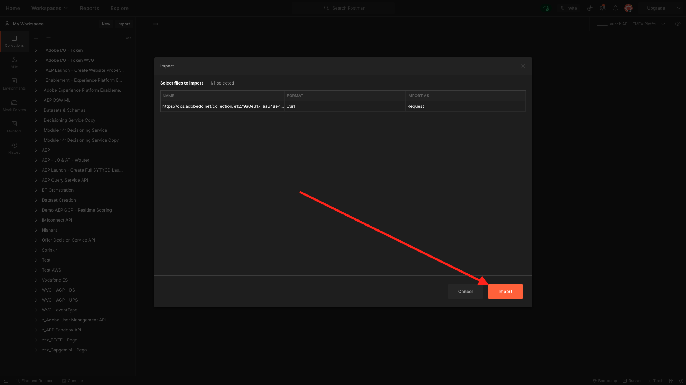
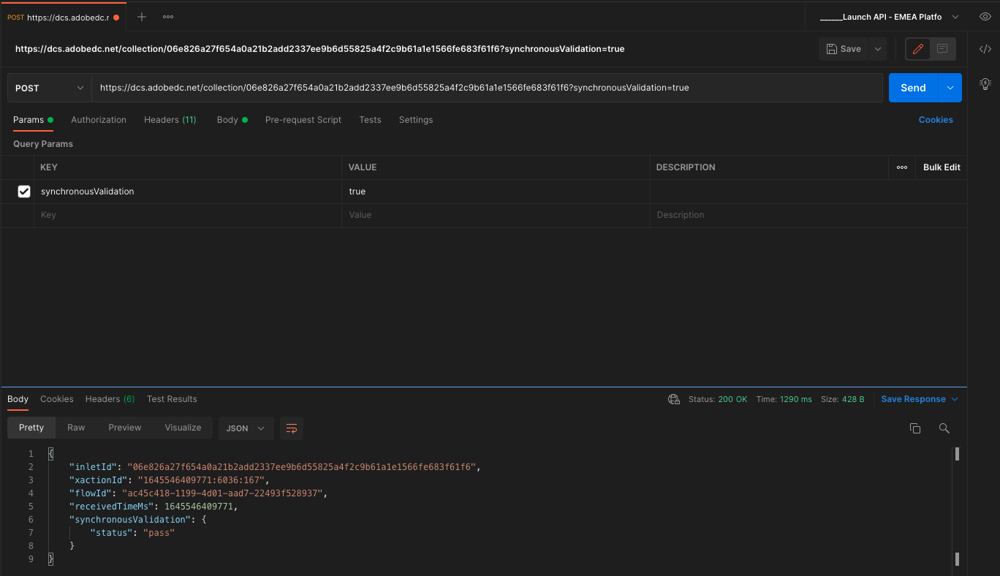

# 10.5 Création d’un parcours d’événement professionnel

Connectez-vous à Adobe Journey Optimizer en accédant à [Adobe Experience Cloud](https://experience.adobe.com). Cliquez sur **Journey Optimizer**.


Vous serez redirigé vers le **Accueil**  dans Journey Optimizer. Tout d’abord, assurez-vous d’utiliser l’environnement de test approprié. L’environnement de test à utiliser est appelé `--aepSandboxId--`. Pour passer d’un environnement de test à un autre, cliquez sur **Production (VA7)** et sélectionnez l’environnement de test dans la liste. Dans cet exemple, l’environnement de test est nommé **Activation AEP FY22**. Vous serez alors dans le **Accueil** affichage de votre environnement de test `--aepSandboxId--`.


## 10.5.1 Création d’un événement commercial

Dans le menu de gauche, cliquez sur **Configurations**. Cliquez sur le bouton **Gérer** à l’intérieur du bouton **Événements** carte.


Les événements professionnels sont un nouveau type d’événement que vous pouvez créer dans Journey Optimizer. Contrairement au **Unitaire** que vous avez créés dans les modules précédents, les événements métier ne sont pas déclenchés par le client, mais par l’organisation. Vous allez maintenant créer votre événement professionnel.

Cliquez sur **Créer un événement**.


Saisissez les valeurs suivantes dans le formulaire de création d&#39;un événement :

- **Nom**: `--demoProfileLdap--ItemBackInStock`. Par exemple : **vangeluwItemBackInStock**
- **Description**: Cet événement est déclenché lorsqu’un produit est de nouveau en stock.
- **Type**: select **Entreprises** dans la liste déroulante


Pour le schéma, sélectionnez **Système de démonstration - Schéma d’événement pour les événements métier JO (Global v1.1) v.1**. Vous devez maintenant sélectionner les champs du schéma dont vous avez besoin pour notre cas d’utilisation.


Procédez de la façon suivante :

Cliquez sur le bouton **crayon** sur le champ où il indique **1 champ sélectionné**.


Sélectionnez tous les champs disponibles dans le schéma, puis cliquez sur **OK**.


Pour la condition : vous devez spécifier les enregistrements de ce schéma qui déclencheront l’événement d’entreprise.

Procédez de la façon suivante :

Cliquez sur le bouton **crayon** sur le champ où il indique **Ajouter une condition**.


Sur le côté gauche, développez la variable `--aepTenantId--` , développez l’objet **joBusinessEvents** et effectuez un glisser-déposer du champ. **eventName** sur la zone de travail.


Pour le champ **eventName**, saisissez la valeur suivante : `--demoProfileLdap--ItemBackInStock`. Par exemple : vangeluwItemBackInStock.
Cliquez sur **OK**.


Cliquez sur **OK**.


Enfin, votre formulaire de création d’événement doit ressembler à ceci. Cliquez sur **Enregistrer** pour enregistrer votre événement professionnel.


## 10.5.2 Création d’un parcours d’événement commercial

Vous pouvez désormais exploiter cet événement professionnel et le message dans un parcours. Accédez à **Parcours**. Cliquez sur **Créer un Parcours**.


Sur le côté droit se trouve un formulaire dans lequel vous devez spécifier le nom et la description du parcours. Saisissez les valeurs suivantes :

- **Nom**: `--demoProfileLdap-- - Item back in stock journey`. Par exemple : vangeluw - Article de retour en stock
- **Description**: Ce parcours envoie un SMS lorsqu’un article est de nouveau en stock à un visiteur qui a manifesté de l’intérêt.

Cliquez sur **OK**.


Dans le menu de gauche, sous **Événements**, recherchez votre ldap. Vous trouverez l’événement professionnel créé précédemment. `--demoProfileLdap--ItemBackInStock`. Faites glisser et déposez cet événement sur la zone de travail, car il s’agira du point de départ du parcours.


Comme vous pouvez le voir, une **Lecture de segment** l’activité a été automatiquement ajoutée à la zone de travail. Cela est dû au fait que les événements professionnels envoient uniquement un déclencheur pour que le parcours lise un segment spécifique, qui récupère ensuite la liste des profils pour ce parcours.

Cliquez sur le bouton **Lecture de segment** activité.
Le **Lecture de segment** La configuration s’attend à ce que vous sélectionniez le segment que vous souhaitez avertir de l’événement commercial qui vient d’avoir lieu. Cliquez sur le bouton **Sélection d’un segment** champ .


Dans le **Sélection d’un segment** , recherchez votre ldap et sélectionnez le segment que vous avez créé dans [Module 6 - CDP en temps réel - Création d’un segment et action](../module6/real-time-cdp-build-a-segment-take-action.md) named `--demoProfileLdap-- - Interest in PROTEUS FITNESS JACKSHIRT`. par exemple : vangeluw - L&#39;intérêt pour PROTEUS FITNESS JACKSHIRT. Cliquez sur **Enregistrer**.


Cliquez ensuite sur **Ok**.


L’étape suivante consiste à faire glisser et déposer l’action que nous voulons exécuter dans ce parcours. Sélectionner l’action **SMS**, puis effectuez un glisser-déposer après la condition que vous venez d’ajouter.


Définissez la variable **Catégorie** to **Marketing** et sélectionnez une surface sms permettant d&#39;envoyer des sms. Dans ce cas, la surface de l&#39;email à sélectionner est **SMS**.


L’étape suivante consiste à créer votre message. Pour ce faire, cliquez sur **Modifier le contenu**.


Le tableau de bord des messages s’affiche maintenant. Vous pouvez y configurer le texte de votre SMS. Cliquez sur le bouton **Composer le message** pour créer votre message.


Saisissez le texte suivant : `Hi {{profile.person.name.firstName}}, the Proteus Fitness Jackshirt is back in stock at Luma.`. Cliquez sur **Enregistrer**.


Revenez au tableau de bord du message en cliquant sur le bouton **flèche** en regard du texte de l’objet dans le coin supérieur gauche.


Vous verrez maintenant votre action SMS terminée. Cliquez sur **OK**.


Votre parcours est maintenant prêt à être publié. Cliquez sur **Publier**.


Cliquez sur **Publier** encore une fois.


Votre parcours est maintenant publié, vous pouvez le tester !


## 10.5.3 Test de votre parcours d’événement professionnel

Vous allez à présent simuler la réévaluation d’un produit en ingérant un nouvel événement sur le **Système de démonstration - Schéma d’événement pour les événements métier JO (Global v1.1) v.1** à l’aide de Postman.

Dans le menu de gauche, cliquez sur **Sources** puis cliquez sur le bouton **Comptes** .


Sur le **Comptes** , le compte nommé **Événements commerciaux Journey Optimizer**. Cliquez dessus pour l’ouvrir.


Ce compte ne comporte qu’un seul flux de données. Cliquez sur le nom du flux de données pour le sélectionner.


Cliquez sur **Copie de la payload de schéma** dans le menu de droite. Cette option copie l’intégralité de la variable **curl** pour insérer un enregistrement par rapport à la fonction **Système de démonstration - Schéma d’événement pour les événements métier JO (Global v1.1) v.1** dans le presse-papiers.


Coller la commande Curl dans un éditeur de texte


Regardons de plus près cette demande,

- La demande du POST est envoyée à l’ID d’ingestion du serveur de collecte de données.
- La requête fait référence au schéma, au jeu de données et à l’ID d’organisation.
- Enfin, il contient le noeud xdmEntity qui représente les données que nous voulons créer dans le jeu de données.

Vous devez maintenant remplacer ce qui suit : `xdmEntity` ligne...

```json
"xdmEntity": {
  "_experienceplatform": {
    "joBusinessEvents": {
      "eventDescription": "string",
      "eventName": "string",
      "stockEventId": "string"
    }
  },
  "_id": "/uri-reference",
  "eventType": "advertising.completes",
  "timestamp": "2018-11-12T20:20:39+00:00"
}
```

...sur cette ligne, veillez à vérifier le champ eventName comme il doit le dire. `--demoProfileLdap--ItemBackInStock`, qui représente la condition que vous avez spécifiée dans votre événement professionnel pour déclencher votre parcours.

```json
"xdmEntity": {
  "_experienceplatform": {
    "joBusinessEvents": {
      "eventDescription": "Product Proteus Fitness Jackshirt is back in stock",
      "eventName": "--demoProfileLdap--ItemBackInStock",
      "stockEventId": "1"
    }
  },
  "_id": "/uri-reference",
  "eventType": "productBackInStock",
  "timestamp": "2021-04-19T15:25:39+00:00"
}
```

La mise à jour **curl** doit se présenter comme suit :


Sélectionnez-la et copiez-la dans le presse-papiers.

Ouvrez Postman. Sur le côté gauche de Postman, cliquez sur **Importer**.


Sélectionnez la **Texte brut** et collez la commande précédemment copiée ici. Cliquez sur **Continuer**.


Cliquez sur **Importer**.



Postman a automatiquement converti la variable **curl** dans une commande REST prête à être déclenchée, appuyez simplement sur la touche **Envoyer** pour demander la création de cet enregistrement dans le jeu de données.


Vérifiez que votre demande a bien été reçue. Recherchez un **200 OK** statut dans postman.



Le SMS peut prendre quelques minutes pour arriver sur votre téléphone portable. Si ce n’est pas le cas, votre **L&#39;intérêt pour le maillot de sport de Proteus** peut ne pas contenir de profil avec un téléphone portable correct. Si tel est le cas, rendez-vous sur le site web de Luma en accédant à la **Veste Fitness de Proteus** et enregistrez-vous tout en veillant à fournir le numéro de téléphone portable correct.


Vous avez maintenant terminé cet exercice.

Étape suivante : [Résumé et avantages](./summary.md)

[Revenir au module 10](./journeyoptimizer.md)

[Revenir à tous les modules](../../overview.md)
