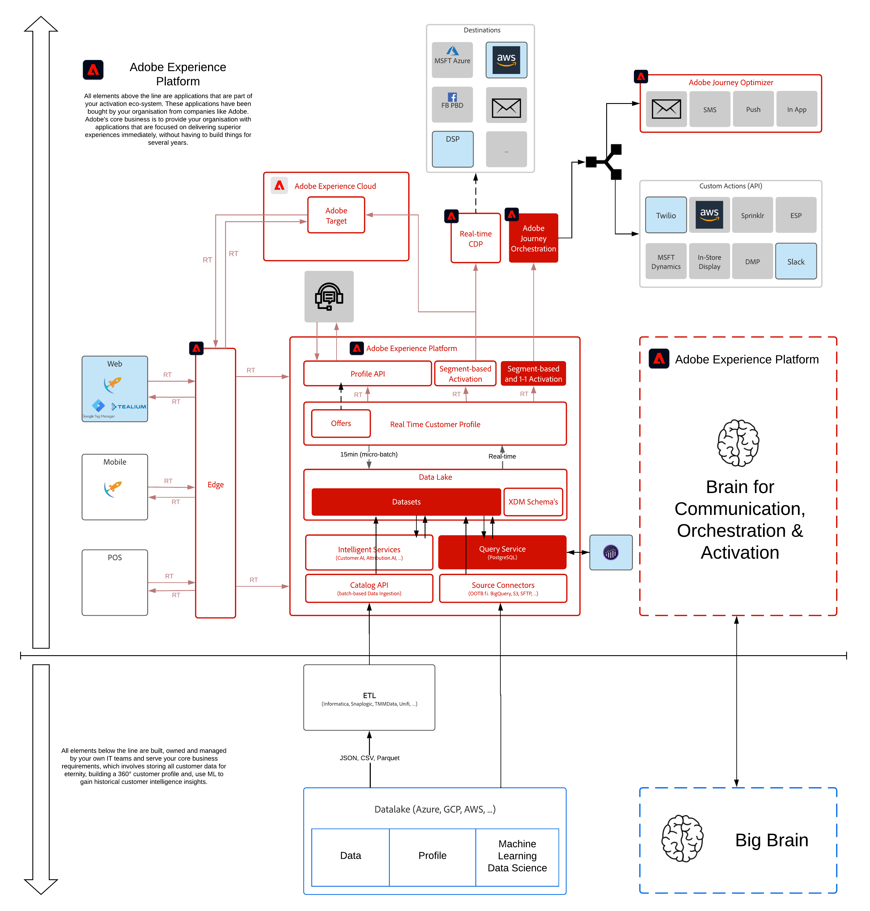

# 11. Customer Journey Analytics : créez un tableau de bord à l’aide d’Analysis Workspace sur Adobe Experience Platform.

**Auteur : [Victor de l&#39;Iglesia](https://www.linkedin.com/in/victordelaiglesia/), [Wouter Van Geluwe](https://www.linkedin.com/in/woutervangeluwe/)**

Dans ce module, vous bénéficiez d’une expérience pratique avec le service d’application de Customer Journey Analytics.

Customer Journey Analytics fournit une boîte à outils aux équipes d’intelligence d’entreprise et de science des données pour l’assemblage et l’analyse de données cross-canal (en ligne et hors ligne). Les fonctionnalités de Customer Journey Analytics offrent un contexte et une clarté aux parcours clients multicanaux complexes. Le contexte fourni génère des informations exploitables sur la manière de supprimer les problèmes du processus de conversion des clients et de fournir des expériences positives dans les moments qui comptent le plus.

Regardez cette vidéo pour comprendre la valeur, le parcours client et le processus de configuration :

>[!VIDEO](https://video.tv.adobe.com/v/327188?quality=12&learn=on)

Plus d’informations sur Customer Journey Analytics sont disponibles [here](https://spark.adobe.com/page/t62eiRu9l6iWJ/).

## Objectifs d’apprentissage

- Familiarisez-vous avec l’interface utilisateur de Customer Journey Analytics
- Importation de jeux de données Adobe Experience Platform dans Customer Journey Analytics
- Présentation de l’ID de personne et de la combinaison de données dans Customer Journey Analytics
- Comprendre les concepts d’une connexion aux données et d’une vue de données
- Utilisation d’Analysis Workspace avec des jeux de données Adobe Experience Platform

## Conditions préalables

- Une certaine familiarité avec Analysis Workspace est préférable, mais elle n’est pas requise.
- Accès à Adobe Experience Platform : [https://experience.adobe.com/platform](https://experience.adobe.com/platform)
- Accès au service d’application Customer Journey Analytics

>[!IMPORTANT]
>
>Ce tutoriel a été créé pour faciliter un format d’atelier particulier. Il utilise des systèmes et des comptes spécifiques auxquels vous n’avez peut-être pas accès. Même sans accès, nous pensons que vous pouvez encore apprendre beaucoup en lisant à travers ce contenu très détaillé. Si vous participez à l’un des ateliers et que vous avez besoin de vos informations d’identification d’accès, veuillez contacter votre représentant d’Adobe qui vous fournira les informations requises.

## Aperçu de l’architecture

Regardez l’architecture ci-dessous, qui met en évidence les composants qui seront discutés et utilisés dans ce module.

## Environnement de test à utiliser

Pour ce module, utilisez cet environnement de test : `--aepSandboxId--`.

>[!NOTE]
>
>N’oubliez pas d’installer, de configurer et d’utiliser l’extension Chrome comme référencé dans [0.1 - Installation de l’extension Chrome pour la documentation Experience League](../module0/ex1.md)

## Exercices

[11.1 Customer Journey Analytics 101](./ex1.md)

Découvrez tous les concepts du Customer Journey Analytics.

[11.2 Connexion des jeux de données Adobe Experience Platform dans Customer Journey Analytics](./ex2.md)

Découvrez comment utiliser plusieurs jeux de données de Adobe Experience Platform dans Customer Journey Analytics.

[11.3 Création d’une vue de données](./ex3.md)

Découvrez comment configurer une vue de données dans Customer Journey Analytics.

[11.4 Préparation des données en Customer Journey Analytics](./ex4.md)

Découvrez comment préparer des données avant de poursuivre l’analyse.

[11.5 Visualisation à l’aide de Customer Journey Analytics](./ex5.md)

Découvrez comment visualiser les données Adobe Experience Platform à l’aide de Customer Journey Analytics.

[Résumé et avantages](./summary.md)

Résumé de ce module et aperçu des avantages.

>[!NOTE]
>
>Merci d&#39;investir votre temps dans l&#39;apprentissage de Adobe Experience Platform. Si vous avez des questions, souhaitez partager les commentaires généraux d&#39;avoir des suggestions sur le contenu futur, contactez directement Wouter Van Geluwe en envoyant un email à **vangeluw@adobe.com**.

[Revenir à tous les modules](../../overview.md)
