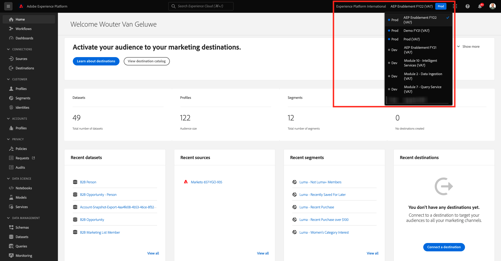

# 13.3 Création d’un segment

## 13.3.1 Introduction

Vous allez créer un segment simple :

- **Intérêt pour le matériel** pour lesquels les profils clients seront qualifiés lorsqu’ils visitent la **Équipement** page du site web de démonstration de Luma.

### Bon à savoir

La plateforme des données clients en temps réel déclenche une activation vers une destination lorsque vous êtes admissible pour un segment qui fait partie de la liste d’activation de cette destination. Dans ce cas, la charge utile de qualification du segment qui sera envoyée à cette destination contiendra **tous les segments pour lesquels votre profil est admissible ;**.

L’objectif de ce module est d’indiquer que la qualification de segment de votre profil client est envoyée à **your** destination du hub d’événements en temps réel.

### État du segment

Une qualification de segment dans Adobe Experience Platform comporte toujours une **status**-property et peut être l’une des options suivantes :

- **réalisé**: cela indique une nouvelle qualification de segment
- **existant**: cela indique une qualification de segment existante
- **exited**: cela indique que le profil n’est plus admissible pour le segment.

## 13.3.2 Création du segment

La création d’un segment est expliquée en détail dans la section [Module 6](../module6/real-time-cdp-build-a-segment-take-action.md).

### Créer un segment

Connectez-vous à Adobe Experience Platform en accédant à cette URL : [https://experience.adobe.com/platform](https://experience.adobe.com/platform).

Une fois connecté, vous accédez à la page d’accueil de Adobe Experience Platform.


Avant de continuer, vous devez sélectionner une **sandbox**. L’environnement de test à sélectionner est nommé ``--aepSandboxId--``. Pour ce faire, cliquez sur le texte **[!UICONTROL Production Prod]** dans la ligne bleue en haut de votre écran. Après avoir sélectionné l’environnement de test approprié, l’écran change et vous êtes désormais dans votre environnement de test dédié.



Accédez à **Segments**. Cliquez sur le bouton **+ Créer un segment** bouton .


Nommer votre segment `--demoProfileLdap-- - Interest in Equipment` et ajoutez l’événement d’expérience de nom de page :

Cliquez sur **Événements**, puis effectuez un glisser-déposer **XDM ExperienceEvent > Web > Détails de la page Web > Nom**. Entrée **équipement** comme valeur :


Glisser-déposer **XDM ExperienceEvent > `--aepTenantIdSchema--` > demoEnvironment > brandName**. Entrée `--demoProfileLdap--` comme valeur, définissez le paramètre de comparaison sur **contains** et cliquez sur **Enregistrer**:


### Définition PQL

Le PQL de votre segment ressemble à ceci :

```code
CHAIN(xEvent, timestamp, [C0: WHAT(web.webPageDetails.name.equals("equipment", false) and _experienceplatform.demoEnvironment.brandName.contains("--demoProfileLdap--", false))])
```

Étape suivante : [13.4 Activation du segment](./ex4.md)

[Revenir au module 13](./segment-activation-microsoft-azure-eventhub.md)

[Revenir à tous les modules](./../../overview.md)
